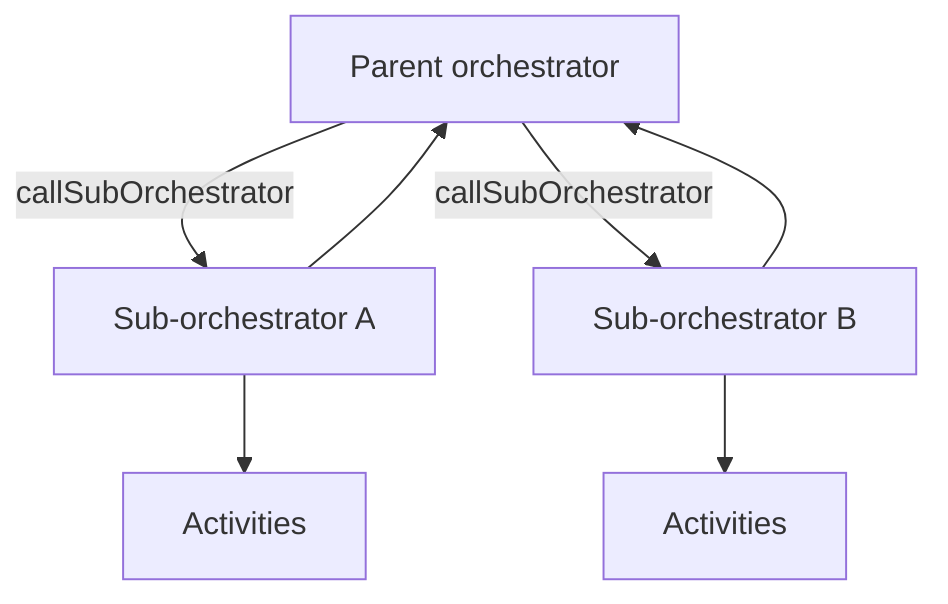

---
content_sources:
  references:
    - type: mslearn-adapted
      url: https://learn.microsoft.com/en-us/azure/azure-functions/durable/durable-functions-sub-orchestrations
    - type: mslearn-adapted
      url: https://learn.microsoft.com/en-us/azure/azure-functions/durable/durable-functions-eternal-orchestrations
    - type: mslearn-adapted
      url: https://learn.microsoft.com/en-us/azure/azure-functions/durable/durable-functions-versioning
  diagrams:
    - id: architecture
      type: flowchart
      source: self-generated
      justification: Flow view of sub-orchestration composition, synthesized from Microsoft Learn documentation cited on this page.
      based_on:
        - https://learn.microsoft.com/en-us/azure/azure-functions/durable/durable-functions-sub-orchestrations
        - https://learn.microsoft.com/en-us/azure/azure-functions/durable/durable-functions-eternal-orchestrations
---
# Durable Functions: Advanced Patterns

This recipe covers advanced Durable Functions patterns for Node.js (v4 programming model) beyond the basic chaining and fan-out/fan-in flows: sub-orchestrations, eternal orchestrations, activity retries, and safe versioning. For the fundamentals, see [Durable Orchestration](durable-orchestration.md).

## Architecture

<!-- diagram-id: architecture -->


## Sub-Orchestrations

Break a large workflow into reusable orchestrators. A parent calls a sub-orchestrator with `context.df.callSubOrchestrator`, and can fan out over several the same way it fans out over activities.

```javascript
const df = require("durable-functions");

df.app.orchestration("parentOrchestrator", function* (context) {
    const regions = context.df.getInput().regions;

    // Fan out over sub-orchestrations, one per region.
    const tasks = regions.map((region) =>
        context.df.callSubOrchestrator("processRegion", region)
    );
    const results = yield context.df.Task.all(tasks);
    return { regionsProcessed: results.length, results };
});

df.app.orchestration("processRegion", function* (context) {
    const region = context.df.getInput();
    const validated = yield context.df.callActivity("validateRegion", region);
    return yield context.df.callActivity("loadRegion", validated);
});
```

## Eternal Orchestrations

For a workflow that runs indefinitely (aggregators, periodic jobs), do **not** use an unbounded loop — the history would grow forever. Call `context.df.continueAsNew` to restart the orchestration with fresh state and a clean history.

```javascript
const df = require("durable-functions");
const moment = require("moment");

df.app.orchestration("periodicCleanup", function* (context) {
    const state = context.df.getInput() || { runs: 0 };

    yield context.df.callActivity("runCleanup", state);
    state.runs += 1;

    // Durable sleep, then restart with new state and empty history.
    const nextRun = moment.utc(context.df.currentUtcDateTime).add(1, "h");
    yield context.df.createTimer(nextRun.toDate());
    context.df.continueAsNew(state);
});
```

## Activity Retries

Wrap flaky activities with a retry policy instead of hand-coding retry loops. The orchestration replays cleanly because retries are recorded in history.

```javascript
const df = require("durable-functions");

df.app.orchestration("resilientOrchestrator", function* (context) {
    const order = context.df.getInput();

    // firstRetryIntervalInMilliseconds, maxNumberOfAttempts
    const retryOptions = new df.RetryOptions(5000, 3);

    const result = yield context.df.callActivityWithRetry(
        "chargeCustomer", retryOptions, order
    );
    return result;
});
```

| Element | Explanation |
|---|---|
| `callSubOrchestrator` | Invokes another orchestrator as a child; compose and fan out like activities. |
| `continueAsNew` | Restarts the orchestration with new input and a trimmed history for eternal loops. |
| `RetryOptions` | Declarative retry policy applied via `callActivityWithRetry`. |

## Versioning

Orchestrations replay from history, so changing an orchestrator's code while instances are in flight can break replay (non-determinism). Safe strategies:

- **Deploy side by side**: give the changed orchestrator a new name and route new instances to it, letting existing instances drain on the old version.
- **Do not reorder or remove** existing activity calls in a deployed orchestrator.
- **Terminate and restart** in-flight instances if a breaking change is unavoidable.

!!! warning "Determinism still applies"
    Advanced patterns do not relax the determinism rule. Never call `Date.now()`, generate random values, or do direct I/O inside an orchestrator — use activities and `context.df.currentUtcDateTime`.

## See Also

- [Durable Orchestration](durable-orchestration.md)
- [Durable Entities](durable-entities.md)
- [Platform: Durable Functions](../../../platform/durable-functions.md)

## Sources

- [Sub-orchestrations (Microsoft Learn)](https://learn.microsoft.com/en-us/azure/azure-functions/durable/durable-functions-sub-orchestrations)
- [Eternal orchestrations (Microsoft Learn)](https://learn.microsoft.com/en-us/azure/azure-functions/durable/durable-functions-eternal-orchestrations)
- [Versioning (Microsoft Learn)](https://learn.microsoft.com/en-us/azure/azure-functions/durable/durable-functions-versioning)
</content>
</invoke>
