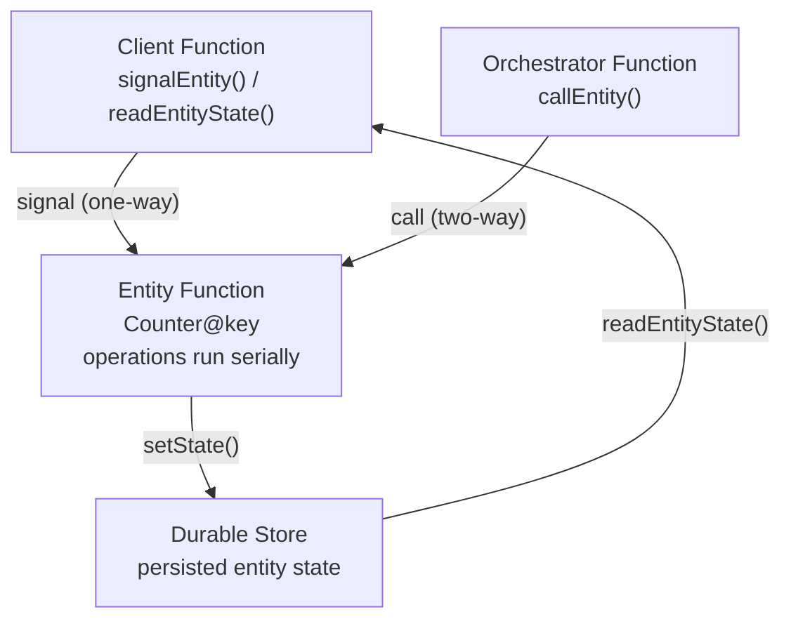

---
content_sources:
  references:
    - type: mslearn-adapted
      url: https://learn.microsoft.com/en-us/azure/azure-functions/durable/durable-functions-entities
    - type: mslearn-adapted
      url: https://learn.microsoft.com/en-us/azure/azure-functions/durable/durable-functions-node-model-upgrade
  diagrams:
    - id: entity-lifecycle
      type: flowchart
      source: self-generated
      justification: Flow view of the durable entity lifecycle, synthesized from Microsoft Learn documentation cited on this page.
      based_on:
        - https://learn.microsoft.com/en-us/azure/azure-functions/durable/durable-functions-entities
        - https://learn.microsoft.com/en-us/azure/azure-functions/durable/durable-functions-node-model-upgrade
---
# Durable Entities

This recipe covers Durable Entities (the stateful entity model) with Azure Functions Node.js v4 using the `durable-functions` package. Entity functions require Durable Functions 2.0 or later.

## Overview

Durable Entities manage small pieces of explicit state — tiny, addressable, single-threaded objects that live in durable storage. Unlike orchestrator functions, which represent state implicitly through control flow, an entity reads and writes its state explicitly through operations.

Entities are ideal for aggregation (counters, running totals), fan-in of high-volume signals without lock contention, and actor-style per-key state.

| Concept | Description |
|---------|-------------|
| **Entity function** | Defines the operations that read and update state. Registered with `df.app.entity`. |
| **Entity ID** | A pair of strings: the **entity name** (e.g. `Counter`) plus the **entity key** (the unique instance). Written as `@Counter@key`. |
| **Operation** | A named action (for example `add`, `reset`, `get`), with optional input. |
| **Serialized access** | A single entity processes its operations one at a time, so you never need locks. |

<!-- diagram-id: entity-lifecycle -->


## Prerequisites

Install the durable package:

```bash
npm install durable-functions
```

Use extension bundle v4 in `host.json`:

```json
{
  "version": "2.0",
  "extensionBundle": {
    "id": "Microsoft.Azure.Functions.ExtensionBundle",
    "version": "[4.*, 5.0.0)"
  }
}
```

## Define an Entity Function

The entity handler receives a context with `df` helpers. Read the current state (with a default factory), branch on the operation name, mutate the value, and persist it with `setState`. Use `return` to send a value to a two-way caller.

```javascript
const { app } = require("@azure/functions");
const df = require("durable-functions");

df.app.entity("Counter", function (context) {
  const currentValue = context.df.getState(() => 0);

  switch (context.df.operationName) {
    case "add":
      context.df.setState(currentValue + context.df.getInput());
      break;
    case "reset":
      context.df.setState(0);
      break;
    case "get":
      context.df.return(currentValue);
      break;
  }
});
```

## Signal an Entity from a Client Function

Signaling is one-way (fire-and-forget): the client sends an operation and does not wait for a result.

```javascript
app.http("addToCounter", {
  methods: ["POST"],
  route: "entities/counter/{key}/add",
  authLevel: "function",
  extraInputs: [df.input.durableClient()],
  handler: async (request, context) => {
    const client = df.getClient(context);
    const key = request.params.key;
    const amount = Number(new URL(request.url).searchParams.get("amount") ?? "1");

    const entityId = new df.EntityId("Counter", key);
    await client.signalEntity(entityId, "add", amount);

    return { status: 202, jsonBody: { entity: `@Counter@${key}`, signaled: "add", amount } };
  }
});
```

## Read Entity State from a Client Function

Reading returns the entity's most recently persisted (committed) state. It may be slightly stale but never reflects a half-completed operation.

```javascript
app.http("getCounter", {
  methods: ["GET"],
  route: "entities/counter/{key}",
  authLevel: "function",
  extraInputs: [df.input.durableClient()],
  handler: async (request, context) => {
    const client = df.getClient(context);
    const key = request.params.key;
    const entityId = new df.EntityId("Counter", key);

    const state = await client.readEntityState(entityId);

    return {
      status: 200,
      jsonBody: {
        entity: `@Counter@${key}`,
        exists: state.entityExists,
        value: state.entityExists ? state.entityState : 0
      }
    };
  }
});
```

## Call an Entity from an Orchestrator

Orchestrators can call an entity (two-way — wait for a result) to read shared state and make a decision.

```javascript
df.app.orchestration("reserveSeat", function* (context) {
  const gameId = context.df.getInput();
  const entityId = new df.EntityId("Counter", gameId);

  // Two-way call: read the current seat count and wait for the result.
  const current = yield context.df.callEntity(entityId, "get");

  if (current >= 100) {
    return { reserved: false, reason: "sold out", seatsTaken: current };
  }

  // Claim a seat.
  yield context.df.callEntity(entityId, "add", 1);
  return { reserved: true, seatNumber: current + 1 };
});
```

!!! note "Signaling from an orchestrator"
    In the Node.js model, orchestrators use `callEntity` (two-way) to communicate with entities. Fire-and-forget signaling is available from client and entity functions.

## Access Rules Summary

| Caller | Signal (one-way) | Call (two-way) | Read state |
|--------|:---:|:---:|:---:|
| **Client function** | Yes | No | Yes |
| **Orchestrator function** | — | Yes | No (call `get` instead) |
| **Entity function** | Yes | No | — |

## See Also

- [Durable Orchestration](durable-orchestration.md)
- [Platform: Durable Functions](../../../platform/durable-functions.md)
- [HTTP API](http-api.md)

## Sources

- [Durable entities (Microsoft Learn)](https://learn.microsoft.com/en-us/azure/azure-functions/durable/durable-functions-entities)
- [Migrate Durable Functions app to Node.js v4 model (Microsoft Learn)](https://learn.microsoft.com/en-us/azure/azure-functions/durable/durable-functions-node-model-upgrade)
