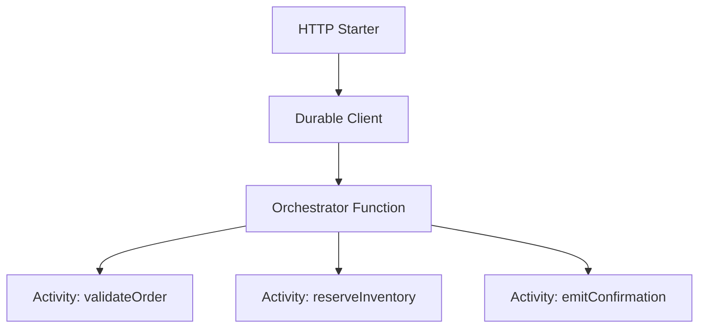

---
content_sources:

- type: mslearn-adapted
  url: https://learn.microsoft.com/azure/azure-functions/durable/durable-functions-node-model-upgrade
- type: mslearn-adapted
  url: https://learn.microsoft.com/azure/azure-functions/durable/durable-functions-overview
content_validation:
  status: verified
  last_reviewed: '2026-05-23'
  reviewer: agent
  core_claims:
  - claim: This page uses Microsoft Learn as the primary source basis for its Azure-specific
      guidance.
    source: https://learn.microsoft.com/azure/azure-functions/durable/durable-functions-node-model-upgrade
    verified: true
---
# Durable Orchestration

This recipe implements a complete Durable Functions Node.js v4 workflow with an HTTP starter, orchestrator, and activity function.

## Architecture

<!-- diagram-id: architecture -->


## Prerequisites

Install durable package:

```bash
npm install durable-functions
```

Use extension bundle v4 in `host.json`:

```json
{
  "version": "2.0",
  "extensionBundle": {
    "id": "Microsoft.Azure.Functions.ExtensionBundle",
    "version": "[4.*, 5.0.0)"
  }
}
```

## Working Node.js v4 Code

```javascript
const { app } = require("@azure/functions");
const df = require("durable-functions");

app.http("startOrderOrchestration", {
  methods: ["POST"],
  route: "orchestrators/order-processing",
  authLevel: "function",
  extraInputs: [df.input.durableClient()],
  handler: async (request, context) => {
    const payload = await request.json();
    const client = df.getClient(context);

    const instanceId = await client.startNew("orderProcessingOrchestrator", {
      input: payload
    });

    context.log("Started orchestration", { instanceId });
    return client.createCheckStatusResponse(request, instanceId);
  }
});

df.app.orchestration("orderProcessingOrchestrator", function* (context) {
  const input = context.df.getInput();

  const validatedOrder = yield context.df.callActivity("validateOrder", input);
  const inventory = yield context.df.callActivity("reserveInventory", validatedOrder);
  const confirmation = yield context.df.callActivity("emitConfirmation", inventory);

  return confirmation;
});

df.app.activity("validateOrder", {
  handler: (order) => {
    if (!order?.orderId || !order?.customerId) {
      throw new Error("orderId and customerId are required.");
    }
    return { ...order, validatedUtc: new Date().toISOString() };
  }
});

df.app.activity("reserveInventory", {
  handler: (order) => {
    return {
      ...order,
      inventoryReservationId: `${order.orderId}-inv`
    };
  }
});

df.app.activity("emitConfirmation", {
  handler: (order) => {
    return {
      orderId: order.orderId,
      reservationId: order.inventoryReservationId,
      status: "Confirmed"
    };
  }
});
```

## Implementation Notes

- Use `df.input.durableClient()` + `df.getClient(context)` in the HTTP starter for orchestration control APIs.
- Start orchestrations with the durable client start API (`client.startNew(...)`, often described as `df.app.client.start()` in starter patterns).
- Keep orchestrator logic deterministic: no random values, no network calls, no current-time APIs inside orchestrator code.
- Put all external interactions in activities (`df.app.activity(...)`).

## Review Matrix

| Review area | Page-specific check |
|---|---|
| Scope | Confirm the guidance applies to Durable Orchestration. |
| Source basis | Validate the recommendation against the Microsoft Learn sources in this page. |
| Evidence | Capture command output, portal state, metrics, logs, or screenshots before treating the result as proven. |

## See Also
- [Node.js Recipes Index](index.md)
- [Timer Jobs](timer.md)
- [Node.js v4 Programming Model](../v4-programming-model.md)

## Sources
- [Migrate Durable Functions app to Node.js v4 model (Microsoft Learn)](https://learn.microsoft.com/azure/azure-functions/durable/durable-functions-node-model-upgrade)
- [Durable Functions overview (Microsoft Learn)](https://learn.microsoft.com/azure/azure-functions/durable/durable-functions-overview)
