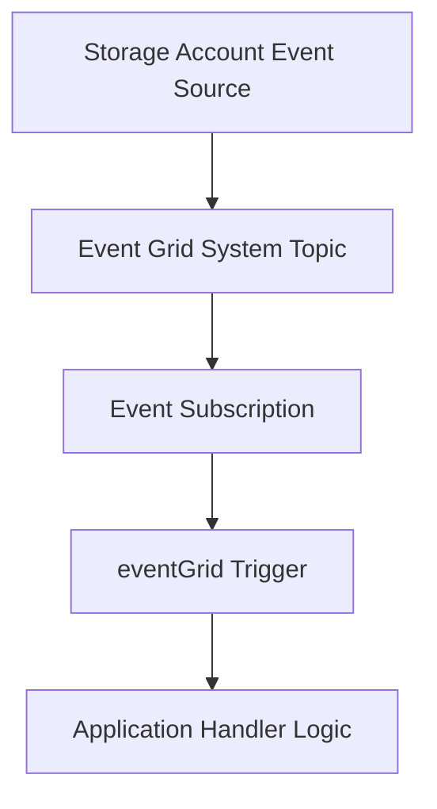

---
content_sources:

  references:
    - type: mslearn-adapted
      url: https://learn.microsoft.com/en-us/azure/azure-functions/functions-bindings-event-grid-trigger
    - type: mslearn-adapted
      url: https://learn.microsoft.com/en-us/cli/azure/eventgrid/event-subscription?view=azure-cli-latest
  diagrams:
    - id: architecture
      type: flowchart
      source: self-generated
      justification: Flow view of architecture, synthesized from Microsoft Learn documentation cited on this page.
      based_on:
        - https://learn.microsoft.com/en-us/azure/azure-functions/functions-bindings-event-grid-trigger
        - https://learn.microsoft.com/en-us/cli/azure/eventgrid/event-subscription?view=azure-cli-latest
---
# Event Grid Events

This recipe uses `app.eventGrid()` (not HTTP trigger emulation) to handle native Event Grid events and branch by event type.

## Architecture

<!-- diagram-id: architecture -->


## Prerequisites

Use extension bundle v4:

```json
{
  "version": "2.0",
  "extensionBundle": {
    "id": "Microsoft.Azure.Functions.ExtensionBundle",
    "version": "[4.*, 5.0.0)"
  }
}
```

Create Event Grid subscription to the function endpoint:

```bash
az eventgrid event-subscription create \
  --name storage-events-to-functions \
  --source-resource-id $(az storage account show --name $STORAGE_NAME --resource-group $RG --query id --output tsv) \
  --endpoint-type azurefunction \
  --endpoint "/subscriptions/<subscription-id>/resourceGroups/$RG/providers/Microsoft.Web/sites/$APP_NAME/functions/processStorageEvent"
```

| CLI element | Explanation |
|---|---|
| Command(s) | `az eventgrid event-subscription create` |
| Key flags | `--name`, `--source-resource-id`, `--resource-group`, `--query`, `--output`, `--endpoint-type`, `--endpoint` |
| Variables | `$STORAGE_NAME`, `$RG`, `$APP_NAME` |
| Expected result | Azure CLI returns provisioning details; confirm the resource name and successful provisioning state before continuing. |


## Working Node.js v4 Code

```javascript
const { app } = require("@azure/functions");

app.eventGrid("processStorageEvent", {
  handler: async (eventGridEvent, context) => {
    context.log("Event Grid event received", {
      id: eventGridEvent.id,
      eventType: eventGridEvent.eventType,
      subject: eventGridEvent.subject,
      topic: eventGridEvent.topic
    });

    if (eventGridEvent.eventType === "Microsoft.Storage.BlobCreated") {
      const blobUrl = eventGridEvent.data.url;
      context.log("Blob created event", { blobUrl });
    } else if (eventGridEvent.eventType === "Microsoft.Storage.BlobDeleted") {
      context.log("Blob deleted event", { subject: eventGridEvent.subject });
    } else {
      context.log("Unhandled event type", { eventType: eventGridEvent.eventType });
    }
  }
});
```

## Implementation Notes

- Use `app.eventGrid()` so Functions runtime handles Event Grid handshake and schema binding.
- Access standard schema properties from `eventGridEvent` (`id`, `eventType`, `subject`, `data`).
- Keep event handlers idempotent because Event Grid provides at-least-once delivery.
- Filter event types at subscription level to reduce unnecessary invocations.

## Event Grid Output: Publish to a Custom Topic

Use the Event Grid output binding to publish events to a custom topic. The binding reads the topic endpoint and access key from app settings — never hard-code the topic URI in the binding properties.

```javascript
const { app, output } = require("@azure/functions");

const eventGridOutput = output.eventGrid({
  topicEndpointUri: "MyEventGridTopicUriSetting",
  topicKeySetting: "MyEventGridTopicKeySetting",
});

app.timer("publishEvents", {
  schedule: "0 */5 * * * *",
  return: eventGridOutput,
  handler: (myTimer, context) => {
    return {
      id: "message-id",
      subject: "orders/created",
      dataVersion: "1.0",
      eventType: "Contoso.Order.Created",
      data: { orderId: 12345 },
      eventTime: new Date().toISOString(),
    };
  },
});
```

To publish multiple events in one invocation, return an array of event objects instead of a single object.

Configure the two app settings the binding references:

```bash
az functionapp config appsettings set \
  --name $APP_NAME \
  --resource-group $RG \
  --settings "MyEventGridTopicUriSetting=$TOPIC_ENDPOINT" "MyEventGridTopicKeySetting=$TOPIC_KEY"
```

| CLI element | Explanation |
|---|---|
| Command(s) | `az functionapp config appsettings set` |
| Key flags | `--name`, `--resource-group`, `--settings` |
| Variables | `$APP_NAME`, `$RG`, `$TOPIC_ENDPOINT`, `$TOPIC_KEY` |
| Expected result | Azure CLI returns the updated app settings as JSON; confirm both settings are present before continuing. |

!!! note "CloudEvents schema"
    The v4 output binding emits the Event Grid schema shown above. To publish in the **CloudEvents 1.0** schema instead, create the custom topic with `--input-schema cloudeventschemav1.0` and publish with the `EventGridPublisherClient` from `@azure/eventgrid` configured for CloudEvents, rather than the output binding.

For identity-based authentication (extension 3.3.x or higher), set a `connection` prefix instead of `topicKeySetting`, and grant the function app's managed identity the **EventGrid Data Sender** role on the topic.

## See Also
- [Node.js Recipes Index](index.md)
- [Blob Storage Patterns](blob-storage.md)
- [Queue Processing](queue.md)

## Sources
- [Event Grid trigger for Azure Functions (Microsoft Learn)](https://learn.microsoft.com/en-us/azure/azure-functions/functions-bindings-event-grid-trigger)
- [Event Grid output binding for Azure Functions (Microsoft Learn)](https://learn.microsoft.com/en-us/azure/azure-functions/functions-bindings-event-grid-output)
- [Create Event Grid subscriptions with Azure CLI (Microsoft Learn)](https://learn.microsoft.com/en-us/cli/azure/eventgrid/event-subscription?view=azure-cli-latest)
