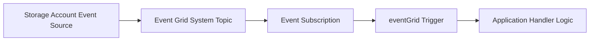

---
content_sources:
  - type: mslearn-adapted
    url: https://learn.microsoft.com/azure/azure-functions/functions-bindings-event-grid-trigger
  - type: mslearn-adapted
    url: https://learn.microsoft.com/azure/event-grid/create-view-manage-event-subscriptions-cli
---

# Event Grid Events

This recipe uses `app.eventGrid()` (not HTTP trigger emulation) to handle native Event Grid events and branch by event type.

## Architecture

<!-- diagram-id: architecture -->


## Prerequisites

Use extension bundle v4:

```json
{
  "version": "2.0",
  "extensionBundle": {
    "id": "Microsoft.Azure.Functions.ExtensionBundle",
    "version": "[4.*, 5.0.0)"
  }
}
```

Create Event Grid subscription to the function endpoint:

```bash
az eventgrid event-subscription create \
  --name storage-events-to-functions \
  --source-resource-id $(az storage account show --name $STORAGE_NAME --resource-group $RG --query id --output tsv) \
  --endpoint-type azurefunction \
  --endpoint "/subscriptions/<subscription-id>/resourceGroups/$RG/providers/Microsoft.Web/sites/$APP_NAME/functions/processStorageEvent"
```

## Working Node.js v4 Code

```javascript
const { app } = require("@azure/functions");

app.eventGrid("processStorageEvent", {
  handler: async (eventGridEvent, context) => {
    context.log("Event Grid event received", {
      id: eventGridEvent.id,
      eventType: eventGridEvent.eventType,
      subject: eventGridEvent.subject,
      topic: eventGridEvent.topic
    });

    if (eventGridEvent.eventType === "Microsoft.Storage.BlobCreated") {
      const blobUrl = eventGridEvent.data.url;
      context.log("Blob created event", { blobUrl });
    } else if (eventGridEvent.eventType === "Microsoft.Storage.BlobDeleted") {
      context.log("Blob deleted event", { subject: eventGridEvent.subject });
    } else {
      context.log("Unhandled event type", { eventType: eventGridEvent.eventType });
    }
  }
});
```

## Implementation Notes

- Use `app.eventGrid()` so Functions runtime handles Event Grid handshake and schema binding.
- Access standard schema properties from `eventGridEvent` (`id`, `eventType`, `subject`, `data`).
- Keep event handlers idempotent because Event Grid provides at-least-once delivery.
- Filter event types at subscription level to reduce unnecessary invocations.

## See Also
- [Node.js Recipes Index](index.md)
- [Blob Storage Patterns](blob-storage.md)
- [Queue Processing](queue.md)

## Sources
- [Event Grid trigger for Azure Functions (Microsoft Learn)](https://learn.microsoft.com/azure/azure-functions/functions-bindings-event-grid-trigger)
- [Create Event Grid subscriptions with Azure CLI (Microsoft Learn)](https://learn.microsoft.com/azure/event-grid/create-view-manage-event-subscriptions-cli)
