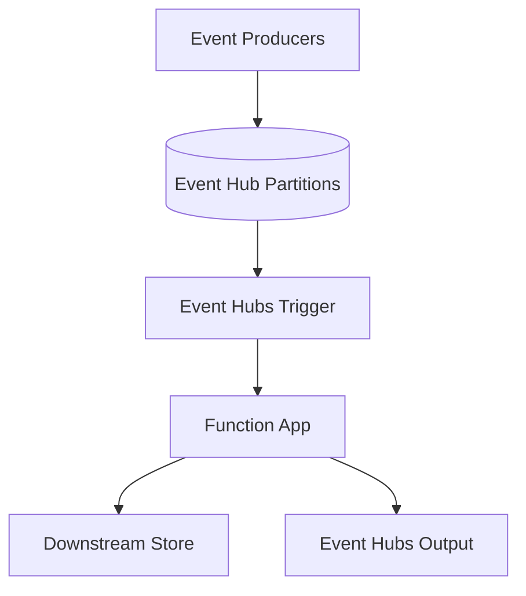

---
content_sources:
  references:
    - type: mslearn-adapted
      url: https://learn.microsoft.com/en-us/azure/azure-functions/functions-bindings-event-hubs
  diagrams:
    - id: architecture
      type: flowchart
      source: self-generated
      justification: Flow view of architecture, synthesized from Microsoft Learn documentation cited on this page.
      based_on:
        - https://learn.microsoft.com/en-us/azure/azure-functions/functions-bindings-event-hubs
        - https://learn.microsoft.com/en-us/azure/azure-functions/functions-bindings-event-hubs-trigger
---
# Event Hubs

This recipe covers integrating Azure Event Hubs with Azure Functions Node.js v4 — consuming a high-throughput event stream with the Event Hubs trigger (single and batch delivery), reading event metadata, and publishing events with the output binding.

## Architecture

<!-- diagram-id: architecture -->


## Prerequisites

Event Hubs bindings ship in the default extension bundle. Ensure your `host.json` references it:

```json
{
  "version": "2.0",
  "extensionBundle": {
    "id": "Microsoft.Azure.Functions.ExtensionBundle",
    "version": "[4.*, 5.0.0)"
  }
}
```

Provide the connection in app settings. A connection-string setting or an identity-based connection is supported. Identity-based connections use a setting prefix with `__fullyQualifiedNamespace`:

```bash
az functionapp config appsettings set \
  --name $APP_NAME \
  --resource-group $RG \
  --settings "EventHubConnection__fullyQualifiedNamespace=$NAMESPACE.servicebus.windows.net"
```

| CLI element | Explanation |
|---|---|
| Command(s) | `az functionapp config appsettings set` |
| Key flags | `--name`, `--resource-group`, `--settings` |
| Variables | `$APP_NAME`, `$RG`, `$NAMESPACE` |
| Expected result | Azure CLI returns the updated app settings as JSON; confirm the setting is present before continuing. |

When using an identity-based connection, grant the function app's managed identity the **Azure Event Hubs Data Receiver** (and **Data Sender** for output) role on the namespace.

## Event Hubs Trigger

By default the Node.js v4 Event Hubs trigger delivers a batch of events per invocation (`cardinality: "many"`), which maximizes throughput for high-volume streams. Design the handler to be idempotent because delivery is at-least-once.

```javascript
const { app, output } = require("@azure/functions");

const downstreamOutput = output.eventHub({
  eventHubName: "downstream",
  connection: "EventHubConnection"
});

app.eventHub("processTelemetry", {
  eventHubName: "telemetry",
  connection: "EventHubConnection",
  consumerGroup: "$Default",
  cardinality: "many",
  extraOutputs: [downstreamOutput],
  handler: (events, context) => {
    // With cardinality "many", events is an array.
    context.log(`Batch size: ${events.length}`);

    const forwarded = [];
    for (const event of events) {
      // Keep processing idempotent.
      context.log("Processing event", { body: event });
      forwarded.push({ processedUtc: new Date().toISOString(), source: event });
    }

    context.extraOutputs.set(downstreamOutput, forwarded);
  }
});
```

## Reading Event Metadata

Enable `triggerMetadata` to access partition context, sequence numbers, and enqueued timestamps:

```javascript
app.eventHub("processWithMetadata", {
  eventHubName: "telemetry",
  connection: "EventHubConnection",
  cardinality: "many",
  handler: (events, context) => {
    const props = context.triggerMetadata.propertiesArray;
    const systemProps = context.triggerMetadata.systemPropertiesArray;

    events.forEach((event, i) => {
      context.log("Sequence:", systemProps?.[i]?.sequenceNumber);
      context.log("Enqueued:", systemProps?.[i]?.enqueuedTimeUtc);
    });
  }
});
```

## Host Configuration and Checkpointing

Tune batch size and checkpoint frequency in `host.json`:

```json
{
  "version": "2.0",
  "extensions": {
    "eventHubs": {
      "maxEventBatchSize": 100,
      "batchCheckpointFrequency": 1,
      "prefetchCount": 300
    }
  }
}
```

| Setting | Default | Description |
|---------|---------|-------------|
| `maxEventBatchSize` | 100 | Maximum number of events delivered per batch invocation |
| `batchCheckpointFrequency` | 1 | Number of batches processed before a checkpoint is written |
| `prefetchCount` | 300 | Number of events the underlying client prefetches |

!!! note "Checkpointing"
    The Event Hubs extension checkpoints progress to the storage account referenced by `AzureWebJobsStorage`. A higher `batchCheckpointFrequency` reduces storage writes but increases the volume of events reprocessed after a restart.

## See Also

- [Queue](queue.md)
- [Managed Identity](managed-identity.md)

## Sources

- [Azure Event Hubs bindings for Azure Functions (Microsoft Learn)](https://learn.microsoft.com/en-us/azure/azure-functions/functions-bindings-event-hubs)
- [Azure Event Hubs trigger for Azure Functions (Microsoft Learn)](https://learn.microsoft.com/en-us/azure/azure-functions/functions-bindings-event-hubs-trigger)
- [Azure Event Hubs output binding for Azure Functions (Microsoft Learn)](https://learn.microsoft.com/en-us/azure/azure-functions/functions-bindings-event-hubs-output)
