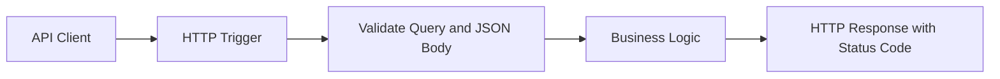

# HTTP API Patterns

This recipe shows production-ready HTTP trigger patterns in the Node.js v4 programming model: query parsing, request body validation, and explicit response contracts.

## Architecture



## Prerequisites

Use the extension bundle required by Azure Functions v4 bindings:

```json
{
  "version": "2.0",
  "extensionBundle": {
    "id": "Microsoft.Azure.Functions.ExtensionBundle",
    "version": "[4.*, 5.0.0)"
  }
}
```

Create a Node.js function app:

```bash
az group create --name $RG --location $LOCATION

az storage account create \
  --name $STORAGE_NAME \
  --resource-group $RG \
  --location $LOCATION \
  --sku Standard_LRS

az functionapp create \
  --name $APP_NAME \
  --resource-group $RG \
  --storage-account $STORAGE_NAME \
  --consumption-plan-location $LOCATION \
  --runtime node \
  --runtime-version 20 \
  --functions-version 4
```

## Working Node.js v4 Code

```javascript
const { app } = require("@azure/functions");
const { randomUUID } = require("node:crypto");

app.http("createOrder", {
  methods: ["POST"],
  authLevel: "function",
  route: "orders",
  handler: async (request, context) => {
    const customerId = request.query.get("customerId");
    if (!customerId) {
      return {
        status: 400,
        jsonBody: { error: "Query parameter 'customerId' is required." }
      };
    }

    let body;
    try {
      body = await request.json();
    } catch {
      return {
        status: 400,
        jsonBody: { error: "Request body must be valid JSON." }
      };
    }

    if (typeof body.productId !== "string" || typeof body.quantity !== "number") {
      return {
        status: 422,
        jsonBody: {
          error: "Body must include string 'productId' and numeric 'quantity'."
        }
      };
    }

    const order = {
      id: randomUUID(),
      customerId,
      productId: body.productId,
      quantity: body.quantity,
      createdUtc: new Date().toISOString()
    };

    context.log("Order accepted", { orderId: order.id, customerId });

    return {
      status: 201,
      headers: {
        "content-type": "application/json",
        "x-order-id": order.id
      },
      jsonBody: {
        message: "Order created.",
        order
      }
    };
  }
});
```

Test with long-form `curl` flags:

```bash
curl --request POST "http://localhost:7071/api/orders?customerId=c-1001" \
  --header "content-type: application/json" \
  --data '{"productId":"sku-42","quantity":2}'
```

## Implementation Notes

- Parse query parameters with `request.query.get()` and treat required values as contract checks.
- Use `await request.json()` inside `try/catch` so malformed JSON returns `400` instead of crashing the invocation.
- Return explicit `400`, `422`, and `201` codes to separate syntax errors, semantic validation failures, and successful creation.
- Set response headers (`content-type`, custom correlation headers) in the returned object.

## See Also
- [Node.js Recipes Index](index.md)
- [HTTP Authentication](http-auth.md)
- [Node.js v4 Programming Model](../v4-programming-model.md)

## Sources
- [Azure Functions Node.js developer guide (Microsoft Learn)](https://learn.microsoft.com/azure/azure-functions/functions-reference-node)
- [Azure Functions HTTP trigger (Microsoft Learn)](https://learn.microsoft.com/azure/azure-functions/functions-bindings-http-webhook-trigger)
