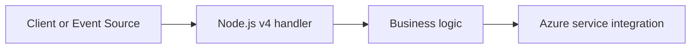

# HTTP Authentication

Auth levels, token forwarding, and Easy Auth integration patterns for HTTP triggers.

## Main Content



### Node.js v4 Example

```javascript
const { app } = require('@azure/functions');

app.http('secureEndpoint', { methods: ['GET'], authLevel: 'function', handler: async (request, context) => { const token = request.headers.get('authorization'); context.log(`Token present: ${Boolean(token)}`); return token ? { body: 'authorized' } : { status: 401, jsonBody: { error: 'missing-token' } }; } });
```

### Implementation Notes

- Use `context.log()` for invocation-scoped telemetry.
- Prefer managed identity to avoid secret distribution.
- Return explicit status codes for deterministic client behavior.

## See Also
- [Recipes Index](index.md)
- [Node.js v4 Programming Model](../v4-programming-model.md)
- [Troubleshooting](../troubleshooting.md)

## Sources
- [Azure Functions Node.js developer guide (Microsoft Learn)](https://learn.microsoft.com/azure/azure-functions/functions-reference-node)
- [Azure Functions trigger and binding concepts (Microsoft Learn)](https://learn.microsoft.com/azure/azure-functions/functions-triggers-bindings)
