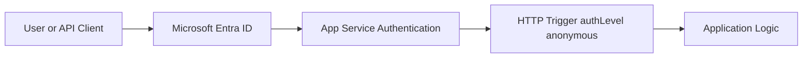

---
content_sources:
  - type: mslearn-adapted
    url: https://learn.microsoft.com/azure/app-service/overview-authentication-authorization
  - type: mslearn-adapted
    url: https://learn.microsoft.com/azure/azure-functions/functions-bindings-http-webhook-trigger
---

# HTTP Authentication

This recipe uses App Service Authentication (Easy Auth) with Node.js v4 HTTP triggers and Microsoft Entra ID, relying on platform-provided identity headers instead of custom token parsing.

## Architecture

<!-- diagram-id: architecture -->


## Prerequisites

Keep extension bundle configuration in `host.json`:

```json
{
  "version": "2.0",
  "extensionBundle": {
    "id": "Microsoft.Azure.Functions.ExtensionBundle",
    "version": "[4.*, 5.0.0)"
  }
}
```

Enable system-assigned identity and configure Easy Auth with Microsoft Entra ID:

```bash
az functionapp identity assign \
  --name $APP_NAME \
  --resource-group $RG

az webapp auth update \
  --name $APP_NAME \
  --resource-group $RG \
  --enabled true \
  --action LoginWithAzureActiveDirectory

az webapp auth microsoft update \
  --name $APP_NAME \
  --resource-group $RG \
  --client-id <entra-app-client-id> \
  --client-secret-setting-name MICROSOFT_PROVIDER_AUTHENTICATION_SECRET \
  --tenant-id <tenant-id>
```

## Working Node.js v4 Code

```javascript
const { app } = require("@azure/functions");

function parseClientPrincipal(request) {
  const encoded = request.headers.get("x-ms-client-principal");
  if (!encoded) {
    return null;
  }

  const decoded = Buffer.from(encoded, "base64").toString("utf8");
  return JSON.parse(decoded);
}

app.http("profile", {
  methods: ["GET"],
  authLevel: "anonymous",
  route: "me",
  handler: async (request, context) => {
    const principal = parseClientPrincipal(request);
    if (!principal) {
      return {
        status: 401,
        jsonBody: { error: "Unauthenticated. Easy Auth principal header missing." }
      };
    }

    const roles = (principal.claims || [])
      .filter((claim) => claim.typ === "roles")
      .map((claim) => claim.val);

    context.log("Authenticated request", {
      userId: principal.userId,
      identityProvider: principal.identityProvider
    });

    return {
      status: 200,
      jsonBody: {
        userId: principal.userId,
        userDetails: principal.userDetails,
        identityProvider: principal.identityProvider,
        roles
      }
    };
  }
});
```

## Implementation Notes

- Keep `authLevel: "anonymous"` when Easy Auth fronts the function; platform auth happens before your code runs.
- Read identity from `x-ms-client-principal` and avoid manual parsing of `authorization` headers.
- Return `401` when the Easy Auth principal header is absent (for local runs or misconfiguration).
- Add authorization checks in code by evaluating claims/roles from `principal.claims`.

## See Also
- [Node.js Recipes Index](index.md)
- [Managed Identity](managed-identity.md)
- [Node.js v4 Programming Model](../v4-programming-model.md)

## Sources
- [Authentication and authorization in Azure App Service and Azure Functions (Microsoft Learn)](https://learn.microsoft.com/azure/app-service/overview-authentication-authorization)
- [Azure Functions HTTP trigger authorization level (Microsoft Learn)](https://learn.microsoft.com/azure/azure-functions/functions-bindings-http-webhook-trigger)
