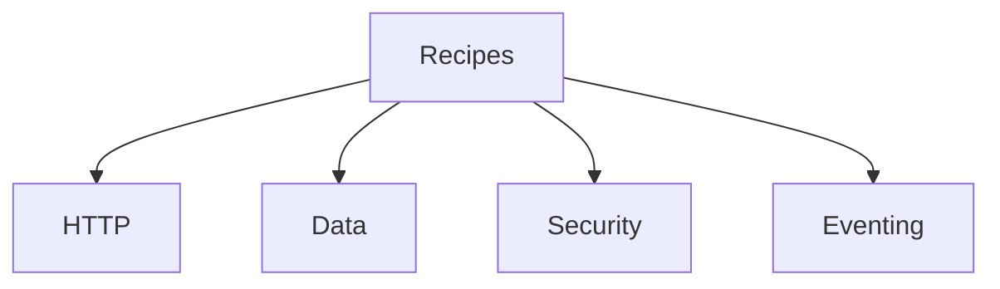

---
content_sources:

  references:
    - type: mslearn-adapted
      url: https://learn.microsoft.com/en-us/azure/azure-functions/functions-triggers-bindings
  diagrams:
    - id: recipe-categories
      type: flowchart
      source: self-generated
      justification: Flow view of recipe categories, synthesized from Microsoft Learn documentation cited on this page.
      based_on:
        - https://learn.microsoft.com/en-us/azure/azure-functions/functions-triggers-bindings
---
# Node.js Recipes

The recipes section provides implementation-focused patterns for common integration scenarios in Azure Functions Node.js v4 apps.

## Recipe Categories

<!-- diagram-id: recipe-categories -->

| Category | Recipes |
|---|---|
| HTTP | [HTTP API](http-api.md), [HTTP Auth](http-auth.md), [OpenAPI and Swagger](openapi.md) |
| Data | [Cosmos DB](cosmosdb.md), [Blob Storage](blob-storage.md), [Queue](queue.md), [Table Storage](table-storage.md) |
| Security | [Key Vault](key-vault.md), [Managed Identity](managed-identity.md), [Custom Domains and Certificates](custom-domain-certificates.md) |
| Eventing | [Timer](timer.md), [Durable Orchestration](durable-orchestration.md), [Durable Entities](durable-entities.md), [Durable Advanced](durable-advanced.md), [Event Grid](event-grid.md), [Event Hubs](event-hub.md), [Service Bus](service-bus.md), [SignalR Service](signalr.md) |
| Patterns | [Dependency Injection](dependency-injection.md), [Retry Policies](retry.md), [Middleware](middleware.md), [Unit Testing](testing.md) |

## See Also
- [Node.js Language Guide](../index.md)
- [Node.js Tutorials](../tutorial/index.md)
- [Troubleshooting](../troubleshooting.md)

## Sources
- [Azure Functions trigger and binding concepts (Microsoft Learn)](https://learn.microsoft.com/en-us/azure/azure-functions/functions-triggers-bindings)
