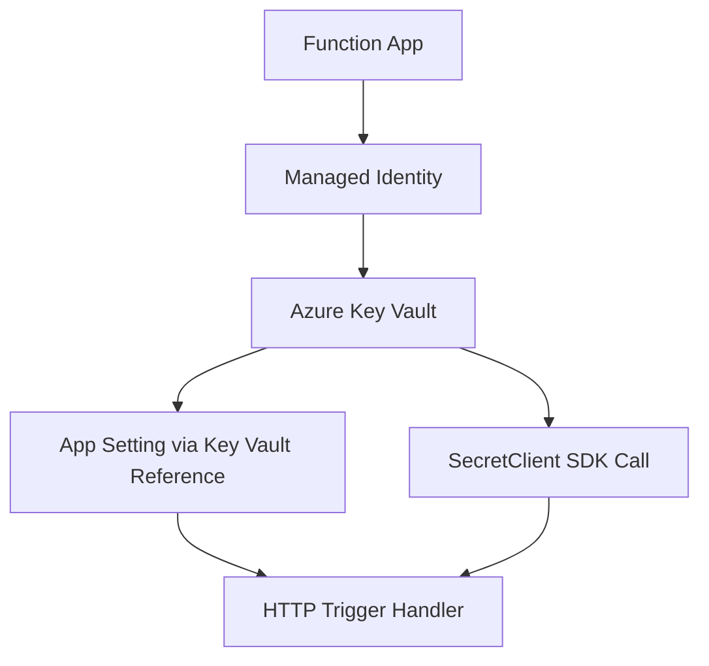

---
content_sources:

- type: mslearn-adapted
  url: https://learn.microsoft.com/azure/app-service/app-service-key-vault-references
- type: mslearn-adapted
  url: https://learn.microsoft.com/javascript/api/overview/azure/keyvault-secrets-readme
content_validation:
  status: verified
  last_reviewed: '2026-05-23'
  reviewer: agent
  core_claims:
  - claim: This page uses Microsoft Learn as the primary source basis for its Azure-specific
      guidance.
    source: https://learn.microsoft.com/azure/app-service/app-service-key-vault-references
    verified: true
---
# Key Vault Access

This recipe covers both Key Vault reference app settings and direct SDK access with `DefaultAzureCredential` in Node.js v4 functions.

## Architecture

<!-- diagram-id: architecture -->


## Prerequisites

Use extension bundle v4 in `host.json`:

```json
{
  "version": "2.0",
  "extensionBundle": {
    "id": "Microsoft.Azure.Functions.ExtensionBundle",
    "version": "[4.*, 5.0.0)"
  }
}
```

Create Key Vault and a secret:

```bash
az keyvault create \
  --name <key-vault-name> \
  --resource-group $RG \
  --location $LOCATION

az keyvault secret set \
  --vault-name <key-vault-name> \
  --name payment-api-key \
  --value "sample-secret-value"
```

| CLI element | Explanation |
|---|---|
| Command(s) | `az keyvault create`, `az keyvault secret set` |
| Key flags | `--name`, `--resource-group`, `--location`, `--vault-name`, `--value` |
| Variables | `$RG`, `$LOCATION` |
| Expected result | Azure CLI returns provisioning details; confirm the resource name and successful provisioning state before continuing. |


Enable managed identity and grant Key Vault secret permissions:

```bash
az functionapp identity assign --name $APP_NAME --resource-group $RG

az role assignment create \
  --assignee <principal-id> \
  --role "Key Vault Secrets User" \
  --scope $(az keyvault show --name <key-vault-name> --resource-group $RG --query id --output tsv)
```

| CLI element | Explanation |
|---|---|
| Command(s) | `az functionapp identity assign`, `az role assignment create` |
| Key flags | `--name`, `--resource-group`, `--assignee`, `--role`, `--scope`, `--query`, `--output` |
| Variables | `$APP_NAME`, `$RG` |
| Expected result | Azure CLI returns provisioning details; confirm the resource name and successful provisioning state before continuing. |


Configure a version-pinned Key Vault reference in app settings:

```bash
az functionapp config appsettings set \
  --name $APP_NAME \
  --resource-group $RG \
  --settings "PaymentApiKey=@Microsoft.KeyVault(SecretUri=https://<key-vault-name>.vault.azure.net/secrets/payment-api-key/<secret-version-guid>)"
```

| CLI element | Explanation |
|---|---|
| Command(s) | `az functionapp config appsettings set` |
| Key flags | `--name`, `--resource-group`, `--settings` |
| Variables | `$APP_NAME`, `$RG` |
| Expected result | Azure CLI applies the configuration change; confirm the returned JSON or follow-up query shows the expected value. |


Install packages for direct SDK access:

```bash
npm install @azure/identity @azure/keyvault-secrets
```

## Working Node.js v4 Code

```javascript
const { app } = require("@azure/functions");
const { DefaultAzureCredential } = require("@azure/identity");
const { SecretClient } = require("@azure/keyvault-secrets");

const vaultUrl = process.env.KEY_VAULT_URI;
const credential = new DefaultAzureCredential();
const secretClient = new SecretClient(vaultUrl, credential);

app.http("secretsHealth", {
  methods: ["GET"],
  route: "secrets/health",
  authLevel: "function",
  handler: async (_request, context) => {
    const fromReference = process.env.PaymentApiKey;
    const fromSdk = await secretClient.getSecret("payment-api-key");

    context.log("Fetched secrets", {
      sdkVersion: fromSdk.properties.version
    });

    return {
      status: 200,
      jsonBody: {
        referenceLoaded: Boolean(fromReference),
        sdkSecretName: fromSdk.name,
        sdkSecretVersion: fromSdk.properties.version
      }
    };
  }
});
```

## Implementation Notes

- Use Key Vault references for simple configuration injection with no SDK code.
- Pin `SecretUri` to a specific version for controlled rollouts and reproducible deployments.
- Use SDK access when you need metadata, dynamic secret names, or explicit version selection at runtime.
- Cache SDK clients across invocations to reduce connection overhead.

## See Also
- [Node.js Recipes Index](index.md)
- [Managed Identity](managed-identity.md)
- [HTTP Authentication](http-auth.md)

## Sources
- [Use Key Vault references for App Service and Azure Functions (Microsoft Learn)](https://learn.microsoft.com/azure/app-service/app-service-key-vault-references)
- [Azure Key Vault Secrets client library for JavaScript (Microsoft Learn)](https://learn.microsoft.com/javascript/api/overview/azure/keyvault-secrets-readme)
