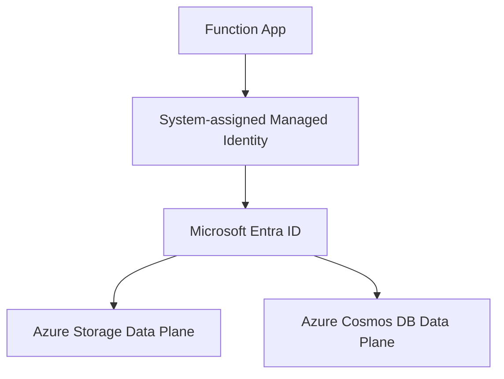
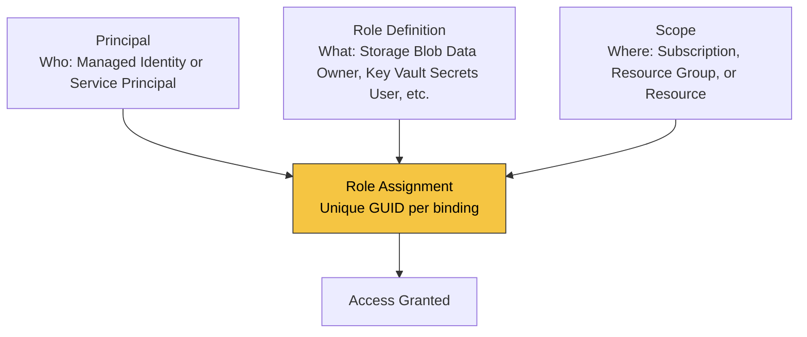

---
content_sources:
  - type: mslearn-adapted
    url: https://learn.microsoft.com/entra/identity/managed-identities-azure-resources/overview
  - type: mslearn-adapted
    url: https://learn.microsoft.com/azure/azure-functions/functions-identity-based-connections-tutorial
---

# Managed Identity

This recipe enables system-assigned managed identity, grants RBAC roles, and uses `DefaultAzureCredential` to access Azure Storage and Cosmos DB without secrets.

## Architecture

<!-- diagram-id: architecture -->


## How RBAC Connects Identity to Resources

A managed identity alone does not grant access. Azure RBAC binds three elements into a **role assignment**:

<!-- diagram-id: rbac-structure -->


| Element | Question it answers | Example |
|---|---|---|
| **Principal** | Who needs access? | Function app's managed identity |
| **Role Definition** | What permission? | `Storage Blob Data Owner`, `Key Vault Secrets User` |
| **Scope** | On which resource? | A specific Storage account, Key Vault, or resource group |
| **Role Assignment** | The binding itself | Unique GUID — one per (principal + role + scope) combination |

Azure RBAC enforces a uniqueness constraint: only one role assignment can exist for the same `(principal, role definition, scope)` triple. Attempting to create a duplicate with a different assignment GUID results in a `RoleAssignmentExists` conflict.

## Prerequisites

Use extension bundle v4 in `host.json`:

```json
{
  "version": "2.0",
  "extensionBundle": {
    "id": "Microsoft.Azure.Functions.ExtensionBundle",
    "version": "[4.*, 5.0.0)"
  }
}
```

Create baseline resources:

```bash
az storage account create \
  --name $STORAGE_NAME \
  --resource-group $RG \
  --location $LOCATION \
  --sku Standard_LRS

az cosmosdb create \
  --name <cosmos-account-name> \
  --resource-group $RG \
  --kind GlobalDocumentDB
```

Enable identity and capture principal id:

```bash
az functionapp identity assign \
  --name $APP_NAME \
  --resource-group $RG
```

Assign RBAC roles:

```bash
az role assignment create \
  --assignee <principal-id> \
  --role "Storage Blob Data Contributor" \
  --scope $(az storage account show --name $STORAGE_NAME --resource-group $RG --query id --output tsv)

az cosmosdb sql role assignment create \
  --account-name <cosmos-account-name> \
  --resource-group $RG \
  --scope "/" \
  --principal-id <principal-id> \
  --role-definition-name "Cosmos DB Built-in Data Contributor"
```

Install SDK packages:

```bash
npm install @azure/identity @azure/storage-blob @azure/cosmos
```

## Working Node.js v4 Code

```javascript
const { app } = require("@azure/functions");
const { DefaultAzureCredential } = require("@azure/identity");
const { BlobServiceClient } = require("@azure/storage-blob");
const { CosmosClient } = require("@azure/cosmos");

const credential = new DefaultAzureCredential();

const blobServiceClient = new BlobServiceClient(
  `https://${process.env.STORAGE_ACCOUNT_NAME}.blob.core.windows.net`,
  credential
);

const cosmosClient = new CosmosClient({
  endpoint: process.env.COSMOS_ENDPOINT,
  aadCredentials: credential
});

app.http("identityProbe", {
  methods: ["GET"],
  route: "identity/probe",
  authLevel: "function",
  handler: async (_request, context) => {
    const containerClient = blobServiceClient.getContainerClient("incoming");
    const exists = await containerClient.exists();

    const { database } = await cosmosClient.databases.createIfNotExists({
      id: "appdb"
    });

    context.log("Managed identity calls succeeded", {
      storageContainerExists: exists,
      databaseId: database.id
    });

    return {
      status: 200,
      jsonBody: {
        storageContainerExists: exists,
        cosmosDatabaseId: database.id
      }
    };
  }
});
```

## Implementation Notes

- `DefaultAzureCredential` uses managed identity automatically in Azure and developer credentials locally.
- Keep endpoint-style settings (`COSMOS_ENDPOINT`, `STORAGE_ACCOUNT_NAME`) and avoid storing keys.
- Assign least-privilege data-plane roles instead of broad management-plane roles.
- Initialize SDK clients once per process to reduce cold-start overhead.

## See Also
- [Node.js Recipes Index](index.md)
- [Key Vault Access](key-vault.md)
- [Cosmos DB Integration](cosmosdb.md)

## Sources
- [Managed identities for Azure resources (Microsoft Learn)](https://learn.microsoft.com/entra/identity/managed-identities-azure-resources/overview)
- [Use managed identities in Azure Functions (Microsoft Learn)](https://learn.microsoft.com/azure/azure-functions/functions-identity-based-connections-tutorial)
