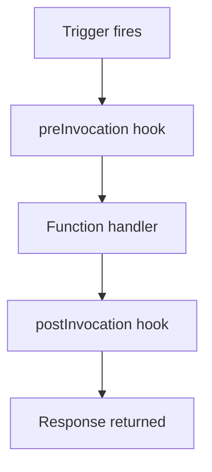

---
content_sources:
  references:
    - type: mslearn-adapted
      url: https://learn.microsoft.com/en-us/azure/azure-functions/functions-reference-node
  diagrams:
    - id: architecture
      type: flowchart
      source: self-generated
      justification: Flow view of architecture, synthesized from Microsoft Learn documentation cited on this page.
      based_on:
        - https://learn.microsoft.com/en-us/azure/azure-functions/functions-reference-node
---
# Middleware

The Node.js v4 programming model provides **invocation hooks** that run before and after every function execution. Hooks are the idiomatic way to add cross-cutting behavior — logging, timing, enrichment, or cleanup — without repeating code in each function.

## Prerequisites

- A Node.js v4 Function App using the `@azure/functions` library.
- Hooks registered once at app startup (for example, in a module imported by your entry point).

## Architecture

<!-- diagram-id: architecture -->


## Invocation Hooks

Register `preInvocation` and `postInvocation` hooks through `app.hook`. Each callback receives a context object exposing the underlying `invocationContext`.

```javascript
const { app } = require("@azure/functions");

app.hook.preInvocation((context) => {
    context.invocationContext.log(
        `Starting ${context.invocationContext.functionName}`
    );
    // Stash state for the matching postInvocation hook.
    context.hookData.startTime = Date.now();
});

app.hook.postInvocation((context) => {
    const elapsed = Date.now() - context.hookData.startTime;
    context.invocationContext.log(
        `Finished ${context.invocationContext.functionName} in ${elapsed}ms`
    );
});
```

## Inspecting and Modifying Arguments

`preInvocation` exposes the trigger inputs through `context.inputs`; `postInvocation` exposes the return value through `context.result`, which you can overwrite.

```javascript
app.hook.postInvocation((context) => {
    // Normalize every HTTP response body shape.
    if (context.result && typeof context.result === "object") {
        context.result = {
            ...context.result,
            headers: { "x-processed-by": "functions-hook" },
        };
    }
});
```

## App-Level Hooks

`appStart` and `appTerminate` run once per worker process — ideal for warming shared clients or flushing telemetry.

```javascript
app.hook.appStart((context) => {
    context.hookData.startedAt = new Date().toISOString();
});

app.hook.appTerminate(() => {
    // Flush buffers, close pooled connections.
});
```

| Element | Explanation |
|---|---|
| `app.hook.preInvocation(fn)` | Runs before each function execution; can read/modify `context.inputs`. |
| `app.hook.postInvocation(fn)` | Runs after each execution; can read/modify `context.result`. |
| `context.invocationContext` | The same context passed to the function (`functionName`, `log`, etc.). |
| `context.hookData` | Per-invocation scratch space shared between pre and post hooks. |
| `app.hook.appStart` / `appTerminate` | Run once per worker process lifecycle. |

!!! note "Hooks are not per-function"
    A registered hook runs for **every** function in the app. Branch inside the hook on `context.invocationContext.functionName` if you need function-specific behavior.

## See Also

- [Dependency Injection](dependency-injection.md)
- [HTTP API](http-api.md)

## Sources

- [Azure Functions Node.js developer guide (Microsoft Learn)](https://learn.microsoft.com/en-us/azure/azure-functions/functions-reference-node)
