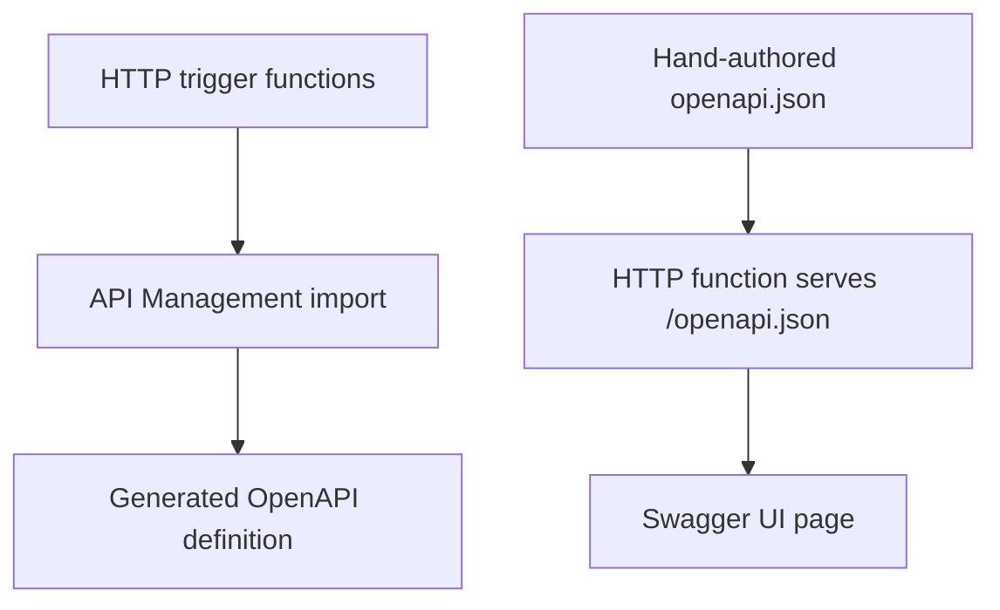

---
content_sources:
  references:
    - type: mslearn-adapted
      url: https://learn.microsoft.com/en-us/azure/azure-functions/functions-openapi-definition
  diagrams:
    - id: architecture
      type: flowchart
      source: self-generated
      justification: Flow view of architecture, synthesized from Microsoft Learn documentation cited on this page.
      based_on:
        - https://learn.microsoft.com/en-us/azure/azure-functions/functions-openapi-definition
---
# OpenAPI and Swagger

Unlike the .NET isolated worker, the Node.js v4 model has no first-class, Microsoft-supported OpenAPI extension that generates a spec from your handler registrations. The idiomatic approaches are: (1) let Azure API Management generate the OpenAPI definition when you import your HTTP endpoints, and (2) hand-author an `openapi.json` document and serve it — plus optionally a Swagger UI — from an HTTP function.

## Architecture

<!-- diagram-id: architecture -->


## Option 1: Generate via API Management

Azure API Management can import your HTTP-triggered function endpoints and produce an OpenAPI definition. This works for function apps in any supported language, including Node.js. In the portal, open your function app, select **API Management**, create or link an instance, then **Link API** to import the endpoints and **Download OpenAPI definition**.

This is the lowest-effort path when you already front your functions with API Management.

## Option 2: Serve a Hand-Authored Spec

Keep an `openapi.json` file in your project and serve it from an HTTP function. This gives you a versioned, source-controlled contract without a code-generation dependency.

```javascript
const { app } = require("@azure/functions");
const openApiSpec = require("../openapi.json");

app.http("openapi", {
    methods: ["GET"],
    authLevel: "anonymous",
    route: "openapi.json",
    handler: async () => ({
        jsonBody: openApiSpec,
    }),
});
```

## Serve Swagger UI

Serve a minimal HTML page from another HTTP function that loads Swagger UI from a CDN and points it at the spec endpoint.

```javascript
const swaggerHtml = `<!DOCTYPE html>
<html>
  <head><link rel="stylesheet" href="https://cdn.jsdelivr.net/npm/swagger-ui-dist/swagger-ui.css"></head>
  <body>
    <div id="swagger-ui"></div>
    <script src="https://cdn.jsdelivr.net/npm/swagger-ui-dist/swagger-ui-bundle.js"></script>
    <script>
      window.onload = () => SwaggerUIBundle({ url: "/api/openapi.json", dom_id: "#swagger-ui" });
    </script>
  </body>
</html>`;

app.http("docs", {
    methods: ["GET"],
    authLevel: "anonymous",
    route: "docs",
    handler: async () => ({
        body: swaggerHtml,
        headers: { "Content-Type": "text/html" },
    }),
});
```

!!! note "Keep the spec in sync"
    Because the spec is hand-authored, it can drift from your actual routes. Add a contract test that loads `openapi.json` and asserts every documented path has a matching registered handler.

## See Also

- [HTTP API Patterns](http-api.md)
- [HTTP Authentication](http-auth.md)

## Sources

- [Expose serverless APIs from HTTP endpoints using Azure API Management (Microsoft Learn)](https://learn.microsoft.com/en-us/azure/azure-functions/functions-openapi-definition)
