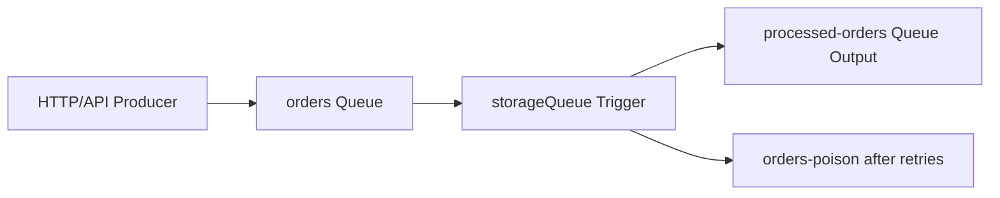

---
content_sources:
  - type: mslearn-adapted
    url: https://learn.microsoft.com/azure/azure-functions/functions-bindings-storage-queue
  - type: mslearn-adapted
    url: https://learn.microsoft.com/azure/azure-functions/functions-bindings-error-pages
---

# Queue Processing

This recipe shows real queue-triggered background processing with queue output bindings, host defaults, and poison queue behavior in Node.js v4.

## Architecture

<!-- diagram-id: architecture -->


## Prerequisites

Create queues:

```bash
az storage queue create \
  --account-name $STORAGE_NAME \
  --name orders

az storage queue create \
  --account-name $STORAGE_NAME \
  --name processed-orders
```

Queue listener defaults in `host.json`:

```json
{
  "version": "2.0",
  "extensionBundle": {
    "id": "Microsoft.Azure.Functions.ExtensionBundle",
    "version": "[4.*, 5.0.0)"
  },
  "extensions": {
    "queues": {
      "maxPollingInterval": "00:01:00",
      "visibilityTimeout": "00:00:00"
    }
  }
}
```

## Working Node.js v4 Code

```javascript
const { app, output } = require("@azure/functions");

const processedOrdersOutput = output.storageQueue({
  queueName: "processed-orders",
  connection: "AzureWebJobsStorage"
});

app.storageQueue("processOrder", {
  queueName: "orders",
  connection: "AzureWebJobsStorage",
  extraOutputs: [processedOrdersOutput],
  handler: async (queueItem, context) => {
    if (!queueItem.orderId || !queueItem.customerId) {
      throw new Error("Invalid message: orderId and customerId are required.");
    }

    const processed = {
      orderId: queueItem.orderId,
      customerId: queueItem.customerId,
      status: "Processed",
      processedUtc: new Date().toISOString()
    };

    context.extraOutputs.set(processedOrdersOutput, processed);
    context.log("Order processed", { orderId: queueItem.orderId });
  }
});
```

When the handler keeps failing for the same message, Azure Functions moves the message to `orders-poison` after the configured `maxDequeueCount`.

## Implementation Notes

- Use queue triggers for at-least-once asynchronous work and design handlers to be idempotent.
- Keep message contracts small and explicit (`orderId`, `customerId`) to reduce downstream ambiguity.
- Throw errors for non-recoverable malformed payloads so poison queue triage is clear.
- Monitor both primary queue depth and `*-poison` queue depth to catch retry storms early.

## See Also
- [Node.js Recipes Index](index.md)
- [Blob Storage Patterns](blob-storage.md)
- [Troubleshooting Guide](../troubleshooting.md)

## Sources
- [Azure Queue Storage bindings for Azure Functions (Microsoft Learn)](https://learn.microsoft.com/azure/azure-functions/functions-bindings-storage-queue)
- [Azure Functions error handling and retries (Microsoft Learn)](https://learn.microsoft.com/azure/azure-functions/functions-bindings-error-pages)
