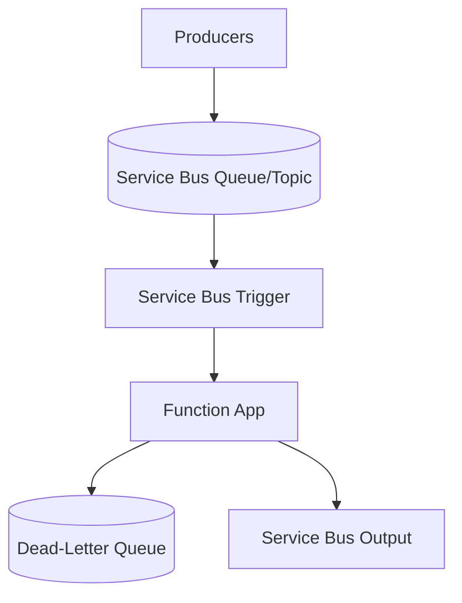

---
content_sources:
  references:
    - type: mslearn-adapted
      url: https://learn.microsoft.com/en-us/azure/azure-functions/functions-bindings-service-bus
  diagrams:
    - id: architecture
      type: flowchart
      source: self-generated
      justification: Flow view of architecture, synthesized from Microsoft Learn documentation cited on this page.
      based_on:
        - https://learn.microsoft.com/en-us/azure/azure-functions/functions-bindings-service-bus
        - https://learn.microsoft.com/en-us/azure/azure-functions/functions-bindings-service-bus-trigger
---
# Service Bus

This recipe covers integrating Azure Service Bus with Azure Functions Node.js v4 — consuming queue and topic/subscription messages, handling dead-lettering, and publishing messages with the output binding.

## Architecture

<!-- diagram-id: architecture -->


## Prerequisites

Provide the connection in app settings. A connection-string setting or an identity-based connection is supported. Identity-based connections use a setting prefix with `__fullyQualifiedNamespace`:

```bash
az functionapp config appsettings set \
  --name $APP_NAME \
  --resource-group $RG \
  --settings "ServiceBusConnection__fullyQualifiedNamespace=$NAMESPACE.servicebus.windows.net"
```

| CLI element | Explanation |
|---|---|
| Command(s) | `az functionapp config appsettings set` |
| Key flags | `--name`, `--resource-group`, `--settings` |
| Variables | `$APP_NAME`, `$RG`, `$NAMESPACE` |
| Expected result | Azure CLI returns the updated app settings as JSON; confirm the setting is present before continuing. |

When using an identity-based connection, grant the function app's managed identity the **Azure Service Bus Data Receiver** (and **Data Sender** for output) role on the namespace.

## Queue Trigger

Message settlement is automatic: completing the handler settles the message, and throwing abandons it. After `maxDeliveryCount` the message is dead-lettered.

```javascript
const { app, output } = require("@azure/functions");

const ordersOutput = output.serviceBusQueue({
  queueName: "orders",
  connection: "ServiceBusConnection"
});

app.serviceBusQueue("processOrder", {
  queueName: "orders",
  connection: "ServiceBusConnection",
  handler: (message, context) => {
    context.log("Message ID:", context.triggerMetadata.messageId);
    context.log("Delivery count:", context.triggerMetadata.deliveryCount);
    context.log("Payload:", message);
    // Throwing here abandons the message; after maxDeliveryCount it is
    // moved to the dead-letter subqueue automatically.
  }
});
```

## Topic/Subscription Trigger

```javascript
app.serviceBusTopic("processEvent", {
  topicName: "events",
  subscriptionName: "billing",
  connection: "ServiceBusConnection",
  handler: (message, context) => {
    context.log("Subscription message:", message);
  }
});
```

## Output Binding: Publish Messages

```javascript
app.http("enqueue", {
  methods: ["POST"],
  authLevel: "function",
  extraOutputs: [ordersOutput],
  handler: async (request, context) => {
    const body = await request.json();
    context.extraOutputs.set(ordersOutput, body);
    return { status: 202, jsonBody: { status: "enqueued" } };
  }
});
```

## Host Configuration

```json
{
  "version": "2.0",
  "extensions": {
    "serviceBus": {
      "maxConcurrentCalls": 16,
      "prefetchCount": 0,
      "maxAutoLockRenewalDuration": "00:05:00"
    }
  }
}
```

| Setting | Description |
|---------|-------------|
| `maxConcurrentCalls` | Maximum concurrent message handlers per instance |
| `prefetchCount` | Number of messages the client prefetches to reduce latency |
| `maxAutoLockRenewalDuration` | How long the runtime keeps renewing the message lock during processing |

!!! note "Sessions and ordering"
    Enable `isSessionsEnabled: true` on the trigger to process session-enabled queues/subscriptions, which guarantees ordered, single-consumer processing per session ID.

## See Also

- [Queue](queue.md)
- [Event Hubs](event-hub.md)

## Sources

- [Azure Service Bus bindings for Azure Functions (Microsoft Learn)](https://learn.microsoft.com/en-us/azure/azure-functions/functions-bindings-service-bus)
- [Azure Service Bus trigger for Azure Functions (Microsoft Learn)](https://learn.microsoft.com/en-us/azure/azure-functions/functions-bindings-service-bus-trigger)
- [Azure Service Bus output binding for Azure Functions (Microsoft Learn)](https://learn.microsoft.com/en-us/azure/azure-functions/functions-bindings-service-bus-output)
