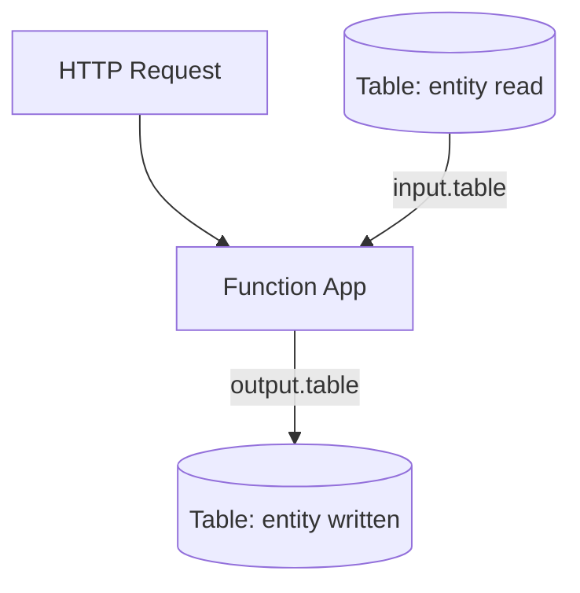

---
content_sources:
  references:
    - type: mslearn-adapted
      url: https://learn.microsoft.com/en-us/azure/azure-functions/functions-bindings-storage-table
  diagrams:
    - id: architecture
      type: flowchart
      source: self-generated
      justification: Flow view of architecture, synthesized from Microsoft Learn documentation cited on this page.
      based_on:
        - https://learn.microsoft.com/en-us/azure/azure-functions/functions-bindings-storage-table
        - https://learn.microsoft.com/en-us/azure/azure-functions/functions-bindings-storage-table-output
---
# Table Storage

This recipe covers reading and writing entities in Azure Table Storage from Azure Functions Node.js v4 using the table input and output bindings.

## Architecture

<!-- diagram-id: architecture -->


## Prerequisites

Provide the connection in app settings. A connection string or an identity-based connection is supported. Identity-based connections use a `__tableServiceUri` suffix:

```bash
az functionapp config appsettings set \
  --name $APP_NAME \
  --resource-group $RG \
  --settings "TableConnection__tableServiceUri=https://$STORAGE_NAME.table.core.windows.net"
```

| CLI element | Explanation |
|---|---|
| Command(s) | `az functionapp config appsettings set` |
| Key flags | `--name`, `--resource-group`, `--settings` |
| Variables | `$APP_NAME`, `$RG`, `$STORAGE_NAME` |
| Expected result | Azure CLI returns the updated app settings as JSON; confirm the setting is present before continuing. |

For an identity-based connection, grant the managed identity **Storage Table Data Reader** (input) and **Storage Table Data Contributor** (output).

!!! note "Output binding creates new entities only"
    The table output binding only creates new entities. To update or delete an entity, use the `@azure/data-tables` SDK directly with a `TableClient`.

## Output Binding: Write Entities

Every entity requires a `PartitionKey` and a `RowKey`.

```javascript
const { app, output } = require("@azure/functions");

const tableOutput = output.table({
  tableName: "messages",
  connection: "TableConnection"
});

app.http("createMessages", {
  methods: ["POST"],
  authLevel: "function",
  extraOutputs: [tableOutput],
  handler: async (request, context) => {
    const body = await request.json();
    const rows = (body.items ?? []).map((item, i) => ({
      PartitionKey: "message",
      RowKey: `${Date.now()}-${i}`,
      Text: item.text ?? ""
    }));

    context.extraOutputs.set(tableOutput, rows);
    return { status: 201, jsonBody: { written: rows.length } };
  }
});
```

## Input Binding: Read an Entity

Bind by partition key and row key to read a single entity.

```javascript
const { app, input } = require("@azure/functions");

const tableInput = input.table({
  tableName: "messages",
  connection: "TableConnection",
  partitionKey: "message",
  rowKey: "{rowKey}"
});

app.http("getMessage", {
  methods: ["GET"],
  route: "messages/{rowKey}",
  authLevel: "function",
  extraInputs: [tableInput],
  handler: (request, context) => {
    const entity = context.extraInputs.get(tableInput);
    if (!entity) {
      return { status: 404, jsonBody: { error: "Not found" } };
    }
    return { status: 200, jsonBody: entity };
  }
});
```

## See Also

- [Blob Storage](blob-storage.md)
- [Queue](queue.md)
- [Managed Identity](managed-identity.md)

## Sources

- [Azure Table storage bindings for Azure Functions (Microsoft Learn)](https://learn.microsoft.com/en-us/azure/azure-functions/functions-bindings-storage-table)
- [Azure Tables output binding for Azure Functions (Microsoft Learn)](https://learn.microsoft.com/en-us/azure/azure-functions/functions-bindings-storage-table-output)
- [Azure Tables input binding for Azure Functions (Microsoft Learn)](https://learn.microsoft.com/en-us/azure/azure-functions/functions-bindings-storage-table-input)
