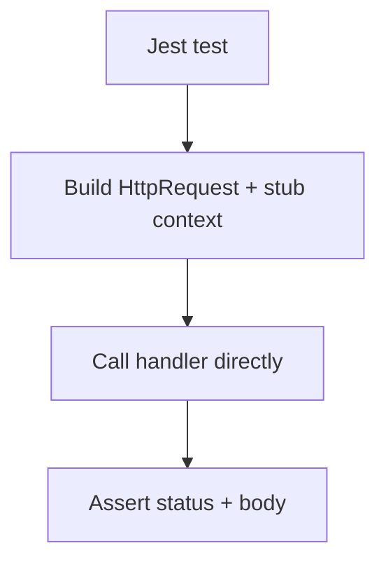

---
content_sources:
  references:
    - type: mslearn-adapted
      url: https://learn.microsoft.com/en-us/azure/azure-functions/functions-reference-node
  diagrams:
    - id: architecture
      type: flowchart
      source: self-generated
      justification: Flow view of architecture, synthesized from Microsoft Learn documentation cited on this page.
      based_on:
        - https://learn.microsoft.com/en-us/azure/azure-functions/functions-reference-node
---
# Unit Testing

In the Node.js v4 model a function handler is a plain async function that receives an `HttpRequest` and an `InvocationContext`. You test it by calling the handler directly with a constructed request and a stub context — no Functions host required. This page uses Jest; the same approach works with the built-in `node:test` runner.

## Prerequisites

- A Node.js v4 Function App using `@azure/functions`.
- A test runner installed (`npm install --save-dev jest`).

## Architecture

<!-- diagram-id: architecture -->


## Testable Handler

Export the handler so tests can import it, and register it separately with `app.http`.

```javascript
const { app } = require("@azure/functions");

async function greet(request, context) {
    const name = request.query.get("name") || "world";
    return { status: 200, body: `hello ${name}` };
}

app.http("greet", { methods: ["GET"], handler: greet });

module.exports = { greet };
```

## Test the HTTP Trigger

Construct an `HttpRequest` and a minimal context stub, then assert on the returned response object.

```javascript
const { HttpRequest } = require("@azure/functions");
const { greet } = require("../src/functions/greet");

function stubContext() {
    return { log: () => {}, invocationId: "test" };
}

test("greets with name", async () => {
    const request = new HttpRequest({
        method: "GET",
        url: "http://localhost/api/greet?name=ada",
    });

    const response = await greet(request, stubContext());

    expect(response.status).toBe(200);
    expect(response.body).toBe("hello ada");
});

test("greets default", async () => {
    const request = new HttpRequest({ method: "GET", url: "http://localhost/api/greet" });
    const response = await greet(request, stubContext());
    expect(response.body).toBe("hello world");
});
```

## Mocking Dependencies

Replace shared clients (see [Dependency Injection](dependency-injection.md)) with `jest.mock` or by injecting a fake into a factory.

```javascript
jest.mock("../src/tableClient", () => ({
    createEntity: jest.fn().mockResolvedValue(undefined),
}));
```

| Element | Explanation |
|---|---|
| `new HttpRequest({...})` | Builds the trigger input without a running host. |
| Context stub | A minimal object providing `log` and any fields the handler reads. |
| `jest.mock` | Replaces module-level clients with test doubles. |

!!! tip "Integration testing"
    To exercise routing, `host.json`, and bindings end to end, run `func start` and issue real HTTP requests. The unit tests above stay host-free for speed.

## See Also

- [Dependency Injection](dependency-injection.md)
- [HTTP API Patterns](http-api.md)

## Sources

- [Azure Functions Node.js developer guide (Microsoft Learn)](https://learn.microsoft.com/en-us/azure/azure-functions/functions-reference-node)
