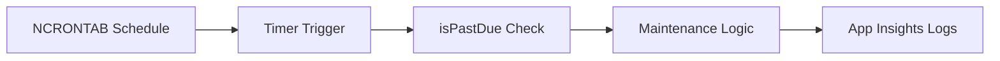

# Timer Jobs

This recipe uses `app.timer()` with NCRONTAB scheduling, demonstrates the `isPastDue` pattern, and calls out hosting-plan time zone behavior.

## Architecture



## Prerequisites

Use extension bundle v4:

```json
{
  "version": "2.0",
  "extensionBundle": {
    "id": "Microsoft.Azure.Functions.ExtensionBundle",
    "version": "[4.*, 5.0.0)"
  }
}
```

Optional time zone configuration:

```bash
az functionapp config appsettings set \
  --name $APP_NAME \
  --resource-group $RG \
  --settings "WEBSITE_TIME_ZONE=Korea Standard Time"
```

`WEBSITE_TIME_ZONE` support:
- Windows plans: supported
- Linux Premium and Dedicated: supported
- Linux Consumption and Flex Consumption: not supported

## Working Node.js v4 Code

```javascript
const { app } = require("@azure/functions");

app.timer("nightlyReconciliation", {
  schedule: "0 0 2 * * *",
  runOnStartup: false,
  useMonitor: true,
  handler: async (timer, context) => {
    if (timer.isPastDue) {
      context.warn("Timer invocation is running later than scheduled.", {
        scheduleStatus: timer.scheduleStatus
      });
    }

    context.log("Starting nightly reconciliation", {
      last: timer.scheduleStatus?.last,
      next: timer.scheduleStatus?.next
    });

    // Execute maintenance workload here.
  }
});
```

## Implementation Notes

- Timer expressions are NCRONTAB (`{second} {minute} {hour} {day} {month} {day-of-week}`), not classic 5-field cron.
- `timer.isPastDue` is the signal for delayed execution due to scale or host restart conditions.
- Keep jobs idempotent; timers can overlap with retries after transient failures.
- On Linux Consumption/Flex, use UTC schedules because `WEBSITE_TIME_ZONE` is unsupported.

## See Also
- [Node.js Recipes Index](index.md)
- [Queue Processing](queue.md)
- [Node.js Troubleshooting](../troubleshooting.md)

## Sources
- [Timer trigger for Azure Functions (Microsoft Learn)](https://learn.microsoft.com/azure/azure-functions/functions-bindings-timer)
- [Azure Functions app settings reference (Microsoft Learn)](https://learn.microsoft.com/azure/azure-functions/functions-app-settings)
