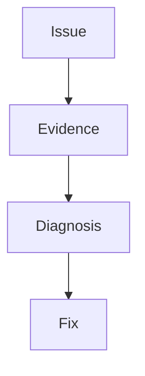

---
content_sources:

  - type: mslearn-adapted
    url: https://learn.microsoft.com/en-us/azure/azure-functions/functions-reference-node
  - type: mslearn-adapted
    url: https://learn.microsoft.com/en-us/azure/azure-functions/functions-diagnostics
content_validation:
  status: verified
  last_reviewed: '2026-05-23'
  reviewer: agent
  core_claims:
    - claim: This page uses Microsoft Learn as the primary source basis for its Azure-specific guidance.
      source: https://learn.microsoft.com/en-us/azure/azure-functions/functions-reference-node
      verified: true
---
# Troubleshooting

This runbook-style reference captures common Node.js v4 issues with practical checks and resolutions.

## Topic/Command Groups

<!-- diagram-id: topic-command-groups -->


### Functions not discovered

- Confirm `FUNCTIONS_WORKER_RUNTIME=node`.
- Check startup logs for module resolution errors.

```bash
az functionapp log tail --name $APP_NAME --resource-group $RG
```

| CLI element | Explanation |
|---|---|
| Command(s) | `az functionapp log tail` |
| Key flags | `--name`, `--resource-group` |
| Variables | `$APP_NAME`, `$RG` |
| Expected result | Azure CLI completes successfully and returns JSON, table, or no output depending on the command; verify the next documented check before continuing. |


### Runtime version mismatch

- Validate runtime and Node settings.
- For Linux apps, validate `siteConfig.linuxFxVersion` in addition to app settings.

```bash
az functionapp config appsettings list --name $APP_NAME --resource-group $RG --query "[?name=='WEBSITE_NODE_DEFAULT_VERSION' || name=='FUNCTIONS_EXTENSION_VERSION']"
az functionapp config show --name $APP_NAME --resource-group $RG --query "linuxFxVersion"
```

| CLI element | Explanation |
|---|---|
| Command(s) | `az functionapp config appsettings list`, `az functionapp config show` |
| Key flags | `--name`, `--resource-group`, `--query` |
| Variables | `$APP_NAME`, `$RG` |
| Expected result | Azure CLI applies the configuration change; confirm the returned JSON or follow-up query shows the expected value. |


### Out-of-memory under load

- Set `languageWorkers__node__arguments=--max-old-space-size=4096`.
- Reduce dependency footprint and stream large payloads.

### Trigger binding failures

- Check `AzureWebJobsStorage` and related connection settings.
- Validate queue or blob names and identity permissions.

## See Also
- [Environment Variables](environment-variables.md)
- [host.json Reference](host-json.md)
- [Operations: Monitoring](../../operations/monitoring.md)

## Sources
- [Azure Functions Node.js developer guide (Microsoft Learn)](https://learn.microsoft.com/en-us/azure/azure-functions/functions-reference-node)
- [Azure Functions diagnostics (Microsoft Learn)](https://learn.microsoft.com/en-us/azure/azure-functions/functions-diagnostics)
