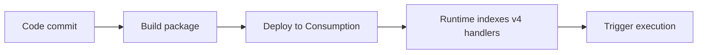

# 02 - First Deploy (Consumption)

Provision resources and publish your first Node.js v4 function app.

## Prerequisites

| Tool | Version | Purpose |
|---|---|---|
| Node.js | 20+ | Local runtime and package execution |
| Azure Functions Core Tools | v4 | Local host and publishing |
| Azure CLI | 2.61+ | Azure resource provisioning and management |

!!! info "Plan basics"
    Consumption scales to zero automatically, does not support VNet integration, and defaults to a 5-minute timeout with a 10-minute maximum.

## Steps




### Step 1 - Create resource group

```bash
az group create --name $RG --location $LOCATION
```

### Step 2 - Create storage and function app

```bash
az storage account create --name $STORAGE_NAME --resource-group $RG --location $LOCATION --sku Standard_LRS
az functionapp create --name $APP_NAME --resource-group $RG --storage-account $STORAGE_NAME --consumption-plan-location $LOCATION --runtime node --runtime-version 20 --functions-version 4 --os-type Linux
```

### Step 3 - Publish app

```bash
func azure functionapp publish $APP_NAME
```

### Step 4 - Validate deployment

```bash
az functionapp function list --name $APP_NAME --resource-group $RG --output table
```


### Plan-specific notes

- Use `--consumption-plan-location` for app creation and expect cold starts under idle periods.
- Use long-form CLI flags for maintainable runbooks.
- Keep `FUNCTIONS_WORKER_RUNTIME=node` across all environments.

## Expected Output

```text
Functions:
    helloHttp: [GET] http://localhost:7071/api/hello/{name?}
```


## See Also
- [Tutorial Overview & Plan Chooser](../index.md)
- [Node.js Language Guide](../../index.md)
- [Platform: Hosting Plans](../../../../platform/hosting.md)
- [Operations: Deployment](../../../../operations/deployment.md)
- [Recipes Index](../../recipes/index.md)

## Sources
- [Azure Functions Node.js developer guide (Microsoft Learn)](https://learn.microsoft.com/azure/azure-functions/functions-reference-node)
- [Create your first Azure Function with Core Tools (Microsoft Learn)](https://learn.microsoft.com/azure/azure-functions/create-first-function-cli-node)
- [Azure Functions hosting options (Microsoft Learn)](https://learn.microsoft.com/azure/azure-functions/functions-scale)
