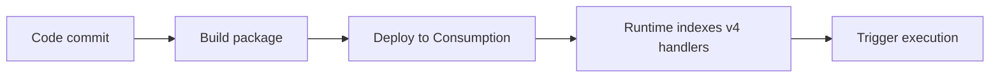

# 03 - Configuration (Consumption)

Manage environment settings, runtime options, and host behavior per environment.

## Prerequisites

| Tool | Version | Purpose |
|---|---|---|
| Node.js | 20+ | Local runtime and package execution |
| Azure Functions Core Tools | v4 | Local host and publishing |
| Azure CLI | 2.61+ | Azure resource provisioning and management |

!!! info "Plan basics"
    Consumption scales to zero automatically, does not support VNet integration, and defaults to a 5-minute timeout with a 10-minute maximum.

## What You'll Build

You will configure runtime and host settings for a Linux Consumption Function App and verify the effective app configuration.

## Steps




### Step 1 - Configure app settings

```bash
az functionapp config appsettings set --name $APP_NAME --resource-group $RG --settings "FUNCTIONS_WORKER_RUNTIME=node" "FUNCTIONS_EXTENSION_VERSION=~4" "languageWorkers__node__arguments=--max-old-space-size=4096"
az functionapp config set --name $APP_NAME --resource-group $RG --linux-fx-version "Node|20"
```

!!! note "Node version setting on Linux Consumption"
    Linux Consumption uses `linuxFxVersion` for runtime selection.
    Use `az functionapp config set --name $APP_NAME --resource-group $RG --linux-fx-version "Node|20"`.

### Step 2 - Configure host timeout

```json
{
  "version": "2.0",
  "functionTimeout": "00:10:00"
}
```

### Step 3 - Validate effective config

```bash
az functionapp config appsettings list --name $APP_NAME --resource-group $RG --output json
```


### Plan-specific notes

- Use `--consumption-plan-location` for app creation and expect cold starts under idle periods.
- Use long-form CLI flags for maintainable runbooks.
- Keep `FUNCTIONS_WORKER_RUNTIME=node` across all environments.

## Verification

```json
[
  {
    "name": "FUNCTIONS_WORKER_RUNTIME",
    "slotSetting": false,
    "value": "node"
  },
  {
    "name": "FUNCTIONS_EXTENSION_VERSION",
    "slotSetting": false,
    "value": "~4"
  },
  {
    "name": "languageWorkers__node__arguments",
    "slotSetting": false,
    "value": "--max-old-space-size=4096"
  }
]
```


## See Also
- [Tutorial Overview & Plan Chooser](../index.md)
- [Node.js Language Guide](../../index.md)
- [Platform: Hosting Plans](../../../../platform/hosting.md)
- [Operations: Deployment](../../../../operations/deployment.md)
- [Recipes Index](../../recipes/index.md)

## Sources
- [Azure Functions Node.js developer guide (Microsoft Learn)](https://learn.microsoft.com/azure/azure-functions/functions-reference-node)
- [Create your first Azure Function with Core Tools (Microsoft Learn)](https://learn.microsoft.com/azure/azure-functions/create-first-function-cli-node)
- [Azure Functions hosting options (Microsoft Learn)](https://learn.microsoft.com/azure/azure-functions/functions-scale)
