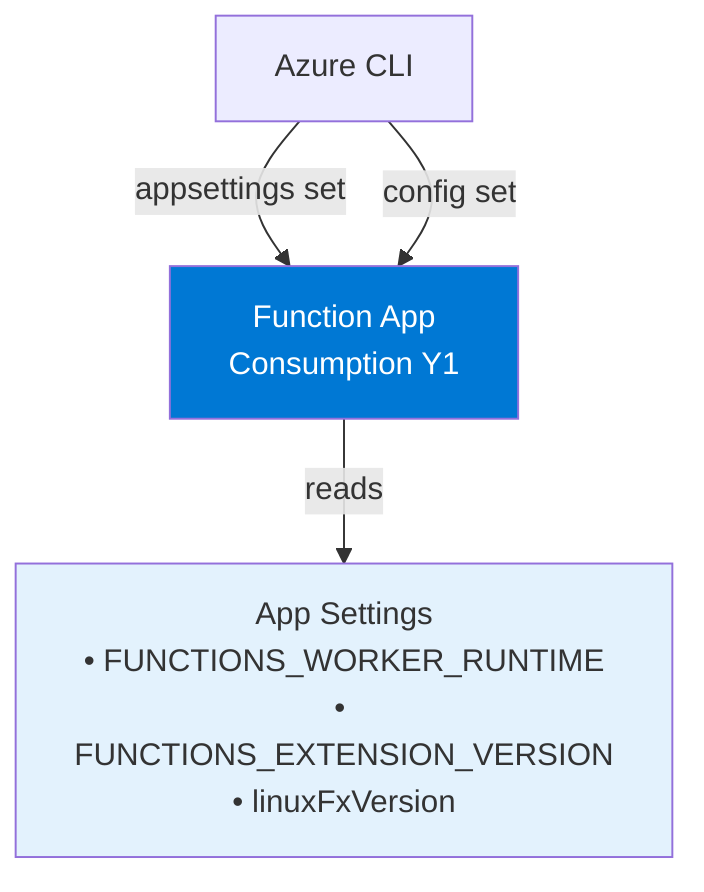
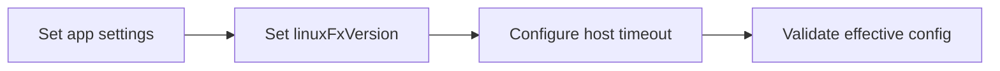

---
hide:
  - toc
validation:
  az_cli:
    last_tested: 2026-04-10
    cli_version: "2.83.0"
    core_tools_version: "4.8.0"
    result: pass
  bicep:
    last_tested: null
    result: not_tested
content_sources:
  - type: mslearn-adapted
    url: https://learn.microsoft.com/azure/azure-functions/functions-reference-node
  - type: mslearn-adapted
    url: https://learn.microsoft.com/azure/azure-functions/functions-app-settings
  - type: mslearn-adapted
    url: https://learn.microsoft.com/azure/azure-functions/functions-scale
---

# 03 - Configuration (Consumption)

Manage environment settings, runtime options, and host behavior per environment.

## Prerequisites

| Tool | Version | Purpose |
|------|---------|---------|
| Node.js | 20+ | Local runtime and package execution |
| Azure Functions Core Tools | v4 | Local host and publishing |
| Azure CLI | 2.61+ | Azure resource provisioning and management |

!!! info "Consumption plan basics"
    Consumption (Y1) is serverless with scale-to-zero, up to 200 instances, 1.5 GB memory per instance, and a default 5-minute timeout (max 10 minutes).

## What You'll Build

You will configure runtime and host settings for a Linux Consumption Function App and verify the effective app configuration.

!!! info "Infrastructure Context"
    **Plan**: Consumption (Y1) | **Network**: Public internet only | **VNet**: ❌ Not supported

    This tutorial modifies app settings on an existing Consumption function app.

    <!-- diagram-id: what-you-ll-build -->


<!-- diagram-id: what-you-ll-build-2 -->


## Steps

### Step 1 - Set variables (if not already set)

```bash
export RG="rg-func-node-consumption-demo"
export APP_NAME="<your-function-app-name>"
export LOCATION="koreacentral"
```

### Step 2 - Configure app settings

```bash
az functionapp config appsettings set \
  --name "$APP_NAME" \
  --resource-group "$RG" \
  --settings \
    "FUNCTIONS_WORKER_RUNTIME=node" \
    "FUNCTIONS_EXTENSION_VERSION=~4" \
    "languageWorkers__node__arguments=--max-old-space-size=4096"
```

### Step 3 - Set Node.js runtime version

```bash
az functionapp config set \
  --name "$APP_NAME" \
  --resource-group "$RG" \
  --linux-fx-version "Node|20"
```

!!! note "Node version setting on Linux Consumption"
    Linux Consumption uses `linuxFxVersion` for runtime selection. The format is `Node|20` (case-sensitive pipe separator). Verify with `az functionapp config show`.

### Step 4 - Configure host timeout

Update `host.json` with the maximum timeout for Consumption:

```json
{
  "version": "2.0",
  "functionTimeout": "00:10:00"
}
```

!!! warning "Consumption timeout limit"
    Consumption plan has a hard maximum of 10 minutes (`00:10:00`). Setting a higher value will cause a deployment error. Premium and Dedicated plans support longer timeouts.

### Step 5 - Validate effective config

```bash
az functionapp config appsettings list \
  --name "$APP_NAME" \
  --resource-group "$RG" \
  --output table
```

### Step 6 - Review Consumption-specific notes

- Use `--consumption-plan-location` for app creation and expect cold starts under idle periods.
- Use long-form CLI flags for maintainable runbooks.
- Keep `FUNCTIONS_WORKER_RUNTIME=node` across all environments.

## Verification

The `appsettings list` command should show at least these three settings:

```json
[
  {
    "name": "FUNCTIONS_WORKER_RUNTIME",
    "slotSetting": false,
    "value": "node"
  },
  {
    "name": "FUNCTIONS_EXTENSION_VERSION",
    "slotSetting": false,
    "value": "~4"
  },
  {
    "name": "languageWorkers__node__arguments",
    "slotSetting": false,
    "value": "--max-old-space-size=4096"
  }
]
```

Verify the `linuxFxVersion` setting:

```bash
az functionapp config show \
  --name "$APP_NAME" \
  --resource-group "$RG" \
  --query "linuxFxVersion" \
  --output tsv
```

Expected output:

```text
Node|20
```

## Next Steps

> **Next:** [04 - Logging and Monitoring](04-logging-monitoring.md)

## See Also

- [Tutorial Overview & Plan Chooser](../index.md)
- [Node.js Language Guide](../../index.md)
- [Platform: Hosting Plans](../../../../platform/hosting.md)
- [Operations: Deployment](../../../../operations/deployment.md)
- [Recipes Index](../../recipes/index.md)

## Sources

- [Azure Functions Node.js developer guide (Microsoft Learn)](https://learn.microsoft.com/azure/azure-functions/functions-reference-node)
- [Azure Functions app settings reference (Microsoft Learn)](https://learn.microsoft.com/azure/azure-functions/functions-app-settings)
- [Azure Functions hosting options (Microsoft Learn)](https://learn.microsoft.com/azure/azure-functions/functions-scale)
