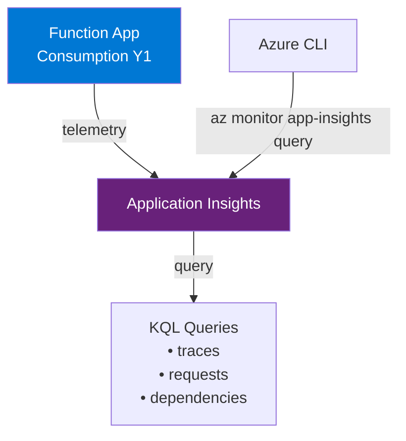
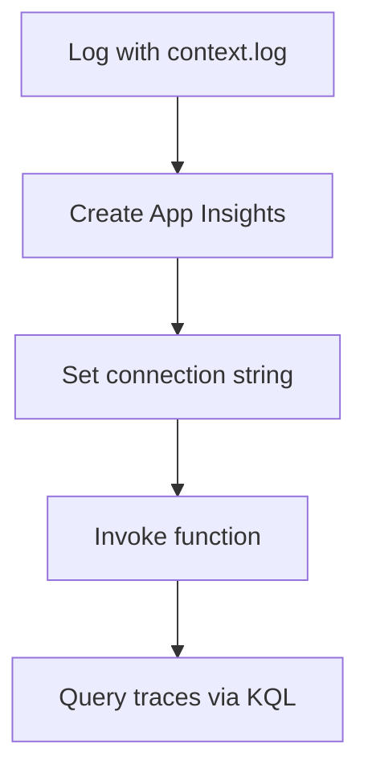

---
validation:
  az_cli:
    last_tested: 2026-04-10
    cli_version: "2.83.0"
    core_tools_version: "4.8.0"
    result: pass
  bicep:
    last_tested: null
    result: not_tested
content_sources:
  - type: mslearn-adapted
    url: https://learn.microsoft.com/azure/azure-functions/functions-reference-node
  - type: mslearn-adapted
    url: https://learn.microsoft.com/azure/azure-functions/functions-monitoring
  - type: mslearn-adapted
    url: https://learn.microsoft.com/azure/azure-functions/configure-monitoring
---

# 04 - Logging and Monitoring (Consumption)

Capture structured logs, connect Application Insights, and validate telemetry queries.

## Prerequisites

| Tool | Version | Purpose |
|------|---------|---------|
| Node.js | 20+ | Local runtime and package execution |
| Azure Functions Core Tools | v4 | Local host and publishing |
| Azure CLI | 2.61+ | Azure resource provisioning and management |

!!! info "Consumption plan basics"
    Consumption (Y1) is serverless with scale-to-zero, up to 200 instances, 1.5 GB memory per instance, and a default 5-minute timeout (max 10 minutes).

## What You'll Build

You will emit structured logs from Node.js v4 handlers, connect Application Insights, and verify telemetry queries return data.

!!! info "Infrastructure Context"
    **Plan**: Consumption (Y1) | **Network**: Public internet only | **VNet**: ❌ Not supported

    This tutorial adds Application Insights monitoring to your deployed function app.

    <!-- diagram-id: what-you-ll-build -->


<!-- diagram-id: what-you-ll-build-2 -->


## Steps

### Step 1 - Set variables (if not already set)

```bash
export RG="rg-func-node-consumption-demo"
export APP_NAME="<your-function-app-name>"
export LOCATION="koreacentral"
```

### Step 2 - Understand structured logging

The Node.js v4 model uses `context.log()` for structured logging:

```javascript
const { app } = require('@azure/functions');

app.http('status', {
    methods: ['GET'],
    handler: async (_request, context) => {
        context.log('status endpoint called');
        context.warn('this is a warning');
        context.error('this is an error');
        return { status: 200, jsonBody: { status: 'ok' } };
    }
});
```

!!! note "Log levels"
    `context.log()` maps to Information level, `context.warn()` to Warning, and `context.error()` to Error in Application Insights. These appear in the `traces` table.

### Step 3 - Create Application Insights (if not auto-created)

```bash
az monitor app-insights component create \
  --app "$APP_NAME-ai" \
  --location "$LOCATION" \
  --resource-group "$RG" \
  --kind web
```

!!! note "Auto-created by `az functionapp create`"
    Since Azure CLI 2.80+, `az functionapp create` automatically provisions an Application Insights resource. Check with `az functionapp config appsettings list` for `APPLICATIONINSIGHTS_CONNECTION_STRING`. If it already exists, skip this step.

### Step 4 - Set the connection string (if needed)

```bash
AI_CONN=$(az monitor app-insights component show \
  --app "$APP_NAME-ai" \
  --resource-group "$RG" \
  --query "connectionString" \
  --output tsv)

az functionapp config appsettings set \
  --name "$APP_NAME" \
  --resource-group "$RG" \
  --settings "APPLICATIONINSIGHTS_CONNECTION_STRING=$AI_CONN"
```

### Step 5 - Generate telemetry

Invoke the function to generate log entries:

```bash
curl --request GET "https://$APP_NAME.azurewebsites.net/api/health"
curl --request GET "https://$APP_NAME.azurewebsites.net/api/hello/TelemetryTest"
curl --request GET "https://$APP_NAME.azurewebsites.net/api/requests/log-levels"
```

!!! warning "Telemetry ingestion delay"
    Application Insights typically has a 2-5 minute ingestion delay for new telemetry. Wait at least 3 minutes after invoking functions before querying traces.

### Step 6 - Query traces

```bash
az monitor app-insights query \
  --app "$APP_NAME-ai" \
  --resource-group "$RG" \
  --analytics-query "traces | take 5" \
  --output json
```

### Step 7 - Review Consumption-specific notes

- Use `--consumption-plan-location` for app creation and expect cold starts under idle periods.
- Use long-form CLI flags for maintainable runbooks.
- Keep `FUNCTIONS_WORKER_RUNTIME=node` across all environments.

## Verification

The `traces | take 5` query should return rows with log messages:

```json
{
  "tables": [
    {
      "name": "PrimaryResult",
      "columns": [
        { "name": "timestamp", "type": "datetime" },
        { "name": "message", "type": "string" },
        { "name": "severityLevel", "type": "int" }
      ],
      "rows": [
        ["2026-04-10T00:20:00.0000000Z", "Handled hello for TelemetryTest", 1],
        ["2026-04-10T00:20:00.0000000Z", "Health check requested", 1]
      ]
    }
  ]
}
```

!!! tip "Severity levels"
    - `0` = Verbose
    - `1` = Information (`context.log`)
    - `2` = Warning (`context.warn`)
    - `3` = Error (`context.error`)

## Next Steps

> **Next:** [05 - Infrastructure as Code](05-infrastructure-as-code.md)

## See Also

- [Tutorial Overview & Plan Chooser](../index.md)
- [Node.js Language Guide](../../index.md)
- [Platform: Hosting Plans](../../../../platform/hosting.md)
- [Operations: Monitoring](../../../../operations/monitoring.md)
- [Recipes Index](../../recipes/index.md)

## Sources

- [Azure Functions Node.js developer guide (Microsoft Learn)](https://learn.microsoft.com/azure/azure-functions/functions-reference-node)
- [Monitor Azure Functions with Application Insights (Microsoft Learn)](https://learn.microsoft.com/azure/azure-functions/functions-monitoring)
- [Application Insights for Azure Functions (Microsoft Learn)](https://learn.microsoft.com/azure/azure-functions/configure-monitoring)
