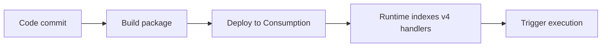

# 04 - Logging and Monitoring (Consumption)

Capture structured logs, query telemetry, and validate operational visibility.

## Prerequisites

| Tool | Version | Purpose |
|---|---|---|
| Node.js | 20+ | Local runtime and package execution |
| Azure Functions Core Tools | v4 | Local host and publishing |
| Azure CLI | 2.61+ | Azure resource provisioning and management |

!!! info "Plan basics"
    Consumption scales to zero automatically, does not support VNet integration, and defaults to a 5-minute timeout with a 10-minute maximum.

## Steps




### Step 1 - Log with context

```javascript
const { app } = require('@azure/functions');

app.http('status', {
    methods: ['GET'],
    handler: async (_request, context) => {
        context.log('status endpoint called');
        return { status: 200, jsonBody: { status: 'ok' } };
    }
});
```

### Step 2 - Enable and verify telemetry

```bash
az monitor app-insights component create --app $APP_NAME-ai --location $LOCATION --resource-group $RG --kind web
az functionapp config appsettings set --name $APP_NAME --resource-group $RG --settings "APPLICATIONINSIGHTS_CONNECTION_STRING=<connection-string>"
```

### Step 3 - Query traces

```bash
az monitor app-insights query --app $APP_NAME-ai --analytics-query "traces | take 20"
```


### Plan-specific notes

- Use `--consumption-plan-location` for app creation and expect cold starts under idle periods.
- Use long-form CLI flags for maintainable runbooks.
- Keep `FUNCTIONS_WORKER_RUNTIME=node` across all environments.

## Expected Output

```text
Functions:
    helloHttp: [GET] http://localhost:7071/api/hello/{name?}
```


## See Also
- [Tutorial Overview & Plan Chooser](../index.md)
- [Node.js Language Guide](../../index.md)
- [Platform: Hosting Plans](../../../../platform/hosting.md)
- [Operations: Deployment](../../../../operations/deployment.md)
- [Recipes Index](../../recipes/index.md)

## Sources
- [Azure Functions Node.js developer guide (Microsoft Learn)](https://learn.microsoft.com/azure/azure-functions/functions-reference-node)
- [Create your first Azure Function with Core Tools (Microsoft Learn)](https://learn.microsoft.com/azure/azure-functions/create-first-function-cli-node)
- [Azure Functions hosting options (Microsoft Learn)](https://learn.microsoft.com/azure/azure-functions/functions-scale)
