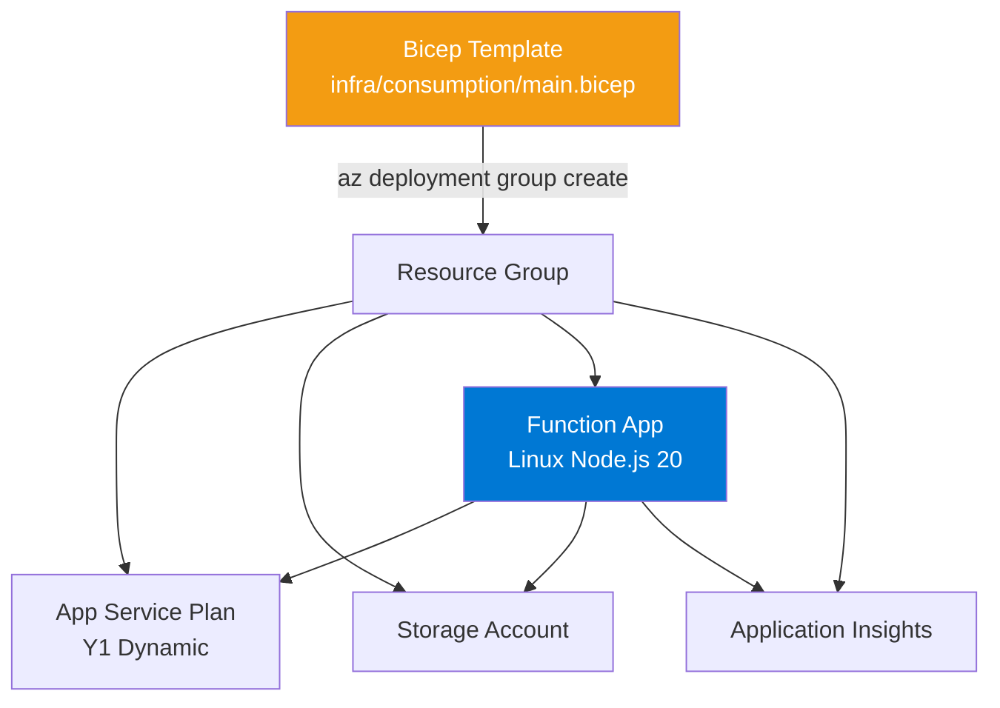
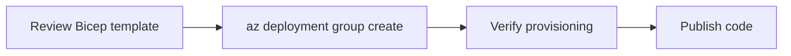

---
hide:
  - toc
validation:
  az_cli:
    last_tested: 2026-04-10
    cli_version: "2.83.0"
    core_tools_version: "4.8.0"
    result: pass
  bicep:
    last_tested: null
    result: not_tested
content_sources:
  - type: mslearn-adapted
    url: https://learn.microsoft.com/azure/azure-functions/functions-reference-node
  - type: mslearn-adapted
    url: https://learn.microsoft.com/azure/azure-resource-manager/bicep/overview
  - type: mslearn-adapted
    url: https://learn.microsoft.com/azure/azure-functions/functions-scale
---

# 05 - Infrastructure as Code (Consumption)

Deploy repeatable infrastructure with Bicep and parameterized environments.

## Prerequisites

| Tool | Version | Purpose |
|------|---------|---------|
| Node.js | 20+ | Local runtime and package execution |
| Azure Functions Core Tools | v4 | Local host and publishing |
| Azure CLI | 2.61+ | Azure resource provisioning and management |

!!! info "Consumption plan basics"
    Consumption (Y1) is serverless with scale-to-zero, up to 200 instances, 1.5 GB memory per instance, and a default 5-minute timeout (max 10 minutes).

## What You'll Build

You will deploy a repeatable Consumption infrastructure stack with Bicep and validate successful resource provisioning.

!!! info "Infrastructure Context"
    **Plan**: Consumption (Y1) | **Network**: Public internet only | **VNet**: ❌ Not supported

    Bicep deploys all resources into a single resource group with public internet access only.

    <!-- diagram-id: what-you-ll-build -->


<!-- diagram-id: what-you-ll-build-2 -->


## Steps

### Step 1 - Set variables (if not already set)

```bash
export RG="rg-func-node-consumption-demo"
export LOCATION="koreacentral"
```

### Step 2 - Review the Bicep template

The production template is at `infra/consumption/main.bicep`. Below is a minimal example showing the key resources for Consumption (Y1):

```bicep
param location string = resourceGroup().location
param appName string
param storageName string
var planName = '${appName}-plan'

resource storage 'Microsoft.Storage/storageAccounts@2023-05-01' = {
  name: storageName
  location: location
  sku: { name: 'Standard_LRS' }
  kind: 'StorageV2'
}

resource plan 'Microsoft.Web/serverfarms@2024-04-01' = {
  name: planName
  location: location
  sku: {
    name: 'Y1'
    tier: 'Dynamic'
  }
  properties: {
    reserved: true
  }
}

resource functionApp 'Microsoft.Web/sites@2024-04-01' = {
  name: appName
  location: location
  kind: 'functionapp,linux'
  properties: {
    serverFarmId: plan.id
    httpsOnly: true
    siteConfig: {
      linuxFxVersion: 'NODE|20'
      appSettings: [
        {
          name: 'FUNCTIONS_EXTENSION_VERSION'
          value: '~4'
        }
        {
          name: 'FUNCTIONS_WORKER_RUNTIME'
          value: 'node'
        }
        {
          name: 'AzureWebJobsStorage'
          value: 'DefaultEndpointsProtocol=https;AccountName=${storage.name};AccountKey=${listKeys(storage.id, storage.apiVersion).keys[0].value};EndpointSuffix=${environment().suffixes.storage}'
        }
        {
          name: 'WEBSITE_CONTENTAZUREFILECONNECTIONSTRING'
          value: 'DefaultEndpointsProtocol=https;AccountName=${storage.name};AccountKey=${listKeys(storage.id, storage.apiVersion).keys[0].value};EndpointSuffix=${environment().suffixes.storage}'
        }
        {
          name: 'WEBSITE_CONTENTSHARE'
          value: toLower('${appName}-content')
        }
      ]
    }
  }
}
```

### Step 3 - Deploy the template

```bash
az deployment group create \
  --resource-group "$RG" \
  --template-file infra/consumption/main.bicep \
  --parameters baseName=ndcons0410
```

!!! warning "baseName length constraint"
    The Bicep template appends `storage` to the `baseName` parameter to create the storage account name. Storage account names are limited to **24 characters**. Keep `baseName` to ~17 characters or fewer to avoid exceeding this limit. For example, `ndcons0410` produces `ndcons0410storage` (17 chars) which is valid.

### Step 4 - Verify provisioning

```bash
az deployment group show \
  --resource-group "$RG" \
  --name main \
  --query "properties.provisioningState" \
  --output tsv
```

### Step 5 - Publish code to the Bicep-deployed app

```bash
# Get the function app name from Bicep outputs
BICEP_APP=$(az deployment group show \
  --resource-group "$RG" \
  --name main \
  --query "properties.outputs.functionAppName.value" \
  --output tsv)

cd apps/nodejs && func azure functionapp publish "$BICEP_APP"
```

### Step 6 - Review Consumption-specific notes

- Use `--consumption-plan-location` for app creation and expect cold starts under idle periods.
- Use long-form CLI flags for maintainable runbooks.
- Keep `FUNCTIONS_WORKER_RUNTIME=node` across all environments.

## Verification

Deployment output shows `Succeeded`:

```json
{
  "id": "/subscriptions/<subscription-id>/resourceGroups/rg-func-node-consumption-demo/providers/Microsoft.Resources/deployments/main",
  "name": "main",
  "properties": {
    "provisioningState": "Succeeded",
    "mode": "Incremental",
    "outputs": {
      "functionAppName": {
        "type": "String",
        "value": "ndcons0410-func"
      },
      "functionAppUrl": {
        "type": "String",
        "value": "https://ndcons0410-func.azurewebsites.net"
      }
    }
  }
}
```

## Next Steps

> **Next:** [06 - CI/CD](06-ci-cd.md)

## See Also

- [Tutorial Overview & Plan Chooser](../index.md)
- [Node.js Language Guide](../../index.md)
- [Platform: Hosting Plans](../../../../platform/hosting.md)
- [Operations: Deployment](../../../../operations/deployment.md)
- [Recipes Index](../../recipes/index.md)

## Sources

- [Azure Functions Node.js developer guide (Microsoft Learn)](https://learn.microsoft.com/azure/azure-functions/functions-reference-node)
- [Automate resource deployment with Bicep (Microsoft Learn)](https://learn.microsoft.com/azure/azure-resource-manager/bicep/overview)
- [Azure Functions hosting options (Microsoft Learn)](https://learn.microsoft.com/azure/azure-functions/functions-scale)
