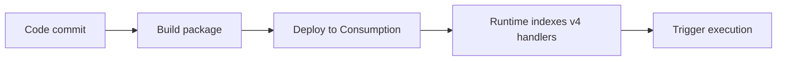

# 05 - Infrastructure as Code (Consumption)

Deploy repeatable infrastructure with Bicep and parameterized environments.

## Prerequisites

| Tool | Version | Purpose |
|---|---|---|
| Node.js | 20+ | Local runtime and package execution |
| Azure Functions Core Tools | v4 | Local host and publishing |
| Azure CLI | 2.61+ | Azure resource provisioning and management |

!!! info "Plan basics"
    Consumption scales to zero automatically, does not support VNet integration, and defaults to a 5-minute timeout with a 10-minute maximum.

## What You'll Build

You will deploy a repeatable Consumption infrastructure stack with Bicep and validate successful resource provisioning.

## Steps




### Step 1 - Define Bicep template

Use this minimal example for Consumption (Y1). For the full production template, use `infra/consumption/main.bicep`.

```bicep
param location string = resourceGroup().location
param appName string
param storageName string
var planName = '${appName}-plan'

resource storage 'Microsoft.Storage/storageAccounts@2023-05-01' = {
  name: storageName
  location: location
  sku: { name: 'Standard_LRS' }
  kind: 'StorageV2'
}

resource plan 'Microsoft.Web/serverfarms@2024-04-01' = {
  name: planName
  location: location
  sku: {
    name: 'Y1'
    tier: 'Dynamic'
  }
  properties: {
    reserved: true
  }
}

resource functionApp 'Microsoft.Web/sites@2024-04-01' = {
  name: appName
  location: location
  kind: 'functionapp,linux'
  properties: {
    serverFarmId: plan.id
    httpsOnly: true
    siteConfig: {
      linuxFxVersion: 'NODE|20'
      appSettings: [
        {
          name: 'FUNCTIONS_EXTENSION_VERSION'
          value: '~4'
        }
        {
          name: 'FUNCTIONS_WORKER_RUNTIME'
          value: 'node'
        }
        {
          name: 'AzureWebJobsStorage'
          value: 'DefaultEndpointsProtocol=https;AccountName=${storage.name};AccountKey=${listKeys(storage.id, storage.apiVersion).keys[0].value};EndpointSuffix=${environment().suffixes.storage}'
        }
        {
          name: 'WEBSITE_CONTENTAZUREFILECONNECTIONSTRING'
          value: 'DefaultEndpointsProtocol=https;AccountName=${storage.name};AccountKey=${listKeys(storage.id, storage.apiVersion).keys[0].value};EndpointSuffix=${environment().suffixes.storage}'
        }
        {
          name: 'WEBSITE_CONTENTSHARE'
          value: toLower('${appName}-content')
        }
      ]
    }
  }
}
```

### Step 2 - Deploy template

```bash
az deployment group create --resource-group $RG --template-file infra/consumption/main.bicep --parameters baseName=$APP_NAME
```

### Step 3 - Publish code package

```bash
func azure functionapp publish $APP_NAME
```


### Plan-specific notes

- Use `--consumption-plan-location` for app creation and expect cold starts under idle periods.
- Use long-form CLI flags for maintainable runbooks.
- Keep `FUNCTIONS_WORKER_RUNTIME=node` across all environments.

## Verification

```json
{
  "id": "/subscriptions/<subscription-id>/resourceGroups/$RG/providers/Microsoft.Resources/deployments/main",
  "name": "main",
  "properties": {
    "provisioningState": "Succeeded",
    "mode": "Incremental",
    "outputs": {
      "functionAppName": {
        "type": "String",
        "value": "$APP_NAME-func"
      },
      "functionAppUrl": {
        "type": "String",
        "value": "https://$APP_NAME-func.azurewebsites.net"
      }
    }
  }
}
```


## See Also
- [Tutorial Overview & Plan Chooser](../index.md)
- [Node.js Language Guide](../../index.md)
- [Platform: Hosting Plans](../../../../platform/hosting.md)
- [Operations: Deployment](../../../../operations/deployment.md)
- [Recipes Index](../../recipes/index.md)

## Sources
- [Azure Functions Node.js developer guide (Microsoft Learn)](https://learn.microsoft.com/azure/azure-functions/functions-reference-node)
- [Create your first Azure Function with Core Tools (Microsoft Learn)](https://learn.microsoft.com/azure/azure-functions/create-first-function-cli-node)
- [Azure Functions hosting options (Microsoft Learn)](https://learn.microsoft.com/azure/azure-functions/functions-scale)
