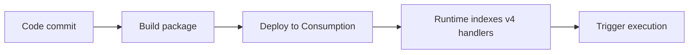

# 06 - CI/CD (Consumption)

Automate build and deployment with GitHub Actions.

## Prerequisites

| Tool | Version | Purpose |
|---|---|---|
| Node.js | 20+ | Local runtime and package execution |
| Azure Functions Core Tools | v4 | Local host and publishing |
| Azure CLI | 2.61+ | Azure resource provisioning and management |

!!! info "Plan basics"
    Consumption scales to zero automatically, does not support VNet integration, and defaults to a 5-minute timeout with a 10-minute maximum.

## What You'll Build

You will create a GitHub Actions workflow for Consumption deployment and confirm release health from runtime logs.

## Steps




### Step 1 - Create workflow

```yaml
name: deploy-node-functions
on:
  push:
    branches: [ main ]
jobs:
  deploy:
    runs-on: ubuntu-latest
    steps:
      - uses: actions/checkout@v4
      - uses: actions/setup-node@v4
        with:
          node-version: '20'
      - run: npm ci
      - run: npm test --if-present
      - uses: Azure/functions-action@v1
        with:
          app-name: ${{ secrets.APP_NAME }}
          package: '.'
          publish-profile: ${{ secrets.AZURE_FUNCTIONAPP_PUBLISH_PROFILE }}
```

### Step 2 - Store secrets

- Add `APP_NAME` in GitHub Actions secrets.
- Add `AZURE_FUNCTIONAPP_PUBLISH_PROFILE` from Function App publish profile export.

### Step 3 - Validate release

```bash
az functionapp log tail --name $APP_NAME --resource-group $RG
```


### Plan-specific notes

- Use `--consumption-plan-location` for app creation and expect cold starts under idle periods.
- Use long-form CLI flags for maintainable runbooks.
- Keep `FUNCTIONS_WORKER_RUNTIME=node` across all environments.

## Verification

```text
2026-04-08T08:20:11  Connected!
2026-04-08T08:20:19  [Information] Executing 'Functions.helloHttp' (Reason='This function was programmatically called via the host APIs.', Id=6d9f2b66-9f0b-4f8f-9f4a-0f0f8f2a7e20)
2026-04-08T08:20:19  [Information] Request received for world
2026-04-08T08:20:19  [Information] Executed 'Functions.helloHttp' (Succeeded, Id=6d9f2b66-9f0b-4f8f-9f4a-0f0f8f2a7e20, Duration=34ms)
```


## See Also
- [Tutorial Overview & Plan Chooser](../index.md)
- [Node.js Language Guide](../../index.md)
- [Platform: Hosting Plans](../../../../platform/hosting.md)
- [Operations: Deployment](../../../../operations/deployment.md)
- [Recipes Index](../../recipes/index.md)

## Sources
- [Azure Functions Node.js developer guide (Microsoft Learn)](https://learn.microsoft.com/azure/azure-functions/functions-reference-node)
- [Create your first Azure Function with Core Tools (Microsoft Learn)](https://learn.microsoft.com/azure/azure-functions/create-first-function-cli-node)
- [Azure Functions hosting options (Microsoft Learn)](https://learn.microsoft.com/azure/azure-functions/functions-scale)
