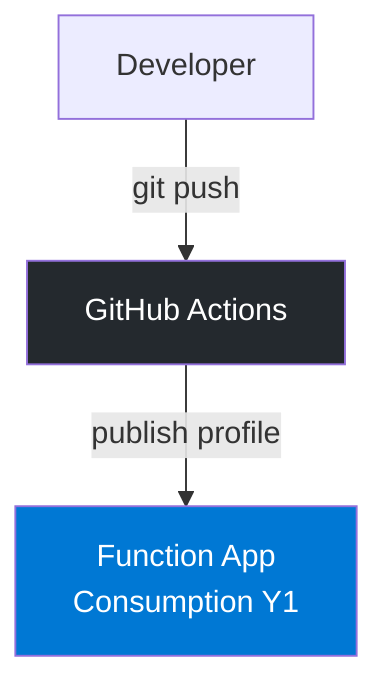
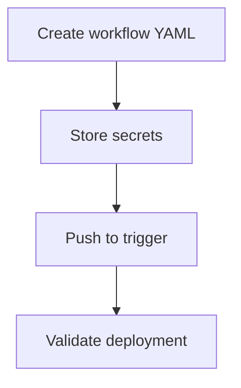

---
validation:
  az_cli:
    last_tested: 2026-04-10
    cli_version: "2.83.0"
    core_tools_version: "4.8.0"
    result: pass
  bicep:
    last_tested: null
    result: not_tested
content_sources:
  - type: mslearn-adapted
    url: https://learn.microsoft.com/azure/azure-functions/functions-reference-node
  - type: mslearn-adapted
    url: https://learn.microsoft.com/azure/azure-functions/functions-continuous-deployment
  - type: mslearn-adapted
    url: https://learn.microsoft.com/azure/azure-functions/functions-how-to-github-actions
---

# 06 - CI/CD (Consumption)

Automate build and deployment with GitHub Actions.

## Prerequisites

| Tool | Version | Purpose |
|------|---------|---------|
| Node.js | 20+ | Local runtime and package execution |
| Azure Functions Core Tools | v4 | Local host and publishing |
| Azure CLI | 2.61+ | Azure resource provisioning and management |
| GitHub repository | — | Source code hosting with Actions enabled |

!!! info "Consumption plan basics"
    Consumption (Y1) is serverless with scale-to-zero, up to 200 instances, 1.5 GB memory per instance, and a default 5-minute timeout (max 10 minutes).

## What You'll Build

You will create a GitHub Actions workflow for Consumption deployment and confirm release health by invoking the deployed function.

!!! info "Infrastructure Context"
    **Plan**: Consumption (Y1) | **Network**: Public internet only | **VNet**: ❌ Not supported

    GitHub Actions deploys to the Consumption function app via publish profile authentication.

    <!-- diagram-id: what-you-ll-build -->


<!-- diagram-id: what-you-ll-build-2 -->


## Steps

### Step 1 - Set variables (if not already set)

```bash
export RG="rg-func-node-consumption-demo"
export APP_NAME="<your-function-app-name>"
```

### Step 2 - Create the GitHub Actions workflow

Save the following as `.github/workflows/deploy-node-consumption.yml`:

```yaml
name: deploy-node-functions
on:
  push:
    branches: [ main ]
jobs:
  deploy:
    runs-on: ubuntu-latest
    steps:
      - uses: actions/checkout@v4
      - uses: actions/setup-node@v4
        with:
          node-version: '20'
      - run: npm ci
        working-directory: apps/nodejs
      - run: npm test --if-present
        working-directory: apps/nodejs
      - uses: Azure/functions-action@v1
        with:
          app-name: ${{ secrets.APP_NAME }}
          package: 'apps/nodejs'
          publish-profile: ${{ secrets.AZURE_FUNCTIONAPP_PUBLISH_PROFILE }}
```

### Step 3 - Store secrets in GitHub

1. Download the publish profile:

    ```bash
    az functionapp deployment list-publishing-profiles \
      --name "$APP_NAME" \
      --resource-group "$RG" \
      --xml
    ```

2. In your GitHub repository, go to **Settings → Secrets and variables → Actions**
3. Add the following secrets:
    - `APP_NAME`: Your function app name (e.g., `func-ndcons-04100010`)
    - `AZURE_FUNCTIONAPP_PUBLISH_PROFILE`: Paste the entire XML output from the command above

### Step 4 - Validate release

After pushing to trigger the workflow, verify the deployment by invoking the function:

```bash
curl --request GET "https://$APP_NAME.azurewebsites.net/api/health"
```

!!! warning "`az functionapp log tail` does not exist"
    The command `az functionapp log tail` is **not a valid Azure CLI command** as of CLI version 2.83.0. The `az webapp log tail` command exists but returns HTTP 404 for Consumption plan function apps because Consumption does not support persistent log streaming.

    **Alternatives for viewing logs:**

    - **Application Insights queries**: `az monitor app-insights query --app $APP_NAME-ai --analytics-query "traces | take 20"`
    - **Azure Portal**: Navigate to Function App → Monitor → Log stream
    - **Live Metrics**: Application Insights → Live Metrics (real-time)

### Step 5 - Review Consumption-specific notes

- Use `--consumption-plan-location` for app creation and expect cold starts under idle periods.
- Use long-form CLI flags for maintainable runbooks.
- Keep `FUNCTIONS_WORKER_RUNTIME=node` across all environments.

## Verification

After a successful GitHub Actions run, verify the function responds:

```bash
curl --request GET "https://$APP_NAME.azurewebsites.net/api/health"
```

Expected response:

```json
{"status":"healthy","timestamp":"2026-04-10T00:30:00.000Z","version":"1.0.0"}
```

You can also verify via Application Insights:

```bash
az monitor app-insights query \
  --app "$APP_NAME-ai" \
  --resource-group "$RG" \
  --analytics-query "requests | where name == 'health' | take 5" \
  --output json
```

## Next Steps

> **Next:** [07 - Extending Triggers](07-extending-triggers.md)

## See Also

- [Tutorial Overview & Plan Chooser](../index.md)
- [Node.js Language Guide](../../index.md)
- [Platform: Hosting Plans](../../../../platform/hosting.md)
- [Operations: Deployment](../../../../operations/deployment.md)
- [Recipes Index](../../recipes/index.md)

## Sources

- [Azure Functions Node.js developer guide (Microsoft Learn)](https://learn.microsoft.com/azure/azure-functions/functions-reference-node)
- [Continuous deployment for Azure Functions (Microsoft Learn)](https://learn.microsoft.com/azure/azure-functions/functions-continuous-deployment)
- [Azure Functions GitHub Actions (Microsoft Learn)](https://learn.microsoft.com/azure/azure-functions/functions-how-to-github-actions)
