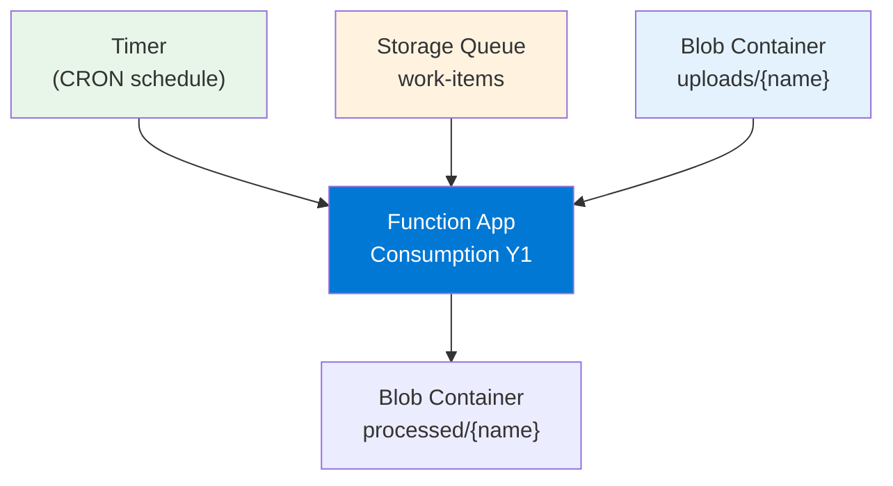
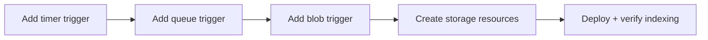

---
validation:
  az_cli:
    last_tested: 2026-04-10
    cli_version: "2.83.0"
    core_tools_version: "4.8.0"
    result: pass
  bicep:
    last_tested: null
    result: not_tested
content_sources:
  - type: mslearn-adapted
    url: https://learn.microsoft.com/azure/azure-functions/functions-reference-node
  - type: mslearn-adapted
    url: https://learn.microsoft.com/azure/azure-functions/functions-triggers-bindings
  - type: mslearn-adapted
    url: https://learn.microsoft.com/azure/azure-functions/functions-bindings-storage-queue-trigger
  - type: mslearn-adapted
    url: https://learn.microsoft.com/azure/azure-functions/functions-bindings-storage-blob-trigger
---

# 07 - Extending Triggers (Consumption)

Add queue, timer, and blob triggers with the Node.js v4 APIs and verify the Functions host indexes each binding.

## Prerequisites

| Tool | Version | Purpose |
|------|---------|---------|
| Node.js | 20+ | Local runtime and package execution |
| Azure Functions Core Tools | v4 | Local host and publishing |
| Azure CLI | 2.61+ | Azure resource provisioning and management |

!!! info "Consumption plan basics"
    Consumption (Y1) is serverless with scale-to-zero, up to 200 instances, 1.5 GB memory per instance, and a default 5-minute timeout (max 10 minutes).

## What You'll Build

You will add timer, queue, and blob triggers to a Node.js v4 app and verify that the Functions host indexes each binding both locally and in Azure.

!!! info "Infrastructure Context"
    **Plan**: Consumption (Y1) | **Network**: Public internet only | **VNet**: ❌ Not supported

    This tutorial adds non-HTTP triggers that require storage queues and blob containers.

    <!-- diagram-id: what-you-ll-build -->


<!-- diagram-id: what-you-ll-build-2 -->


## Steps

### Step 1 - Set variables (if not already set)

```bash
export RG="rg-func-node-consumption-demo"
export APP_NAME="<your-function-app-name>"
export STORAGE_NAME="<your-storage-account-name>"
```

### Step 2 - Add a timer trigger

Save the following as `src/functions/nightlySummary.js`:

```javascript
const { app } = require('@azure/functions');

app.timer('nightlySummary', {
    schedule: '0 0 2 * * *',
    handler: async (_timer, context) => {
        context.log('Nightly summary job fired');
    }
});
```

### Step 3 - Add a queue trigger

Save the following as `src/functions/orderProcessor.js`:

```javascript
const { app } = require('@azure/functions');

app.storageQueue('orderProcessor', {
    queueName: 'work-items',
    connection: 'QueueStorage',
    handler: async (queueItem, context) => {
        context.log(`Order received: ${JSON.stringify(queueItem)}`);
    }
});
```

### Step 4 - Add a blob trigger

Save the following as `src/functions/blobIngest.js`:

```javascript
const { app } = require('@azure/functions');

app.storageBlob('blobIngest', {
    path: 'uploads/{name}',
    connection: 'AzureWebJobsStorage',
    handler: async (blob, context) => {
        context.log(`Blob received, size: ${blob.length} bytes`);
    }
});
```

### Step 5 - Create storage resources

```bash
# Create the queue
az storage queue create \
  --name "work-items" \
  --account-name "$STORAGE_NAME"

# Create blob containers
az storage container create \
  --name "uploads" \
  --account-name "$STORAGE_NAME"

az storage container create \
  --name "processed" \
  --account-name "$STORAGE_NAME"
```

### Step 6 - Verify local trigger indexing

```bash
cd apps/nodejs && func host start
```

!!! warning "EventHub connection required"
    If the reference app includes an EventHub trigger, you must either provide a valid `EventHubConnection` setting or temporarily remove the EventHub trigger file to start the host locally without errors.

### Step 7 - Deploy and verify in Azure

```bash
func azure functionapp publish "$APP_NAME"
```

### Step 8 - Test the queue trigger

```bash
az storage message put \
  --queue-name "work-items" \
  --content '{"orderId":"test-001","item":"widget"}' \
  --account-name "$STORAGE_NAME"
```

### Step 9 - Review Consumption-specific notes

- Use `--consumption-plan-location` for app creation and expect cold starts under idle periods.
- Use long-form CLI flags for maintainable runbooks.
- Keep `FUNCTIONS_WORKER_RUNTIME=node` across all environments.
- Queue triggers on Consumption poll every 100ms-1s with exponential backoff when idle.

## Verification

Local `func host start` output shows all triggers indexed:

```text
Functions:

    helloHttp: [GET] http://localhost:7071/api/hello/{name?}
    health: [GET] http://localhost:7071/api/health
    nightlySummary: timerTrigger
    orderProcessor: queueTrigger
    blobIngest: blobTrigger
```

!!! note "Reference app has 20 functions"
    The full reference app at `apps/nodejs` registers 20 functions. The output above shows only the functions created in this tutorial plus existing HTTP triggers. All triggers should appear in the host output.

Deployed function list:

```bash
az functionapp function list \
  --name "$APP_NAME" \
  --resource-group "$RG" \
  --output table
```

## Clean Up

If you are finished with the Consumption tutorials, delete the resource group:

```bash
az group delete --name "$RG" --yes --no-wait
```

## See Also

- [Tutorial Overview & Plan Chooser](../index.md)
- [Node.js Language Guide](../../index.md)
- [Platform: Hosting Plans](../../../../platform/hosting.md)
- [Operations: Deployment](../../../../operations/deployment.md)
- [Recipes Index](../../recipes/index.md)

## Sources

- [Azure Functions Node.js developer guide (Microsoft Learn)](https://learn.microsoft.com/azure/azure-functions/functions-reference-node)
- [Azure Functions triggers and bindings (Microsoft Learn)](https://learn.microsoft.com/azure/azure-functions/functions-triggers-bindings)
- [Azure Queue storage trigger for Azure Functions (Microsoft Learn)](https://learn.microsoft.com/azure/azure-functions/functions-bindings-storage-queue-trigger)
- [Azure Blob storage trigger for Azure Functions (Microsoft Learn)](https://learn.microsoft.com/azure/azure-functions/functions-bindings-storage-blob-trigger)
