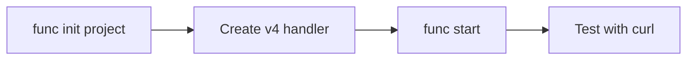

# 01 - Run Locally (Dedicated)

Initialize, run, and verify a Node.js v4 app on your machine before cloud deployment.

## Prerequisites

| Tool | Version | Purpose |
|---|---|---|
| Node.js | 20+ | Local runtime and package execution |
| Azure Functions Core Tools | v4 | Local host and publishing |
| Azure CLI | 2.61+ | Azure resource provisioning and management |

!!! info "Plan basics"
    Dedicated runs on App Service plans (B1/S1/P1v3), supports Always On, and behaves like traditional web app hosting.

## What You'll Build

You will create a Node.js v4 HTTP-triggered function named `helloHttp` and run it locally with Azure Functions Core Tools.
You will validate the local route at `/api/hello/{name?}` and confirm the function returns a JSON payload.

## Steps



### Step 1 - Initialize project

```bash
func init node-guide-dedicated --worker-runtime node --language javascript
cd node-guide-dedicated
npm install @azure/functions
```

### Step 2 - Create the v4 handler

Save the following as `src/functions/helloHttp.js`:

```javascript
const { app } = require('@azure/functions');

app.http('helloHttp', {
    methods: ['GET'],
    route: 'hello/{name?}',
    handler: async (request, context) => {
        const name = request.params.name || request.query.get('name') || 'world';
        context.log(`Handled hello for ${name}`);
        return { status: 200, jsonBody: { message: `Hello, ${name}` } };
    }
});
```

### Step 3 - Run host and test

```bash
func start
```

In a second terminal, test the endpoint:

```bash
curl --request GET "http://localhost:7071/api/hello"
```

### Step 4 - Review Dedicated-specific notes

- Dedicated does not require Azure Files content share settings for zip-based deployments (`WEBSITE_RUN_FROM_PACKAGE=1`).
- Enable Always On for non-HTTP triggers so timer, queue, and blob workloads stay active.
- Use long-form CLI flags (for example, `--resource-group`) for maintainable runbooks.

## Verification

```text
Functions:
    helloHttp: [GET] http://localhost:7071/api/hello/{name?}
```

Confirm that the host lists `helloHttp`, then run `curl --request GET "http://localhost:7071/api/hello"` and verify a `200 OK` response with a JSON body such as `{"message":"Hello, world"}`.

## See Also
- [Tutorial Overview & Plan Chooser](../index.md)
- [Node.js Language Guide](../../index.md)
- [Platform: Hosting Plans](../../../../platform/hosting.md)
- [Operations: Deployment](../../../../operations/deployment.md)
- [Recipes Index](../../recipes/index.md)

## Sources
- [Azure Functions Node.js developer guide (Microsoft Learn)](https://learn.microsoft.com/azure/azure-functions/functions-reference-node)
- [Create your first Azure Function with Core Tools (Microsoft Learn)](https://learn.microsoft.com/azure/azure-functions/create-first-function-cli-node)
- [Azure Functions hosting options (Microsoft Learn)](https://learn.microsoft.com/azure/azure-functions/functions-scale)
