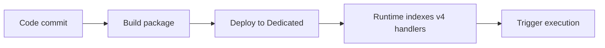

# 01 - Run Locally (Dedicated)

Initialize, run, and verify a Node.js v4 app on your machine before cloud deployment.

## Prerequisites

| Tool | Version | Purpose |
|---|---|---|
| Node.js | 20+ | Local runtime and package execution |
| Azure Functions Core Tools | v4 | Local host and publishing |
| Azure CLI | 2.61+ | Azure resource provisioning and management |

!!! info "Plan basics"
    Dedicated runs on App Service plans (B1/S1/P1v3), supports Always On, and behaves like traditional web app hosting.

## Steps




### Step 1 - Initialize project

```bash
func init node-guide-dedicated --javascript
cd node-guide-dedicated
func new --template "HTTP trigger" --name httpTrigger
```

### Step 2 - Add v4 handler

```javascript
const { app } = require('@azure/functions');

app.http('helloHttp', {
    methods: ['GET'],
    route: 'hello/{name?}',
    handler: async (request, context) => {
        const name = request.params.name || request.query.get('name') || 'world';
        context.log(`Handled hello for ${name}`);
        return { status: 200, jsonBody: { message: `Hello, ${name}` } };
    }
});
```

### Step 3 - Run host and test

```bash
func start
curl --request GET "http://localhost:7071/api/hello"
```


### Plan-specific notes

- Enable Always On for non-trivial workloads to avoid app unload behavior.
- Use long-form CLI flags for maintainable runbooks.
- Keep `FUNCTIONS_WORKER_RUNTIME=node` across all environments.

## Expected Output

```text
Functions:
    helloHttp: [GET] http://localhost:7071/api/hello/{name?}
```


## See Also
- [Tutorial Overview & Plan Chooser](../index.md)
- [Node.js Language Guide](../../index.md)
- [Platform: Hosting Plans](../../../../platform/hosting.md)
- [Operations: Deployment](../../../../operations/deployment.md)
- [Recipes Index](../../recipes/index.md)

## Sources
- [Azure Functions Node.js developer guide (Microsoft Learn)](https://learn.microsoft.com/azure/azure-functions/functions-reference-node)
- [Create your first Azure Function with Core Tools (Microsoft Learn)](https://learn.microsoft.com/azure/azure-functions/create-first-function-cli-node)
- [Azure Functions hosting options (Microsoft Learn)](https://learn.microsoft.com/azure/azure-functions/functions-scale)
