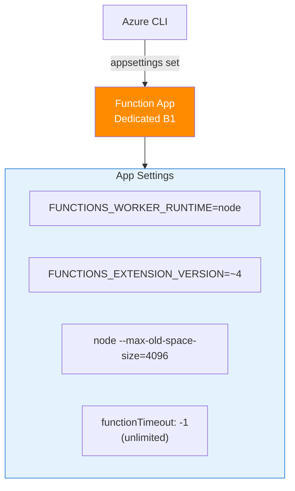

---
validation:
  az_cli:
    last_tested: 2026-04-10
    cli_version: "2.83.0"
    core_tools_version: "4.8.0"
    result: pass
  bicep:
    last_tested: null
    result: not_tested
content_sources:
  - type: mslearn-adapted
    url: https://learn.microsoft.com/azure/azure-functions/functions-reference-node
  - type: mslearn-adapted
    url: https://learn.microsoft.com/azure/azure-functions/create-first-function-cli-node
  - type: mslearn-adapted
    url: https://learn.microsoft.com/azure/azure-functions/functions-scale
---

# 03 - Configuration (Dedicated)

Manage environment settings, runtime options, and host behavior per environment.

## Prerequisites

- You completed [02 - First Deploy](02-first-deploy.md).
- Your function app `$APP_NAME` is deployed and running on the Dedicated plan.

## What You'll Build

- Apply required app settings for the Node.js worker and runtime extension.
- Tune host-level timeout behavior appropriate for Dedicated plan characteristics.
- Validate effective settings in Azure.

!!! info "Infrastructure Context"
    **Plan**: Dedicated (B1) | **Timeout**: Unlimited (`-1`) | **Always On**: ✅

    Dedicated plans support unlimited function timeout (`functionTimeout: -1`), unlike Consumption (5/10 min) and Premium (30/60 min defaults). This makes Dedicated ideal for long-running workloads.

    <!-- diagram-id: what-you-ll-build -->


## Steps

1. Configure app settings.

    ```bash
    az functionapp config appsettings set \
      --name "$APP_NAME" \
      --resource-group "$RG" \
      --settings \
        "FUNCTIONS_WORKER_RUNTIME=node" \
        "FUNCTIONS_EXTENSION_VERSION=~4" \
        "languageWorkers__node__arguments=--max-old-space-size=4096"
    ```

    Expected output (abridged):

    ```text
    Name                                    SlotSetting    Value
    --------------------------------------  -------------  -------------------------
    FUNCTIONS_WORKER_RUNTIME                False          node
    FUNCTIONS_EXTENSION_VERSION             False          ~4
    languageWorkers__node__arguments        False          --max-old-space-size=4096
    ```

    !!! tip "FUNCTIONS_WORKER_RUNTIME on Dedicated"
        On Dedicated plans, `FUNCTIONS_WORKER_RUNTIME` can be set via `az functionapp config appsettings set` without issues. On Flex Consumption, this setting is platform-managed and cannot be changed via CLI.

2. Configure host timeout.

    The `host.json` file in your project root controls timeout behavior. For Dedicated plans, set `functionTimeout` to `-1` for unlimited execution:

    ```json
    {
      "version": "2.0",
      "functionTimeout": "-1"
    }
    ```

    !!! warning "Timeout values by plan"
        | Plan | Default Timeout | Maximum |
        |---|---|---|
        | Consumption | 5 min | 10 min |
        | Premium | 30 min | 60 min (unlimited with `host.json`) |
        | Dedicated | 30 min | Unlimited (`-1`) |

3. Validate effective config.

    ```bash
    az functionapp config appsettings list \
      --name "$APP_NAME" \
      --resource-group "$RG" \
      --output table
    ```

    Expected output (abridged):

    ```text
    Name                                         Value
    -------------------------------------------  -----------------------------------
    FUNCTIONS_WORKER_RUNTIME                     node
    FUNCTIONS_EXTENSION_VERSION                  ~4
    AzureWebJobsStorage                          DefaultEndpointsProtocol=https;...
    APPLICATIONINSIGHTS_CONNECTION_STRING        InstrumentationKey=...
    EventHubConnection__fullyQualifiedNamespace  placeholder.servicebus.windows.net
    QueueStorage                                 DefaultEndpointsProtocol=https;...
    WEBSITE_RUN_FROM_PACKAGE                     1
    languageWorkers__node__arguments             --max-old-space-size=4096
    ```

    !!! note "WEBSITE_RUN_FROM_PACKAGE"
        Dedicated plans automatically set `WEBSITE_RUN_FROM_PACKAGE=1` for zip-based deployments. This setting is not required on Consumption or Flex Consumption.

4. Review Dedicated-specific configuration notes.

    - **Always On**: Enable via portal or Bicep (`alwaysOn: true`) for non-HTTP triggers (timer, queue, blob). Without Always On, the app may idle and miss timer/queue events.
    - **No content share**: Unlike Premium and Consumption, Dedicated does not use `WEBSITE_CONTENTAZUREFILECONNECTIONSTRING` or `WEBSITE_CONTENTSHARE`.
    - **Memory tuning**: `--max-old-space-size=4096` sets Node.js heap to 4 GB. Adjust based on your B1 (1.75 GB RAM) or S1/P1v3 tier.

## Verification

The table confirms required Node.js worker settings are applied to the deployed app. Verify:

- `FUNCTIONS_WORKER_RUNTIME` is `node`
- `FUNCTIONS_EXTENSION_VERSION` is `~4`
- `languageWorkers__node__arguments` includes `--max-old-space-size`
- `WEBSITE_RUN_FROM_PACKAGE` is `1`

## See Also
- [Tutorial Overview & Plan Chooser](../index.md)
- [Node.js Language Guide](../../index.md)
- [Platform: Hosting Plans](../../../../platform/hosting.md)
- [Operations: Deployment](../../../../operations/deployment.md)
- [Recipes Index](../../recipes/index.md)

## Sources
- [Azure Functions Node.js developer guide (Microsoft Learn)](https://learn.microsoft.com/azure/azure-functions/functions-reference-node)
- [Create your first Azure Function with Core Tools (Microsoft Learn)](https://learn.microsoft.com/azure/azure-functions/create-first-function-cli-node)
- [Azure Functions hosting options (Microsoft Learn)](https://learn.microsoft.com/azure/azure-functions/functions-scale)
