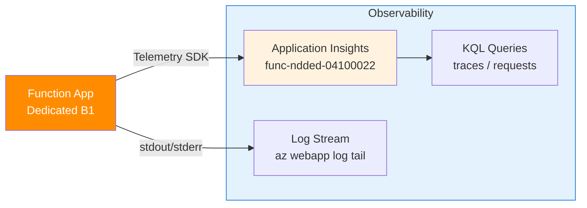

---
validation:
  az_cli:
    last_tested: 2026-04-10
    cli_version: "2.83.0"
    core_tools_version: "4.8.0"
    result: pass
  bicep:
    last_tested: null
    result: not_tested
content_sources:
  - type: mslearn-adapted
    url: https://learn.microsoft.com/azure/azure-functions/functions-reference-node
  - type: mslearn-adapted
    url: https://learn.microsoft.com/azure/azure-functions/create-first-function-cli-node
  - type: mslearn-adapted
    url: https://learn.microsoft.com/azure/azure-functions/functions-scale
---

# 04 - Logging and Monitoring (Dedicated)

Capture structured logs, query telemetry, and validate operational visibility.

## Prerequisites

- You completed [03 - Configuration](03-configuration.md).
- Your function app `$APP_NAME` is deployed and running with Application Insights connected.

## What You'll Build

- Emit structured application logs from Node.js HTTP functions.
- Query Application Insights traces to verify telemetry ingestion.
- Use `az webapp log tail` for real-time log streaming on Dedicated plans.

!!! info "Infrastructure Context"
    **Plan**: Dedicated (B1) | **Monitoring**: Application Insights (auto-created) | **Log streaming**: `az webapp log tail`

    Application Insights is auto-created with the same name as the function app. On Dedicated plans, real-time log streaming uses `az webapp log tail` (not `az functionapp log tail`, which does not exist).

    <!-- diagram-id: what-you-ll-build -->


## Steps

1. Review the logging function.

    The reference app includes `src/functions/logLevels.js` which emits structured logs at different severity levels:

    ```javascript
    const { app } = require('@azure/functions');

    app.http('logLevels', {
        methods: ['GET'],
        route: 'loglevels',
        handler: async (_request, context) => {
            context.log('Info-level message from logLevels');
            context.warn('Warning-level message from logLevels');
            context.error('Error-level message from logLevels');
            return { status: 200, jsonBody: { logged: true } };
        }
    });
    ```

2. Generate telemetry by invoking endpoints.

    ```bash
    curl --request GET "https://$APP_NAME.azurewebsites.net/api/health"
    curl --request GET "https://$APP_NAME.azurewebsites.net/api/hello/Monitor"
    curl --request GET "https://$APP_NAME.azurewebsites.net/api/info"
    ```

    !!! tip "Telemetry ingestion delay"
        Application Insights has a 2–5 minute ingestion delay for new data. Wait at least 3 minutes after invoking endpoints before querying traces.

3. Query Application Insights traces.

    !!! warning "App Insights name"
        The Application Insights resource is auto-created with the **same name** as the function app (`func-ndded-04100022`), not `$APP_NAME-ai`. Use `--app "$APP_NAME"` for queries.

    ```bash
    az monitor app-insights query \
      --app "$APP_NAME" \
      --resource-group "$RG" \
      --analytics-query "traces | where timestamp > ago(30m) | project timestamp, message, severityLevel | take 20" \
      --output json
    ```

    Expected output (abridged):

    ```json
    {
      "tables": [
        {
          "name": "PrimaryResult",
          "columns": [
            { "name": "timestamp", "type": "datetime" },
            { "name": "message", "type": "string" },
            { "name": "severityLevel", "type": "int" }
          ],
          "rows": [
            ["2026-04-09T16:03:51.569Z", "Node.js v20 reached EOL on 2026-04...", 3],
            ["2026-04-09T16:03:51.731Z", "Using the AzureStorage storage provider.", 1],
            ["2026-04-09T16:03:54.950Z", "Initializing Warmup Extension.", 1],
            ["2026-04-09T16:04:20.575Z", "Handled hello for Monitor", 1]
          ]
        }
      ]
    }
    ```

    !!! tip "How to read this"
        - `severityLevel: 1` = Information, `2` = Warning, `3` = Error
        - Runtime startup messages appear first, followed by your function logs
        - The Node.js EOL warning (severity 3) is expected for Node.js 20 deployments

4. Stream real-time logs (Dedicated plan).

    !!! warning "`az functionapp log tail` does not exist"
        As of Azure CLI 2.83.0, `az functionapp log tail` is **not a valid command**. On Dedicated plans, use `az webapp log tail` instead, which works because Dedicated Function Apps run on App Service infrastructure.

    ```bash
    az webapp log tail \
      --name "$APP_NAME" \
      --resource-group "$RG"
    ```

    Then in another terminal, trigger a request:

    ```bash
    curl --request GET "https://$APP_NAME.azurewebsites.net/api/hello/LogTest"
    ```

    Expected log stream output:

    ```text
    2026-04-09T16:10:11  Connected!
    2026-04-09T16:10:19  [Information] Executing 'Functions.helloHttp'
    2026-04-09T16:10:19  [Information] Handled hello for LogTest
    2026-04-09T16:10:19  [Information] Executed 'Functions.helloHttp' (Succeeded, Duration=12ms)
    ```

5. Query request performance metrics.

    ```bash
    az monitor app-insights query \
      --app "$APP_NAME" \
      --resource-group "$RG" \
      --analytics-query "requests | where timestamp > ago(30m) | project timestamp, name, resultCode, duration | take 10" \
      --output json
    ```

## Verification

The query result proves telemetry ingestion is active for your Function App. Verify:

- `traces` table contains your function log messages
- `requests` table shows HTTP invocations with status codes and durations
- `az webapp log tail` streams real-time logs (not `az functionapp log tail`)

## See Also
- [Tutorial Overview & Plan Chooser](../index.md)
- [Node.js Language Guide](../../index.md)
- [Platform: Hosting Plans](../../../../platform/hosting.md)
- [Operations: Deployment](../../../../operations/deployment.md)
- [Recipes Index](../../recipes/index.md)

## Sources
- [Azure Functions Node.js developer guide (Microsoft Learn)](https://learn.microsoft.com/azure/azure-functions/functions-reference-node)
- [Create your first Azure Function with Core Tools (Microsoft Learn)](https://learn.microsoft.com/azure/azure-functions/create-first-function-cli-node)
- [Azure Functions hosting options (Microsoft Learn)](https://learn.microsoft.com/azure/azure-functions/functions-scale)
