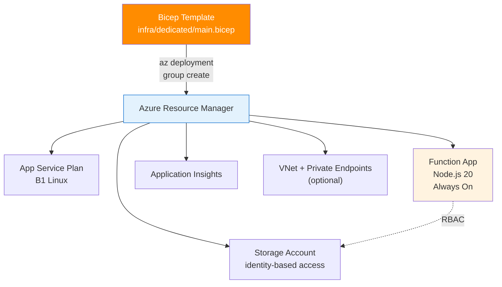

---
hide:
  - toc
validation:
  az_cli:
    last_tested: 2026-04-10
    cli_version: "2.83.0"
    core_tools_version: "4.8.0"
    result: pass
  bicep:
    last_tested: null
    result: not_tested
content_sources:
  - type: mslearn-adapted
    url: https://learn.microsoft.com/azure/azure-functions/functions-reference-node
  - type: mslearn-adapted
    url: https://learn.microsoft.com/azure/azure-functions/create-first-function-cli-node
  - type: mslearn-adapted
    url: https://learn.microsoft.com/azure/azure-functions/functions-scale
---

# 05 - Infrastructure as Code (Dedicated)

Deploy repeatable infrastructure with Bicep and parameterized environments.

## Prerequisites

- You completed [04 - Logging and Monitoring](04-logging-monitoring.md).
- You have the Bicep CLI installed (`az bicep install`).

## What You'll Build

- Deploy the complete Dedicated infrastructure stack from Bicep, including storage, hosting plan, and Linux Function App resources.
- Verify the deployment state using Azure Resource Manager deployment metadata.

!!! info "Infrastructure Context"
    **Plan**: Dedicated (B1) | **IaC**: Bicep | **Identity**: System-assigned managed identity

    The Dedicated Bicep template uses `Microsoft.Web/serverfarms` with `kind: 'linux'` (not `kind: 'elastic'` used by Premium). Storage is configured with `allowSharedKeyAccess: false` for identity-based access.

    <!-- diagram-id: what-you-ll-build -->


## Steps

1. Review the Dedicated Bicep template.

    The repository template at `infra/dedicated/main.bicep` includes VNet integration, private endpoints, private DNS, and full RBAC configuration. Below is a simplified version showing key differences from other plans:

    ```bicep
    param location string = resourceGroup().location
    param baseName string

    var functionAppName = '${baseName}-func'
    var storageAccountName = toLower(replace('${baseName}storage', '-', ''))
    var appServicePlanName = '${baseName}-plan'

    resource storage 'Microsoft.Storage/storageAccounts@2023-05-01' = {
      name: storageAccountName
      location: location
      sku: { name: 'Standard_LRS' }
      kind: 'StorageV2'
      properties: {
        allowSharedKeyAccess: false
      }
    }

    resource plan 'Microsoft.Web/serverfarms@2024-04-01' = {
      name: appServicePlanName
      location: location
      sku: {
        name: 'S1'
        tier: 'Standard'
      }
      kind: 'linux'
      properties: {
        reserved: true
      }
    }

    resource functionApp 'Microsoft.Web/sites@2024-04-01' = {
      name: functionAppName
      location: location
      kind: 'functionapp,linux'
      identity: {
        type: 'SystemAssigned'
      }
      properties: {
        serverFarmId: plan.id
        httpsOnly: true
        siteConfig: {
          linuxFxVersion: 'NODE|20'
          alwaysOn: true
          appSettings: [
            { name: 'FUNCTIONS_EXTENSION_VERSION'; value: '~4' }
            { name: 'FUNCTIONS_WORKER_RUNTIME'; value: 'node' }
            { name: 'AzureWebJobsStorage__accountName'; value: storage.name }
            { name: 'AzureWebJobsStorage__credential'; value: 'managedidentity' }
            { name: 'WEBSITE_RUN_FROM_PACKAGE'; value: '1' }
          ]
        }
      }
    }
    ```

    !!! tip "Key Dedicated Bicep differences"
        | Property | Premium | Dedicated |
        |---|---|---|
        | Plan `kind` | `elastic` | `linux` |
        | Plan SKU | `EP1` / `ElasticPremium` | `B1` / `Basic` or `S1` / `Standard` |
        | `alwaysOn` | Not needed (pre-warmed) | **Required** for non-HTTP triggers |
        | Content share | Required (`WEBSITE_CONTENTAZUREFILECONNECTIONSTRING`) | Not needed |
        | `WEBSITE_RUN_FROM_PACKAGE` | `1` | `1` |
        | `allowSharedKeyAccess` | `true` (content share needs it) | `false` (identity-based only) |

2. Deploy the template.

    !!! note "baseName length constraint"
        Storage account names max 24 characters. Keep `baseName` ≤ 17 characters to avoid naming conflicts.

    ```bash
    az deployment group create \
      --resource-group "$RG" \
      --template-file infra/dedicated/main.bicep \
      --parameters baseName="$BASE_NAME"
    ```

3. Verify deployment state.

    ```bash
    az deployment group show \
      --resource-group "$RG" \
      --name main \
      --output json
    ```

    Expected output (abridged):

    ```json
    {
      "name": "main",
      "properties": {
        "provisioningState": "Succeeded",
        "mode": "Incremental",
        "timestamp": "2026-04-09T16:15:00.000Z"
      }
    }
    ```

4. Review Dedicated-specific Bicep notes.

    - Dedicated does not require Azure Files content share settings; zip-based deployments use `WEBSITE_RUN_FROM_PACKAGE=1` as configured in the template.
    - Enable `alwaysOn: true` in `siteConfig` for non-HTTP triggers so timer, queue, and blob workloads stay active.
    - The repository template (`infra/dedicated/main.bicep`) includes full VNet integration with private endpoints and DNS zones, plus RBAC role assignments for identity-based storage.
    - Modify `linuxFxVersion` to `NODE|20` (or `NODE|22`) for Node.js apps; the template defaults to Python.

## Verification

A `Succeeded` provisioning state confirms the Bicep deployment completed. Verify:

- `az deployment group show` returns `provisioningState: Succeeded`
- The created Function App has `alwaysOn: true` in site config
- Storage account has `allowSharedKeyAccess: false`

## See Also
- [Tutorial Overview & Plan Chooser](../index.md)
- [Node.js Language Guide](../../index.md)
- [Platform: Hosting Plans](../../../../platform/hosting.md)
- [Operations: Deployment](../../../../operations/deployment.md)
- [Recipes Index](../../recipes/index.md)

## Sources
- [Azure Functions Node.js developer guide (Microsoft Learn)](https://learn.microsoft.com/azure/azure-functions/functions-reference-node)
- [Create your first Azure Function with Core Tools (Microsoft Learn)](https://learn.microsoft.com/azure/azure-functions/create-first-function-cli-node)
- [Azure Functions hosting options (Microsoft Learn)](https://learn.microsoft.com/azure/azure-functions/functions-scale)
