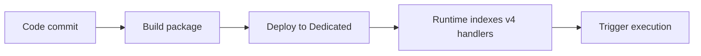

# 05 - Infrastructure as Code (Dedicated)

Deploy repeatable infrastructure with Bicep and parameterized environments.

## Prerequisites

| Tool | Version | Purpose |
|---|---|---|
| Node.js | 20+ | Local runtime and package execution |
| Azure Functions Core Tools | v4 | Local host and publishing |
| Azure CLI | 2.61+ | Azure resource provisioning and management |

!!! info "Plan basics"
    Dedicated runs on App Service plans (B1/S1/P1v3), supports Always On, and behaves like traditional web app hosting.

## Steps




### Step 1 - Define Bicep template

```bicep
param location string = resourceGroup().location
param appName string
param storageName string
param planName string = 'plan-node-dedicated'

resource storage 'Microsoft.Storage/storageAccounts@2023-05-01' = {
  name: storageName
  location: location
  sku: { name: 'Standard_LRS' }
  kind: 'StorageV2'
}
```

### Step 2 - Deploy template

```bash
az deployment group create --resource-group $RG --template-file infra/main.bicep --parameters appName=$APP_NAME storageName=$STORAGE_NAME planName=$PLAN_NAME
```

### Step 3 - Publish code package

```bash
func azure functionapp publish $APP_NAME
```


### Plan-specific notes

- Enable Always On for non-trivial workloads to avoid app unload behavior.
- Use long-form CLI flags for maintainable runbooks.
- Keep `FUNCTIONS_WORKER_RUNTIME=node` across all environments.

## Expected Output

```text
Functions:
    helloHttp: [GET] http://localhost:7071/api/hello/{name?}
```


## See Also
- [Tutorial Overview & Plan Chooser](../index.md)
- [Node.js Language Guide](../../index.md)
- [Platform: Hosting Plans](../../../../platform/hosting.md)
- [Operations: Deployment](../../../../operations/deployment.md)
- [Recipes Index](../../recipes/index.md)

## Sources
- [Azure Functions Node.js developer guide (Microsoft Learn)](https://learn.microsoft.com/azure/azure-functions/functions-reference-node)
- [Create your first Azure Function with Core Tools (Microsoft Learn)](https://learn.microsoft.com/azure/azure-functions/create-first-function-cli-node)
- [Azure Functions hosting options (Microsoft Learn)](https://learn.microsoft.com/azure/azure-functions/functions-scale)
