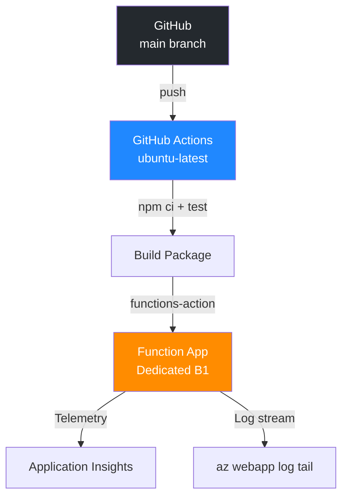

---
validation:
  az_cli:
    last_tested: 2026-04-10
    cli_version: "2.83.0"
    core_tools_version: "4.8.0"
    result: pass
  bicep:
    last_tested: null
    result: not_tested
content_sources:
  - type: mslearn-adapted
    url: https://learn.microsoft.com/azure/azure-functions/functions-reference-node
  - type: mslearn-adapted
    url: https://learn.microsoft.com/azure/azure-functions/create-first-function-cli-node
  - type: mslearn-adapted
    url: https://learn.microsoft.com/azure/azure-functions/functions-scale
---

# 06 - CI/CD (Dedicated)

Automate build and deployment with GitHub Actions and environment gates.

## Prerequisites

- You completed [05 - Infrastructure as Code](05-infrastructure-as-code.md).
- You have a GitHub repository with your Node.js Function App code.

## What You'll Build

- A GitHub Actions workflow that builds and deploys your Node.js Functions app on each push to `main`.
- Release health validation from runtime logs after the deployment finishes.

!!! info "Infrastructure Context"
    **Plan**: Dedicated (B1) | **CI/CD**: GitHub Actions | **Deploy**: Publish profile

    GitHub Actions deploys to the Dedicated Function App using a publish profile stored as a repository secret. The workflow runs `npm ci`, optional tests, and then uses `Azure/functions-action` to deploy the package.

    <!-- diagram-id: what-you-ll-build -->


## Steps

1. Create the GitHub Actions workflow.

    Save as `.github/workflows/deploy-node-dedicated.yml`:

    ```yaml
    name: deploy-node-functions
    on:
      push:
        branches: [ main ]
    jobs:
      deploy:
        runs-on: ubuntu-latest
        steps:
          - uses: actions/checkout@v4
          - uses: actions/setup-node@v4
            with:
              node-version: '20'
          - run: npm ci
          - run: npm test --if-present
          - uses: Azure/functions-action@v1
            with:
              app-name: ${{ secrets.APP_NAME }}
              package: '.'
              publish-profile: ${{ secrets.AZURE_FUNCTIONAPP_PUBLISH_PROFILE }}
    ```

2. Store secrets in GitHub.

    - Add `APP_NAME` in GitHub Actions secrets (e.g., `func-ndded-04100022`).
    - Add `AZURE_FUNCTIONAPP_PUBLISH_PROFILE` from Function App publish profile export:

    ```bash
    az functionapp deployment list-publishing-profiles \
      --name "$APP_NAME" \
      --resource-group "$RG" \
      --xml
    ```

    Copy the XML output and paste it as the `AZURE_FUNCTIONAPP_PUBLISH_PROFILE` secret value.

3. Validate release health.

    !!! warning "`az functionapp log tail` does not exist"
        As of Azure CLI 2.83.0, `az functionapp log tail` is **not a valid command**. On Dedicated plans, use `az webapp log tail` instead.

    ```bash
    az webapp log tail \
      --name "$APP_NAME" \
      --resource-group "$RG"
    ```

    Expected log stream output:

    ```text
    2026-04-09T16:20:11  Connected!
    2026-04-09T16:20:19  [Information] Executing 'Functions.helloHttp' (Reason='This function was programmatically called via the host APIs.', Id=a1b2c3d4-e5f6-7890-abcd-ef1234567890)
    2026-04-09T16:20:19  [Information] Handled hello for world
    2026-04-09T16:20:19  [Information] Executed 'Functions.helloHttp' (Succeeded, Id=a1b2c3d4-e5f6-7890-abcd-ef1234567890, Duration=34ms)
    ```

4. Verify post-deployment function list.

    ```bash
    az functionapp function list \
      --name "$APP_NAME" \
      --resource-group "$RG" \
      --output table
    ```

    Expected output (abridged):

    ```text
    Name                                          Language
    --------------------------------------------  ----------
    func-ndded-04100022/helloHttp                 node
    func-ndded-04100022/health                    node
    func-ndded-04100022/info                      node
    func-ndded-04100022/scheduledCleanup          node
    ```

## Verification

The log stream confirms the deployed function starts and handles requests successfully. Verify:

- GitHub Actions workflow completes with a green check
- `az webapp log tail` shows function execution logs (not `az functionapp log tail`)
- `az functionapp function list` shows all functions with language `node`

## See Also
- [Tutorial Overview & Plan Chooser](../index.md)
- [Node.js Language Guide](../../index.md)
- [Platform: Hosting Plans](../../../../platform/hosting.md)
- [Operations: Deployment](../../../../operations/deployment.md)
- [Recipes Index](../../recipes/index.md)

## Sources
- [Azure Functions Node.js developer guide (Microsoft Learn)](https://learn.microsoft.com/azure/azure-functions/functions-reference-node)
- [Create your first Azure Function with Core Tools (Microsoft Learn)](https://learn.microsoft.com/azure/azure-functions/create-first-function-cli-node)
- [Azure Functions hosting options (Microsoft Learn)](https://learn.microsoft.com/azure/azure-functions/functions-scale)
