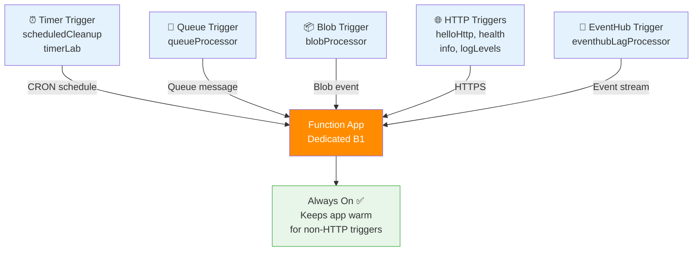

---
validation:
  az_cli:
    last_tested: 2026-04-10
    cli_version: "2.83.0"
    core_tools_version: "4.8.0"
    result: pass
  bicep:
    last_tested: null
    result: not_tested
content_sources:
  - type: mslearn-adapted
    url: https://learn.microsoft.com/azure/azure-functions/functions-reference-node
  - type: mslearn-adapted
    url: https://learn.microsoft.com/azure/azure-functions/create-first-function-cli-node
  - type: mslearn-adapted
    url: https://learn.microsoft.com/azure/azure-functions/functions-scale
---

# 07 - Extending Triggers (Dedicated)

Add queue, timer, and blob triggers with the Node.js v4 APIs and deploy to Dedicated.

## Prerequisites

- You completed [06 - CI/CD](06-ci-cd.md).
- Your function app `$APP_NAME` is deployed and running on the Dedicated plan.

## What You'll Build

- Extend your app with timer, queue, and blob triggers using the Node.js v4 programming model.
- Deploy all triggers to Dedicated and verify they index correctly.
- Understand Always On requirements for non-HTTP triggers on Dedicated plans.

!!! info "Infrastructure Context"
    **Plan**: Dedicated (B1) | **Triggers**: HTTP + Timer + Queue + Blob + EventHub | **Always On**: ✅ (required)

    Dedicated plans **require** Always On for non-HTTP triggers. Without it, the app may idle after 20 minutes and miss timer/queue/blob events. The reference app includes 20 functions across all trigger types.

    <!-- diagram-id: what-you-ll-build -->


## Steps

1. Add timer trigger.

    The reference app includes `src/functions/scheduledCleanup.js`:

    ```javascript
    const { app } = require('@azure/functions');

    app.timer('scheduledCleanup', {
        schedule: '0 0 2 * * *',
        handler: async (_timer, context) => {
            context.log('Nightly cleanup job fired');
        }
    });
    ```

    !!! tip "Always On required for timers"
        On Dedicated plans, timer triggers only fire if Always On is enabled. Without it, the app may idle and miss scheduled executions.

2. Add queue trigger.

    The reference app includes `src/functions/queueProcessor.js`:

    ```javascript
    const { app } = require('@azure/functions');

    app.storageQueue('queueProcessor', {
        queueName: 'incoming-orders',
        connection: 'QueueStorage',
        handler: async (queueItem, context) => {
            context.log(`Order received: ${JSON.stringify(queueItem)}`);
        }
    });
    ```

    !!! note "Queue connection setting"
        The `connection` property (`QueueStorage`) must match an app setting containing the storage connection string. Set it during deployment:

        ```bash
        az functionapp config appsettings set \
          --name "$APP_NAME" \
          --resource-group "$RG" \
          --settings "QueueStorage=$(az storage account show-connection-string --name $STORAGE_NAME --resource-group $RG --query connectionString --output tsv)"
        ```

3. Add blob trigger.

    The reference app includes `src/functions/blobProcessor.js`:

    ```javascript
    const { app } = require('@azure/functions');

    app.storageBlob('blobProcessor', {
        path: 'uploads/{name}',
        connection: 'AzureWebJobsStorage',
        source: 'EventGrid',
        handler: async (blob, context) => {
            context.log(`Processing blob: ${context.triggerMetadata.name}, size: ${blob.length} bytes`);
        }
    });
    ```

4. Deploy and verify trigger indexing.

    ```bash
    cd apps/nodejs
    func azure functionapp publish "$APP_NAME"
    ```

    Wait 30–60 seconds for indexing, then verify:

    ```bash
    az functionapp function list \
      --name "$APP_NAME" \
      --resource-group "$RG" \
      --output table
    ```

    Expected output (all 20 functions):

    ```text
    Name                                          Language
    --------------------------------------------  ----------
    func-ndded-04100022/blobProcessor             node
    func-ndded-04100022/checkReplayStatus         node
    func-ndded-04100022/dnsResolve                node
    func-ndded-04100022/eventhubLagProcessor      node
    func-ndded-04100022/externalDependency        node
    func-ndded-04100022/health                    node
    func-ndded-04100022/helloHttp                 node
    func-ndded-04100022/identityProbe             node
    func-ndded-04100022/info                      node
    func-ndded-04100022/logLevels                 node
    func-ndded-04100022/queueProcessor            node
    func-ndded-04100022/replayLabActivity         node
    func-ndded-04100022/replayStormOrchestrator   node
    func-ndded-04100022/scheduledCleanup          node
    func-ndded-04100022/slowResponse              node
    func-ndded-04100022/startReplayLab            node
    func-ndded-04100022/storageProbe              node
    func-ndded-04100022/testError                 node
    func-ndded-04100022/timerLab                  node
    func-ndded-04100022/unhandledError            node
    ```

5. Test HTTP endpoints after deployment.

    ```bash
    curl --request GET "https://$APP_NAME.azurewebsites.net/api/health"
    ```

    Expected output:

    ```json
    {"status":"healthy","timestamp":"2026-04-09T16:05:04.222Z","version":"1.0.0"}
    ```

    ```bash
    curl --request GET "https://$APP_NAME.azurewebsites.net/api/hello/Triggers"
    ```

    Expected output:

    ```json
    {"message":"Hello, Triggers"}
    ```

6. Review Dedicated trigger-specific notes.

    - **Always On**: Required for timer, queue, blob, and EventHub triggers. Without it, Dedicated apps idle after ~20 minutes.
    - **EventHub placeholder**: Set `EventHubConnection__fullyQualifiedNamespace=placeholder.servicebus.windows.net` to allow indexing without a real EventHub.
    - **Queue connection**: `QueueStorage` app setting must contain a valid storage connection string for `queueProcessor` to index.
    - **No auto-scale**: Dedicated plans do not scale automatically based on queue depth or event backlog. For auto-scaling workloads, use Premium or Consumption.

## Verification

The host output confirms all triggers are indexed and available. Verify:

- `az functionapp function list` shows all 20 functions with language `node`
- HTTP endpoints return expected responses
- Timer triggers (`scheduledCleanup`, `timerLab`) are listed — they will fire on schedule only if Always On is enabled

## See Also
- [Tutorial Overview & Plan Chooser](../index.md)
- [Node.js Language Guide](../../index.md)
- [Platform: Hosting Plans](../../../../platform/hosting.md)
- [Operations: Deployment](../../../../operations/deployment.md)
- [Recipes Index](../../recipes/index.md)

## Sources
- [Azure Functions Node.js developer guide (Microsoft Learn)](https://learn.microsoft.com/azure/azure-functions/functions-reference-node)
- [Create your first Azure Function with Core Tools (Microsoft Learn)](https://learn.microsoft.com/azure/azure-functions/create-first-function-cli-node)
- [Azure Functions hosting options (Microsoft Learn)](https://learn.microsoft.com/azure/azure-functions/functions-scale)
