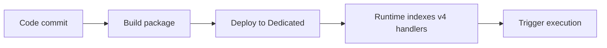

# 07 - Extending Triggers (Dedicated)

Add queue, timer, and blob triggers with the Node.js v4 APIs.

## Prerequisites

| Tool | Version | Purpose |
|---|---|---|
| Node.js | 20+ | Local runtime and package execution |
| Azure Functions Core Tools | v4 | Local host and publishing |
| Azure CLI | 2.61+ | Azure resource provisioning and management |

!!! info "Plan basics"
    Dedicated runs on App Service plans (B1/S1/P1v3), supports Always On, and behaves like traditional web app hosting.

## What You'll Build

You will extend your app with a timer trigger (`nightlySummary`), a queue trigger (`orderProcessor`), and a blob trigger (`blobIngest`).
You will run the host locally to verify that all triggers are indexed alongside the existing `helloHttp` endpoint.

## Steps



### Step 1 - Add timer and queue triggers

```javascript
const { app } = require('@azure/functions');

app.timer('nightlySummary', {
    schedule: '0 0 2 * * *',
    handler: async (_timer, context) => {
        context.log('Nightly summary job fired');
    }
});

app.storageQueue('orderProcessor', {
    queueName: 'orders',
    connection: 'AzureWebJobsStorage',
    handler: async (queueItem, context) => {
        context.log(`Order received ${queueItem.orderId}`);
    }
});
```

### Step 2 - Add blob trigger

```javascript
const { app } = require('@azure/functions');

app.storageBlob('blobIngest', {
    path: 'incoming/{name}',
    connection: 'AzureWebJobsStorage',
    handler: async (blob, context) => {
        context.log(`Blob bytes: ${blob.length}`);
    }
});
```

### Step 3 - Verify trigger indexing

```bash
func start
```

### Plan-specific notes

- Dedicated does not require Azure Files content share settings for zip-based deployments (`WEBSITE_RUN_FROM_PACKAGE=1`).
- Enable Always On for non-HTTP triggers so timer, queue, and blob workloads stay active.
- Use long-form CLI flags for maintainable runbooks.

## Verification

```text
Functions:
    helloHttp: [GET] http://localhost:7071/api/hello/{name?}
    nightlySummary: timerTrigger
    orderProcessor: queueTrigger
    blobIngest: blobTrigger
```

The host output confirms all added triggers are indexed and available for local validation.

## See Also
- [Tutorial Overview & Plan Chooser](../index.md)
- [Node.js Language Guide](../../index.md)
- [Platform: Hosting Plans](../../../../platform/hosting.md)
- [Operations: Deployment](../../../../operations/deployment.md)
- [Recipes Index](../../recipes/index.md)

## Sources
- [Azure Functions Node.js developer guide (Microsoft Learn)](https://learn.microsoft.com/azure/azure-functions/functions-reference-node)
- [Create your first Azure Function with Core Tools (Microsoft Learn)](https://learn.microsoft.com/azure/azure-functions/create-first-function-cli-node)
- [Azure Functions hosting options (Microsoft Learn)](https://learn.microsoft.com/azure/azure-functions/functions-scale)
