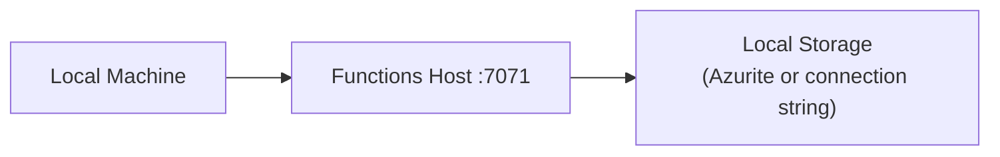
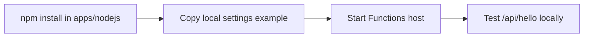

---
hide:
  - toc
validation:
  az_cli:
    last_tested: 2026-04-10
    cli_version: "2.83.0"
    core_tools_version: "4.8.0"
    result: pass
  bicep:
    last_tested: null
    result: not_tested
content_sources:
  - type: mslearn-adapted
    url: https://learn.microsoft.com/azure/azure-functions/functions-reference-node
  - type: mslearn-adapted
    url: https://learn.microsoft.com/azure/azure-functions/functions-run-local
  - type: mslearn-adapted
    url: https://learn.microsoft.com/azure/azure-functions/flex-consumption-plan
---

# 01 - Run Locally (Flex Consumption)

Run the sample Azure Functions Node.js v4 app on your machine before deploying to the Flex Consumption (FC1) plan. This track uses Linux shell examples; the same workflow works on Windows with equivalent commands.

## Prerequisites

| Tool | Version | Purpose |
|------|---------|---------|
| Node.js | 20+ | Local runtime and package execution |
| Azure Functions Core Tools | v4 | Start the local host and publish later |
| Azure CLI | 2.61+ | Provision and configure Azure resources |

!!! info "Flex Consumption plan basics"
    Flex Consumption (FC1) supports VNet integration, identity-based storage, per-function scaling, and remote build workflows. Unlike standard Consumption, it uses a deployment container in Blob Storage for package deployment.

!!! warning "Node.js 20 end-of-life"
    Node.js 20 reaches end-of-life on **April 30, 2026**. Consider using Node.js 22 for new projects. Azure CLI will warn about this during deployment.

## What You'll Build

You will run the Node.js v4 Functions app locally from `apps/nodejs`, install dependencies, and verify the hello endpoint responds from the local Functions host.

!!! info "Infrastructure Context"
    **Plan**: Flex Consumption (FC1) — **Network**: VNet integration supported

    This tutorial runs locally - no Azure resources are created.

    <!-- diagram-id: what-you-ll-build -->


<!-- diagram-id: what-you-ll-build-2 -->


## Steps

### Step 1 - Install dependencies

```bash
cd apps/nodejs
npm install
```

### Step 2 - Create local settings

```bash
cp apps/nodejs/local.settings.json.example apps/nodejs/local.settings.json
```

Update `apps/nodejs/local.settings.json` with these baseline values:

```json
{
  "IsEncrypted": false,
  "Values": {
    "FUNCTIONS_WORKER_RUNTIME": "node",
    "AzureWebJobsStorage": "UseDevelopmentStorage=true"
  }
}
```

!!! warning "EventHub placeholder connection"
    If your app includes an Event Hub trigger, do **not** set `EventHubConnection` to an empty string in `local.settings.json`. The EventHub extension validates the connection string at startup and will crash the host. Either provide a valid connection string or remove the setting entirely.

### Step 3 - Start the Functions host

```bash
cd apps/nodejs && func host start
```

### Step 4 - Call an endpoint from another terminal

```bash
curl --request GET "http://localhost:7071/api/hello"
```

### Step 5 - Review Flex Consumption-specific notes

- Flex Consumption routes all traffic through the integrated VNet by default, so you do not set `WEBSITE_VNET_ROUTE_ALL` manually.
- Flex Consumption does not support custom container hosting for Function Apps.
- Use long-form CLI flags (`--resource-group`, not `-g`) for maintainable runbooks.

## Verification

Host start output:

```text
Azure Functions Core Tools
Core Tools Version:       4.x.x
Function Runtime Version: 4.x.x.x

Functions:

    helloHttp: [GET] http://localhost:7071/api/hello/{name?}
    health: [GET] http://localhost:7071/api/health
    info: [GET] http://localhost:7071/api/info
```

!!! note "All 20 functions indexed"
    The reference app at `apps/nodejs` registers 20 functions across HTTP, Timer, Queue, Blob, EventHub, and Durable triggers. Only the HTTP functions are shown above for brevity.

HTTP response example:

```json
{"message":"Hello, world"}
```

## Next Steps

> **Next:** [02 - First Deploy](02-first-deploy.md)

## See Also

- [Tutorial Overview & Plan Chooser](../index.md)
- [Node.js Language Guide](../../index.md)
- [Platform: Hosting Plans](../../../../platform/hosting.md)
- [Operations: Deployment](../../../../operations/deployment.md)
- [Recipes Index](../../recipes/index.md)

## Sources

- [Azure Functions Node.js developer guide (Microsoft Learn)](https://learn.microsoft.com/azure/azure-functions/functions-reference-node)
- [Run Functions locally with Core Tools (Microsoft Learn)](https://learn.microsoft.com/azure/azure-functions/functions-run-local)
- [Azure Functions Flex Consumption plan (Microsoft Learn)](https://learn.microsoft.com/azure/azure-functions/flex-consumption-plan)
