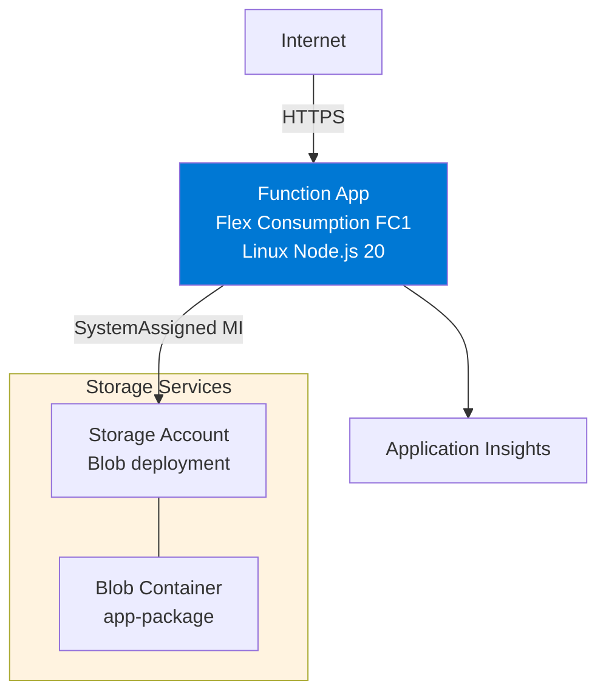
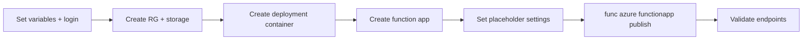

---
hide:
  - toc
validation:
  az_cli:
    last_tested: 2026-04-10
    cli_version: "2.83.0"
    core_tools_version: "4.8.0"
    result: pass
  bicep:
    last_tested: null
    result: not_tested
content_sources:
  - type: mslearn-adapted
    url: https://learn.microsoft.com/azure/azure-functions/functions-reference-node
  - type: mslearn-adapted
    url: https://learn.microsoft.com/azure/azure-functions/create-first-function-cli-node
  - type: mslearn-adapted
    url: https://learn.microsoft.com/azure/azure-functions/flex-consumption-plan
---

# 02 - First Deploy (Flex Consumption)

Deploy the app to Azure Functions Flex Consumption (FC1) using long-form CLI commands only.

## Prerequisites

| Tool | Version | Purpose |
|------|---------|---------|
| Node.js | 20+ | Local runtime and package execution |
| Azure Functions Core Tools | v4 | Local host and publishing |
| Azure CLI | 2.61+ | Azure resource provisioning and management |
| Azure subscription | Active | Target for deployment |

!!! info "Flex Consumption plan basics"
    Flex Consumption (FC1) supports VNet integration, identity-based storage, per-function scaling, and remote build workflows.

## What You'll Build

You will provision a Linux Function App on the Flex Consumption plan, publish your Node.js v4 app, and validate trigger discovery.

!!! info "Infrastructure Context"
    **Plan**: Flex Consumption (FC1) | **Network**: VNet integration supported | **Storage auth**: SystemAssigned MI

    Flex Consumption uses blob-based deployment storage with managed identity authentication, unlike Consumption which uses Azure Files with connection strings.

    <!-- diagram-id: what-you-ll-build -->


<!-- diagram-id: what-you-ll-build-2 -->


## Steps

### Step 1 - Set variables and sign in

```bash
export RG="rg-func-node-flex-demo"
export APP_NAME="func-ndflex-$(date +%m%d%H%M)"
export STORAGE_NAME="stndflex$(date +%m%d)"
export LOCATION="koreacentral"

az login
az account set --subscription "<subscription-id>"
```

| Command/Parameter | Purpose |
|-------------------|---------|
| `export RG="rg-func-node-flex-demo"` | Sets the resource group name for the deployment. |
| `export APP_NAME="..."` | Defines a globally unique name for the Function App using a timestamp. |
| `export STORAGE_NAME="..."` | Sets a unique name for the storage account. |
| `export LOCATION="koreacentral"` | Chooses the Azure region for the deployment. |
| `az login` | Authenticates your CLI session with Azure. |
| `az account set --subscription` | Targets the specific Azure subscription for resource creation. |

### Step 2 - Create resource group and storage account

```bash
az group create --name "$RG" --location "$LOCATION"

az storage account create \
  --name "$STORAGE_NAME" \
  --resource-group "$RG" \
  --location "$LOCATION" \
  --sku Standard_LRS \
  --kind StorageV2
```

| Command/Parameter | Purpose |
|-------------------|---------|
| `az group create` | Provisions a new Azure resource group container. |
| `--name "$RG"` | Specifies the resource group name. |
| `--location "$LOCATION"` | Sets the geographical region for the group. |
| `az storage account create` | Provisions a new Azure Storage account. |
| `--sku Standard_LRS` | Selects locally-redundant storage for cost-efficiency. |
| `--kind StorageV2` | Uses the general-purpose v2 storage account type. |

### Step 3 - Create the deployment container

```bash
az storage container create \
  --name app-package \
  --account-name "$STORAGE_NAME" \
  --auth-mode login
```

| Command/Parameter | Purpose |
|-------------------|---------|
| `az storage container create` | Creates a new blob container within the storage account. |
| `--name app-package` | Names the container that will store deployment zip files. |
| `--auth-mode login` | Uses your Entra ID credentials instead of a connection string. |

!!! warning "Container must exist before function app creation"
    Flex Consumption requires a pre-existing blob container for deployment packages. If the container does not exist, `az functionapp create` fails with a `ContainerNotFound` error.

### Step 4 - Create function app

```bash
az functionapp create \
  --name "$APP_NAME" \
  --resource-group "$RG" \
  --storage-account "$STORAGE_NAME" \
  --runtime node \
  --runtime-version 20 \
  --functions-version 4 \
  --flexconsumption-location "$LOCATION" \
  --deployment-storage-name "$STORAGE_NAME" \
  --deployment-storage-container-name app-package \
  --deployment-storage-auth-type SystemAssignedIdentity
```

| Command/Parameter | Purpose |
|-------------------|---------|
| `az functionapp create` | Provisions the core Function App resource. |
| `--runtime node` | Selects the Node.js execution environment. |
| `--runtime-version 20` | Pins the Node.js version to v20. |
| `--functions-version 4` | Uses version 4 of the Azure Functions runtime host. |
| `--flexconsumption-location` | Specifies the region for the Flex Consumption plan. |
| `--deployment-storage-name` | Links the app to the deployment storage account. |
| `--deployment-storage-container-name` | Targets the specific container for package storage. |
| `--deployment-storage-auth-type` | Uses Managed Identity for secure access to deployment blobs. |

!!! note "Flex Consumption vs Consumption CLI differences"
    Flex Consumption uses `--flexconsumption-location` instead of `--consumption-plan-location`. It also requires `--deployment-storage-name`, `--deployment-storage-container-name`, and `--deployment-storage-auth-type` parameters.

### Step 5 - Set placeholder trigger settings

```bash
STORAGE_CONN=$(az storage account show-connection-string \
  --name "$STORAGE_NAME" \
  --resource-group "$RG" \
  --output tsv)

az functionapp config appsettings set \
  --name "$APP_NAME" \
  --resource-group "$RG" \
  --settings \
    "QueueStorage=$STORAGE_CONN" \
    "EventHubConnection=Endpoint=sb://placeholder.servicebus.windows.net/;SharedAccessKeyName=placeholder;SharedAccessKey=placeholder;EntityPath=placeholder" \
    "TIMER_LAB_SCHEDULE=0 */5 * * * *"
```

| Command/Parameter | Purpose |
|-------------------|---------|
| `az storage account show-connection-string` | Retrieves the full connection string for the storage account. |
| `az functionapp config appsettings set` | Updates the application settings for the Function App. |
| `--settings` | Defines the key-value pairs required by the function triggers. |

!!! warning "Placeholder settings prevent host errors"
    The Node.js v4 reference app includes triggers for Queue, EventHub, and Timer. If these connection settings are missing, the Functions host enters an `Error` state and cannot index any functions.

### Step 6 - Publish app

```bash
cd apps/nodejs && func azure functionapp publish "$APP_NAME"
```

| Command/Parameter | Purpose |
|-------------------|---------|
| `cd apps/nodejs` | Moves the terminal into the source code directory. |
| `func azure functionapp publish` | Bundles, uploads, and triggers a remote build for the app. |

!!! note "Upload size"
    Node.js function apps include `node_modules` in the deployment package, resulting in ~49 MB uploads.

### Step 7 - Validate deployment

```bash
# List deployed functions
az functionapp function list \
  --name "$APP_NAME" \
  --resource-group "$RG" \
  --output table

# Test the health endpoint
curl --request GET "https://$APP_NAME.azurewebsites.net/api/health"

# Test the hello endpoint
curl --request GET "https://$APP_NAME.azurewebsites.net/api/hello/FlexTest"
```

| Command/Parameter | Purpose |
|-------------------|---------|
| `az functionapp function list` | Queries ARM to retrieve the list of indexed functions. |
| `--output table` | Formats the function list as a readable text table. |
| `curl --request GET` | Sends an HTTP GET request to verify the live endpoints. |


### Step 8 - Review Flex Consumption-specific notes

- Flex Consumption routes all traffic through the integrated VNet by default once configured.
- Flex Consumption does not support custom container hosting for Function Apps.
- Use long-form CLI flags for maintainable runbooks.

## Verification

Function list output (showing key fields):

```json
[
  {
    "name": "helloHttp",
    "type": "Microsoft.Web/sites/functions",
    "invokeUrlTemplate": "https://<app-name>.azurewebsites.net/api/hello/{name?}",
    "language": "node",
    "isDisabled": false
  }
]
```

Health endpoint response:

```json
{"status":"healthy","timestamp":"2026-04-10T00:27:00.000Z","version":"1.0.0"}
```

Hello endpoint response:

```json
{"message":"Hello, FlexTest"}
```

## Next Steps

> **Next:** [03 - Configuration](03-configuration.md)

## See Also

- [Tutorial Overview & Plan Chooser](../index.md)
- [Node.js Language Guide](../../index.md)
- [Platform: Hosting Plans](../../../../platform/hosting.md)
- [Operations: Deployment](../../../../operations/deployment.md)
- [Recipes Index](../../recipes/index.md)

## Sources

- [Azure Functions Node.js developer guide (Microsoft Learn)](https://learn.microsoft.com/azure/azure-functions/functions-reference-node)
- [Create your first Azure Function with Core Tools (Microsoft Learn)](https://learn.microsoft.com/azure/azure-functions/create-first-function-cli-node)
- [Azure Functions Flex Consumption plan (Microsoft Learn)](https://learn.microsoft.com/azure/azure-functions/flex-consumption-plan)
