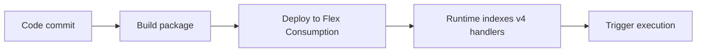

# 02 - First Deploy (Flex Consumption)

Provision resources and publish your first Node.js v4 function app.

## Prerequisites

| Tool | Version | Purpose |
|---|---|---|
| Node.js | 20+ | Local runtime and package execution |
| Azure Functions Core Tools | v4 | Local host and publishing |
| Azure CLI | 2.61+ | Azure resource provisioning and management |

!!! info "Plan basics"
    Flex Consumption supports VNet integration, identity-based storage, per-function scaling, and remote build workflows.

## What You'll Build

You will provision a Linux Function App on the Flex Consumption track, deploy your Node.js v4 project, and verify function indexing in Azure.
You will confirm the deployed function list from the platform control plane rather than local runtime output.

## Steps



### Step 1 - Create resource group

```bash
az group create --name $RG --location $LOCATION
```

### Step 2 - Create storage and function app

```bash
az storage account create --name $STORAGE_NAME --resource-group $RG --location $LOCATION --sku Standard_LRS
az functionapp create --name $APP_NAME --resource-group $RG --storage-account $STORAGE_NAME --runtime node --runtime-version 20 --functions-version 4 --flexconsumption-location $LOCATION --deployment-storage-name $STORAGE_NAME --deployment-storage-container-name app-package --deployment-storage-auth-type SystemAssignedIdentity
```

### Step 3 - Publish app

```bash
func azure functionapp publish $APP_NAME
```

### Step 4 - Validate deployment

```bash
az functionapp function list --name $APP_NAME --resource-group $RG --output table
```

### Plan-specific notes

- Flex Consumption routes all traffic through the integrated VNet by default, so you do not set `WEBSITE_VNET_ROUTE_ALL` manually.
- Flex Consumption does not support custom container hosting for Function Apps.
- Use long-form CLI flags for maintainable runbooks.

## Verification

```text
Name       Language
---------  ----------
helloHttp  Javascript
```

The output confirms that Azure indexed your function definition and is ready to serve requests.

## See Also
- [Tutorial Overview & Plan Chooser](../index.md)
- [Node.js Language Guide](../../index.md)
- [Platform: Hosting Plans](../../../../platform/hosting.md)
- [Operations: Deployment](../../../../operations/deployment.md)
- [Recipes Index](../../recipes/index.md)

## Sources
- [Azure Functions Node.js developer guide (Microsoft Learn)](https://learn.microsoft.com/azure/azure-functions/functions-reference-node)
- [Create your first Azure Function with Core Tools (Microsoft Learn)](https://learn.microsoft.com/azure/azure-functions/create-first-function-cli-node)
- [Azure Functions hosting options (Microsoft Learn)](https://learn.microsoft.com/azure/azure-functions/functions-scale)
