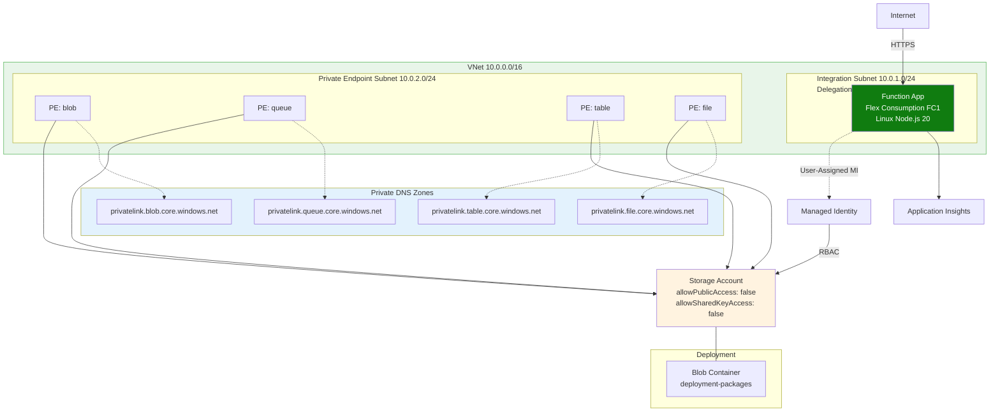
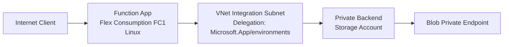

---
hide:
  - toc
validation:
  az_cli:
    last_tested: null
    cli_version: "2.83.0"
    core_tools_version: "4.8.0"
    result: not_tested
  bicep:
    last_tested: null
    result: not_tested
content_sources:
  - type: mslearn-adapted
    url: https://learn.microsoft.com/azure/azure-functions/functions-reference-node
  - type: mslearn-adapted
    url: https://learn.microsoft.com/azure/azure-functions/flex-consumption-plan
  - type: mslearn-adapted
    url: https://learn.microsoft.com/azure/azure-functions/create-first-function-cli-node
---

# 02A - First Deploy (Private Egress)

Deploy your first Azure Functions app to the Flex Consumption plan (FC1) with full private networking (VNet + Storage Private Endpoints), validate runtime health, and confirm network + deployment behavior specific to Flex.

## Prerequisites

| Tool | Minimum version | Purpose |
|---|---|---|
| Node.js | 20+ | Local runtime and package execution |
| Azure Functions Core Tools | 4.x | Publish function code |
| Azure CLI | 2.60+ | Provision resources |
| jq | Latest | Parse deployment output |
| Bash | Any modern version | Run deployment script |

## What You'll Build

You will provision a Flex Consumption Function App with Azure CLI, publish Node.js code, and validate FC1 runtime behavior in Azure — all with private networking.

!!! tip "Network Scenario Choices"
    This tutorial deploys with **full private networking** (VNet + Storage PE). For other network configurations:

    | Scenario | Description | Guide |
    |----------|-------------|-------|
    | **Public Only** | No VNet, simplest setup | [Public Only](../../../../platform/networking-scenarios/public-only.md) |
    | **Private Egress** | VNet + Storage PE (this tutorial) | Current page |
    | **Private Ingress** | + Site Private Endpoint | [Private Ingress](../../../../platform/networking-scenarios/private-ingress.md) |
    | **Fixed Outbound IP** | + NAT Gateway | [Fixed Outbound](../../../../platform/networking-scenarios/fixed-outbound-nat.md) |

!!! info "Infrastructure Context"
    **Plan**: Flex Consumption (FC1) | **Network**: Full private network | **VNet**: ✅

    FC1 deploys with VNet integration, private endpoints for all storage services, private DNS zones, and user-assigned managed identity. Storage uses identity-based authentication (no shared keys).

    <!-- diagram-id: what-you-ll-build -->


<!-- diagram-id: what-you-ll-build-2 -->


## Steps

### Step 1: Authenticate and Set Subscription

```bash
az login
az account set --subscription "<subscription-id>"
az account show --output json
```

| Command/Parameter | Purpose |
|-------------------|---------|
| `az login` | Authenticates your Azure CLI session with your Azure account. |
| `az account set --subscription "<subscription-id>"` | Sets the active subscription context for subsequent commands. |
| `--subscription "<subscription-id>"` | Specifies the target subscription ID. |
| `az account show --output json` | Displays the current subscription details in JSON format to verify the context. |

Expected output:

```json
{
  "id": "<subscription-id>",
  "tenantId": "<tenant-id>",
  "user": {
    "name": "<redacted>",
    "type": "user"
  }
}
```

### Step 2: Set Deployment Variables

```bash
export BASE_NAME="ndflex"
export RG="rg-func-node-flex-demo"
export APP_NAME="func-ndflex-$(openssl rand -hex 4)"
export PLAN_NAME="flexdemo-plan"
export STORAGE_NAME="stndflex$(openssl rand -hex 4)"
export MI_NAME="ndflex-identity"
export VNET_NAME="ndflex-vnet"
export APPINSIGHTS_NAME="ndflex-insights"
export LOCATION="koreacentral"
```

| Command/Parameter | Purpose |
|-------------------|---------|
| `export BASE_NAME="ndflex"` | Sets the base name for resource naming conventions. |
| `export RG="rg-func-node-flex-demo"` | Defines the resource group name. |
| `export APP_NAME="func-ndflex-..."` | Sets the name for the Azure Function App (globally unique). |
| `export PLAN_NAME="flexdemo-plan"` | Defines the Flex Consumption hosting plan name. |
| `export STORAGE_NAME="stndflex..."` | Specifies the storage account name for the function (globally unique). |
| `export MI_NAME="ndflex-identity"` | Sets the name for the user-assigned managed identity. |
| `export VNET_NAME="ndflex-vnet"` | Defines the Virtual Network name. |
| `export APPINSIGHTS_NAME="ndflex-insights"` | Sets the Application Insights resource name. |
| `export LOCATION="koreacentral"` | Specifies the Azure region for deployment. |

!!! note "No output"
    `export` commands set shell variables silently. No output is expected.

### Step 3: Create Storage Account (locked down)

```bash
az group create \
  --name "$RG" \
  --location "$LOCATION" \
  --output json

az storage account create \
  --name "$STORAGE_NAME" \
  --resource-group "$RG" \
  --location "$LOCATION" \
  --sku Standard_LRS \
  --kind StorageV2 \
  --allow-blob-public-access false \
  --allow-shared-key-access false \
  --min-tls-version TLS1_2
```

| Command/Parameter | Purpose |
|-------------------|---------|
| `az group create` | Creates a new resource group to contain all deployment resources. |
| `--name "$RG"` | Specifies the resource group name from the variable. |
| `--location "$LOCATION"` | Sets the Azure region for the resource group. |
| `az storage account create` | Provisions a new Azure Storage account for the function app. |
| `--sku Standard_LRS` | Uses Standard Locally Redundant Storage for cost efficiency. |
| `--kind StorageV2` | Selects General Purpose v2 storage account type. |
| `--allow-blob-public-access false` | Disables public anonymous access to blobs for security. |
| `--allow-shared-key-access false` | Disables access via account keys, forcing identity-based access. |
| `--min-tls-version TLS1_2` | Enforces a minimum TLS version of 1.2 for all requests. |

Expected output:

```json
{
  "id": "/subscriptions/<subscription-id>/resourceGroups/rg-func-node-flex-demo",
  "location": "koreacentral",
  "name": "rg-func-node-flex-demo",
  "properties": {
    "provisioningState": "Succeeded"
  }
}
```

```json
{
  "id": "/subscriptions/<subscription-id>/resourceGroups/rg-func-node-flex-demo/providers/Microsoft.Storage/storageAccounts/<storage-name>",
  "kind": "StorageV2",
  "location": "koreacentral",
  "name": "<storage-name>",
  "properties": {
    "allowBlobPublicAccess": false,
    "allowSharedKeyAccess": false,
    "minimumTlsVersion": "TLS1_2",
    "provisioningState": "Succeeded"
  },
  "sku": {
    "name": "Standard_LRS",
    "tier": "Standard"
  }
}
```

### Step 4: Create User-Assigned Managed Identity

```bash
export MI_NAME="ndflex-identity"

az identity create \
  --name "$MI_NAME" \
  --resource-group "$RG" \
  --location "$LOCATION"

export MI_PRINCIPAL_ID=$(az identity show \
  --name "$MI_NAME" \
  --resource-group "$RG" \
  --query "principalId" \
  --output tsv)

export MI_CLIENT_ID=$(az identity show \
  --name "$MI_NAME" \
  --resource-group "$RG" \
  --query "clientId" \
  --output tsv)

export MI_ID=$(az identity show \
  --name "$MI_NAME" \
  --resource-group "$RG" \
  --query "id" \
  --output tsv)
```

| Command/Parameter | Purpose |
|-------------------|---------|
| `az identity create` | Provisions a new user-assigned managed identity for the function app. |
| `--name "$MI_NAME"` | Specifies the identity name. |
| `az identity show` | Retrieves specific properties of the created identity. |
| `--query "principalId"` | Extracts the service principal's object ID for RBAC assignments. |
| `--query "clientId"` | Extracts the application client ID for configuration. |
| `--query "id"` | Retrieves the full resource ID of the identity. |
| `--output tsv` | Formats output as tab-separated values for clean variable capture. |

Expected output:

```json
{
  "clientId": "<object-id>",
  "id": "/subscriptions/<subscription-id>/resourceGroups/rg-func-node-flex-demo/providers/Microsoft.ManagedIdentity/userAssignedIdentities/ndflex-identity",
  "location": "koreacentral",
  "name": "ndflex-identity",
  "principalId": "<object-id>",
  "resourceGroup": "rg-func-node-flex-demo",
  "tenantId": "<tenant-id>"
}
```

```text
The three export commands complete silently when values are captured.
```

!!! tip "AAD propagation delay"
    After creating a managed identity, wait 20-30 seconds before assigning RBAC roles. The identity's principal needs time to propagate to Azure Active Directory. If you see `Cannot find user or service principal in graph database`, wait and retry.


### Step 5: Assign RBAC Roles to Managed Identity

```bash
export STORAGE_ID=$(az storage account show \
  --name "$STORAGE_NAME" \
  --resource-group "$RG" \
  --query "id" \
  --output tsv)

az role assignment create \
  --assignee "$MI_PRINCIPAL_ID" \
  --role "Storage Blob Data Owner" \
  --scope "$STORAGE_ID"

az role assignment create \
  --assignee "$MI_PRINCIPAL_ID" \
  --role "Storage Account Contributor" \
  --scope "$STORAGE_ID"

az role assignment create \
  --assignee "$MI_PRINCIPAL_ID" \
  --role "Storage Queue Data Contributor" \
  --scope "$STORAGE_ID"
```

| Command/Parameter | Purpose |
|-------------------|---------|
| `az storage account show` | Retrieves storage account details to capture the resource ID. |
| `az role assignment create` | Grants the specified permissions to the managed identity. |
| `--assignee "$MI_PRINCIPAL_ID"` | Targets the principal ID of the user-assigned identity. |
| `--role "Storage Blob Data Owner"` | Grants full data access to storage blobs, including host and package data. |
| `--role "Storage Account Contributor"` | Allows control-plane operations for managing storage settings. |
| `--role "Storage Queue Data Contributor"` | Grants access to storage queues for function triggers. |
| `--scope "$STORAGE_ID"` | Limits the role assignment to the specific storage account. |

Expected output:

```json
{
  "id": "/subscriptions/<subscription-id>/resourceGroups/rg-func-node-flex-demo/providers/Microsoft.Authorization/roleAssignments/<object-id>",
  "principalId": "<object-id>",
  "principalType": "ServicePrincipal",
  "roleDefinitionName": "Storage Blob Data Owner",
  "scope": "/subscriptions/<subscription-id>/resourceGroups/rg-func-node-flex-demo/providers/Microsoft.Storage/storageAccounts/<storage-name>"
}
```

```json
{
  "id": "/subscriptions/<subscription-id>/resourceGroups/rg-func-node-flex-demo/providers/Microsoft.Authorization/roleAssignments/<object-id>",
  "principalId": "<object-id>",
  "principalType": "ServicePrincipal",
  "roleDefinitionName": "Storage Account Contributor",
  "scope": "/subscriptions/<subscription-id>/resourceGroups/rg-func-node-flex-demo/providers/Microsoft.Storage/storageAccounts/<storage-name>"
}
```

```json
{
  "id": "/subscriptions/<subscription-id>/resourceGroups/rg-func-node-flex-demo/providers/Microsoft.Authorization/roleAssignments/<object-id>",
  "principalId": "<object-id>",
  "principalType": "ServicePrincipal",
  "roleDefinitionName": "Storage Queue Data Contributor",
  "scope": "/subscriptions/<subscription-id>/resourceGroups/rg-func-node-flex-demo/providers/Microsoft.Storage/storageAccounts/<storage-name>"
}
```

!!! tip "Why these three storage roles are required"
    - `Storage Blob Data Owner` allows host and deployment package blob access.
    - `Storage Account Contributor` allows control-plane operations for storage settings used by the runtime.
    - `Storage Queue Data Contributor` allows queue trigger and host queue operations.

### Step 6: Create VNet and Subnets

```bash
export VNET_NAME="ndflex-vnet"

az network vnet create \
  --name "$VNET_NAME" \
  --resource-group "$RG" \
  --location "$LOCATION" \
  --address-prefixes "10.0.0.0/16" \
  --subnet-name "subnet-integration" \
  --subnet-prefixes "10.0.1.0/24"

az network vnet subnet create \
  --name "subnet-private-endpoints" \
  --resource-group "$RG" \
  --vnet-name "$VNET_NAME" \
  --address-prefixes "10.0.2.0/24"

az network vnet subnet update \
  --name "subnet-integration" \
  --resource-group "$RG" \
  --vnet-name "$VNET_NAME" \
  --delegations "Microsoft.App/environments"
```

| Command/Parameter | Purpose |
|-------------------|---------|
| `az network vnet create` | Provisions a new Azure Virtual Network for secure deployment. |
| `--address-prefixes "10.0.0.0/16"` | Defines the total CIDR range for the virtual network. |
| `--subnet-name "subnet-integration"` | Creates the initial integration subnet for the function app. |
| `--subnet-prefixes "10.0.1.0/24"` | Assigns the CIDR range for the integration subnet. |
| `az network vnet subnet create` | Creates a second subnet for private endpoint hosting. |
| `--subnet "subnet-private-endpoints"` | Defines the name for the private endpoint subnet. |
| `az network vnet subnet update` | Modifies the integration subnet properties. |
| `--delegations "Microsoft.App/environments"` | Delegating the subnet to Azure Functions (Flex Consumption) runtime environment. |

Expected output:

```json
{
  "newVNet": {
    "id": "/subscriptions/<subscription-id>/resourceGroups/rg-func-node-flex-demo/providers/Microsoft.Network/virtualNetworks/ndflex-vnet",
    "location": "koreacentral",
    "name": "ndflex-vnet",
    "provisioningState": "Succeeded"
  }
}
```

```json
{
  "addressPrefix": "10.0.2.0/24",
  "id": "/subscriptions/<subscription-id>/resourceGroups/rg-func-node-flex-demo/providers/Microsoft.Network/virtualNetworks/ndflex-vnet/subnets/subnet-private-endpoints",
  "name": "subnet-private-endpoints",
  "provisioningState": "Succeeded"
}
```

```json
{
  "delegations": [
    {
      "serviceName": "Microsoft.App/environments"
    }
  ],
  "name": "subnet-integration",
  "provisioningState": "Succeeded"
}
```

### Step 7: Create Storage Private Endpoints (x4)

```bash
for SVC in blob queue table file; do
  az network private-endpoint create \
    --name "pe-st-$SVC" \
    --resource-group "$RG" \
    --location "$LOCATION" \
    --vnet-name "$VNET_NAME" \
    --subnet "subnet-private-endpoints" \
    --private-connection-resource-id "$STORAGE_ID" \
    --group-ids "$SVC" \
    --connection-name "conn-st-$SVC"
done
```

| Command/Parameter | Purpose |
|-------------------|---------|
| `for SVC in blob queue table file; do` | Iterates through each storage service to create separate private endpoints. |
| `az network private-endpoint create` | Provisions a private endpoint for the specified storage service. |
| `--name "pe-st-$SVC"` | Sets the private endpoint name for the current service. |
| `--subnet "subnet-private-endpoints"` | Places the endpoint in the private endpoint subnet. |
| `--private-connection-resource-id "$STORAGE_ID"` | Links the endpoint to the specific storage account. |
| `--group-ids "$SVC"` | Specifies the target sub-resource within the storage account. |
| `--connection-name "conn-st-$SVC"` | Defines the name for the private connection. |

Expected output:

```text
{
  "name": "pe-st-blob",
  "provisioningState": "Succeeded"
}
{
  "name": "pe-st-queue",
  "provisioningState": "Succeeded"
}
{
  "name": "pe-st-table",
  "provisioningState": "Succeeded"
}
{
  "name": "pe-st-file",
  "provisioningState": "Succeeded"
}
```

### Step 8: Create Private DNS Zones and Link to VNet (x4)

```bash
for SVC in blob queue table file; do
  az network private-dns zone create \
    --resource-group "$RG" \
    --name "privatelink.$SVC.core.windows.net"

  az network private-dns link vnet create \
    --resource-group "$RG" \
    --zone-name "privatelink.$SVC.core.windows.net" \
    --name "link-$SVC" \
    --virtual-network "$VNET_NAME" \
    --registration-enabled false

  az network private-endpoint dns-zone-group create \
    --resource-group "$RG" \
    --endpoint-name "pe-st-$SVC" \
    --name "$SVC-dns-zone-group" \
    --private-dns-zone "privatelink.$SVC.core.windows.net" \
    --zone-name "$SVC"
done
```

| Command/Parameter | Purpose |
|-------------------|---------|
| `az network private-dns zone create` | Provisions a private DNS zone for each storage service endpoint. |
| `--name "privatelink.$SVC.core.windows.net"` | Sets the private DNS zone name for the storage sub-resource. |
| `az network private-dns link vnet create` | Connects the private DNS zone to the virtual network. |
| `--registration-enabled false` | Disables auto-registration of VMs in this DNS zone. |
| `az network private-endpoint dns-zone-group create` | Links the private endpoint to its corresponding private DNS zone. |
| `--endpoint-name "pe-st-$SVC"` | Targets the specific private endpoint created in Step 7. |
| `--private-dns-zone "privatelink.$SVC.core.windows.net"` | Specifies the DNS zone to include in the group. |

Expected output:

```text
{
  "name": "privatelink.blob.core.windows.net",
  "numberOfRecordSets": 1
}
{
  "name": "link-blob",
  "registrationEnabled": false,
  "virtualNetwork": {
    "id": "/subscriptions/<subscription-id>/resourceGroups/rg-func-node-flex-demo/providers/Microsoft.Network/virtualNetworks/ndflex-vnet"
  }
}
{
  "name": "blob-dns-zone-group",
  "provisioningState": "Succeeded"
}
... repeated for queue, table, and file
```

### Step 9: Create Deployment Blob Container

```bash
az storage container create \
  --name "deployment-packages" \
  --account-name "$STORAGE_NAME" \
  --auth-mode login
```

| Command/Parameter | Purpose |
|-------------------|---------|
| `az storage container create` | Provisions a blob container for storing function deployment packages. |
| `--name "deployment-packages"` | Specifies the container name. |
| `--account-name "$STORAGE_NAME"` | Targets the specific storage account. |
| `--auth-mode login` | Uses Entra ID (Azure AD) credentials for authentication instead of account keys. |

Expected output:

```json
{
  "created": true
}
```

### Step 10: Lock Down Storage Network Access

Now that private endpoints and DNS zones are configured and the deployment container exists, disable public network access on the storage account so that all traffic is forced through private endpoints.

```bash
az storage account update \
  --name "$STORAGE_NAME" \
  --resource-group "$RG" \
  --default-action Deny
```

| Command/Parameter | Purpose |
|-------------------|---------|
| `az storage account update` | Modifies the properties of the existing storage account. |
| `--default-action Deny` | Blocks all traffic from public networks to the storage account. |

Expected output:

```json
{
  "networkRuleSet": {
    "bypass": "AzureServices",
    "defaultAction": "Deny",
    "ipRules": [],
    "virtualNetworkRules": []
  }
}
```

!!! warning "Order matters"
    This step must come **after** creating the deployment blob container (Step 9) and private endpoints/DNS zones (Steps 7-8). If you deny public access before these are in place, subsequent data-plane operations from your local machine will fail.

### Step 11: Create Application Insights

```bash
az monitor app-insights component create \
  --app "$APPINSIGHTS_NAME" \
  --resource-group "$RG" \
  --location "$LOCATION" \
  --application-type web

export APPINSIGHTS_CONN=$(az monitor app-insights component show \
  --app "$APPINSIGHTS_NAME" \
  --resource-group "$RG" \
  --query "connectionString" \
  --output tsv)
```

| Command/Parameter | Purpose |
|-------------------|---------|
| `az monitor app-insights component create` | Provisions an Application Insights instance for monitoring. |
| `--application-type web` | Selects the telemetry collection mode. |
| `az monitor app-insights component show` | Retrieves properties of the created insights component. |
| `--query "connectionString"` | Extracts the full connection string needed for configuration. |

Expected output:

```json
{
  "appId": "<object-id>",
  "applicationType": "web",
  "connectionString": "InstrumentationKey=<redacted>;IngestionEndpoint=https://koreacentral-0.in.applicationinsights.azure.com/;LiveEndpoint=https://koreacentral.livediagnostics.monitor.azure.com/",
  "id": "/subscriptions/<subscription-id>/resourceGroups/rg-func-node-flex-demo/providers/microsoft.insights/components/ndflex-insights",
  "name": "ndflex-insights"
}
```

```text
The export command completes silently when the connection string is captured.
```

### Step 12: Create Flex Consumption Function App

```bash
az functionapp create \
  --name "$APP_NAME" \
  --resource-group "$RG" \
  --storage-account "$STORAGE_NAME" \
  --flexconsumption-location "$LOCATION" \
  --runtime node \
  --runtime-version 20 \
  --functions-version 4 \
  --assign-identity "$MI_ID"
```

| Command/Parameter | Purpose |
|-------------------|---------|
| `az functionapp create` | Provisions a new Azure Function App in the Flex Consumption plan. |
| `--storage-account "$STORAGE_NAME"` | Links the app to the storage account created in Step 3. |
| `--flexconsumption-location "$LOCATION"` | Specifies the region where the Flex Consumption plan will be hosted. |
| `--runtime node` | Sets the application language runtime to Node.js. |
| `--runtime-version 20` | Selects the specific Node.js version. |
| `--functions-version 4` | Selects version 4.x of the Azure Functions runtime. |
| `--assign-identity "$MI_ID"` | Assigns the user-assigned managed identity to the function app. |

Expected output:

```json
{
  "defaultHostName": "<app-name>.azurewebsites.net",
  "httpsOnly": false,
  "id": "/subscriptions/<subscription-id>/resourceGroups/rg-func-node-flex-demo/providers/Microsoft.Web/sites/<app-name>",
  "identity": {
    "type": "UserAssigned"
  },
  "kind": "functionapp,linux",
  "name": "<app-name>",
  "properties": {
    "functionAppConfig": {
      "runtime": {
        "name": "node",
        "version": "20"
      },
      "scaleAndConcurrency": {
        "instanceMemoryMB": 2048,
        "maximumInstanceCount": 100
      }
    },
    "sku": "FlexConsumption",
    "state": "Running"
  }
}
```

!!! note "Auto-created Application Insights"
    `az functionapp create` automatically creates its own Application Insights instance named after the function app. This is separate from the `ndflex-insights` instance created in Step 11. The auto-created instance can be deleted from the portal if you prefer to use only the manually created one.


### Step 13: Configure Deployment Storage to Use Managed Identity

By default, Flex Consumption uses a connection string for deployment storage authentication. Since this tutorial disables shared key access on the storage account (`allowSharedKeyAccess: false`), you must switch to identity-based authentication for deployment storage.

```bash
az functionapp deployment config set \
  --name "$APP_NAME" \
  --resource-group "$RG" \
  --deployment-storage-auth-type UserAssignedIdentity \
  --deployment-storage-auth-value "$MI_ID"
```

| Command/Parameter | Purpose |
|-------------------|---------|
| `az functionapp deployment config set` | Configures deployment-related settings for the function app. |
| `--deployment-storage-auth-type UserAssignedIdentity` | Forces deployment storage to use managed identity instead of connection strings. |
| `--deployment-storage-auth-value "$MI_ID"` | Links the user-assigned identity for deployment authentication. |

Expected output:

```json
{
  "storage": {
    "authentication": {
      "type": "userassignedidentity",
      "userAssignedIdentityResourceId": "/subscriptions/<subscription-id>/resourcegroups/rg-func-node-flex-demo/providers/Microsoft.ManagedIdentity/userAssignedIdentities/ndflex-identity"
    },
    "type": "blobcontainer",
    "value": "https://<storage-name>.blob.core.windows.net/app-package-<app-id>"
  }
}
```

!!! warning "Without this step, `func azure functionapp publish` will fail"
    If deployment storage uses connection string authentication while `allowSharedKeyAccess` is `false`, the publish command will return:

    `InaccessibleStorageException: Failed to access storage account for deployment: Key based authentication is not permitted on this storage account.`

!!! warning "Remove auto-created connection string settings"
    `az functionapp create` automatically adds `AzureWebJobsStorage` and `DEPLOYMENT_STORAGE_CONNECTION_STRING` connection string settings. Since the storage account has `allowSharedKeyAccess: false`, these settings will cause publish failures (`ServiceUnavailable`). Remove them before proceeding:

    ```bash
    az functionapp config appsettings delete \
      --name "$APP_NAME" \
      --resource-group "$RG" \
      --setting-names "AzureWebJobsStorage" "DEPLOYMENT_STORAGE_CONNECTION_STRING"
    ```

    | Command/Parameter | Purpose |
    |-------------------|---------|
    | `az functionapp config appsettings delete` | Removes specified application settings from the function app. |
    | `--setting-names "AzureWebJobsStorage" "DEPLOYMENT_STORAGE_CONNECTION_STRING"` | Targets the settings that rely on shared key authentication. |

### Step 14: Configure App Settings (identity-based storage)

```bash
az functionapp config appsettings set \
  --name "$APP_NAME" \
  --resource-group "$RG" \
  --settings \
    "AzureWebJobsStorage__accountName=$STORAGE_NAME" \
    "AzureWebJobsStorage__credential=managedidentity" \
    "AzureWebJobsStorage__clientId=$MI_CLIENT_ID" \
    "APPLICATIONINSIGHTS_CONNECTION_STRING=$APPINSIGHTS_CONN"
```

| Command/Parameter | Purpose |
|-------------------|---------|
| `az functionapp config appsettings set` | Configures key-value pairs used by the function app environment. |
| `AzureWebJobsStorage__accountName=$STORAGE_NAME` | Sets the storage account name for host storage. |
| `AzureWebJobsStorage__credential=managedidentity` | Forces the use of managed identity for host storage access. |
| `AzureWebJobsStorage__clientId=$MI_CLIENT_ID` | Specifies the client ID of the user-assigned identity to use. |
| `APPLICATIONINSIGHTS_CONNECTION_STRING=$APPINSIGHTS_CONN` | Links the app to Application Insights for telemetry. |

Expected output:

```json
[
  {
    "name": "AzureWebJobsStorage__accountName",
    "slotSetting": false,
    "value": null
  },
  {
    "name": "AzureWebJobsStorage__credential",
    "slotSetting": false,
    "value": null
  },
  {
    "name": "AzureWebJobsStorage__clientId",
    "slotSetting": false,
    "value": null
  },
  {
    "name": "APPLICATIONINSIGHTS_CONNECTION_STRING",
    "slotSetting": false,
    "value": null
  }
]
```

!!! tip "Placeholder settings for reference app triggers"
    The reference app in `apps/nodejs/` includes EventHub, Queue, and Timer triggers. These require additional app settings to prevent host startup errors. Add them after the core settings:

    ```bash
    az functionapp config appsettings set \
      --name "$APP_NAME" \
      --resource-group "$RG" \
      --settings \
        "EventHubConnection=Endpoint=sb://placeholder.servicebus.windows.net/;SharedAccessKeyName=placeholder;SharedAccessKey=cGxhY2Vob2xkZXI=;EntityPath=placeholder" \
        "QueueStorage=$STORAGE_CONN" \
        "TIMER_LAB_SCHEDULE=0 */5 * * * *"
    ```

    | Command/Parameter | Purpose |
    |-------------------|---------|
    | `az functionapp config appsettings set` | Configures trigger-specific application settings. |
    | `"EventHubConnection=Endpoint=sb://..."` | Provides a placeholder for the EventHub connection setting. |
    | `"QueueStorage=$STORAGE_CONN"` | Sets the connection for queue trigger operations. |
    | `"TIMER_LAB_SCHEDULE=0 */5 * * * *"` | Sets a placeholder cron schedule for the timer trigger. |

    Without these, the function host will enter `Error` state and HTTP endpoints will return `503 Service Unavailable`.

### Step 15: Enable VNet Integration

```bash
az functionapp vnet-integration add \
  --name "$APP_NAME" \
  --resource-group "$RG" \
  --vnet "$VNET_NAME" \
  --subnet "subnet-integration"
```

| Command/Parameter | Purpose |
|-------------------|---------|
| `az functionapp vnet-integration add` | Configures outbound traffic from the function app to the virtual network. |
| `--vnet "$VNET_NAME"` | Targets the virtual network created in Step 6. |
| `--subnet "subnet-integration"` | Links the app to the integration subnet. |

Expected output:

```json
{
  "id": "/subscriptions/<subscription-id>/resourceGroups/rg-func-node-flex-demo/providers/Microsoft.Network/virtualNetworks/ndflex-vnet",
  "location": "Korea Central",
  "name": "ndflex-vnet",
  "resourceGroup": "rg-func-node-flex-demo",
  "subnetResourceId": "/subscriptions/<subscription-id>/resourceGroups/rg-func-node-flex-demo/providers/Microsoft.Network/virtualNetworks/ndflex-vnet/subnets/subnet-integration"
}
```

### Step 16: Publish Code with Core Tools

Flex does not expose Kudu/SCM workflows; publish with Core Tools (or One Deploy in CI/CD).

```bash
cd apps/nodejs
func azure functionapp publish "$APP_NAME"
```

| Command/Parameter | Purpose |
|-------------------|---------|
| `cd apps/nodejs` | Navigates to the Node.js function application source directory. |
| `func azure functionapp publish "$APP_NAME"` | Packages and uploads the local project to the Azure Function App. |

Expected output:

```text
Getting site publishing info...
Creating archive for current directory...
Uploading 49.17 MB [########################################]
Deployment completed successfully.
Functions in <app-name>:
    health - [httpTrigger]
    info - [httpTrigger]
    log_levels - [httpTrigger]
    external_dependency - [httpTrigger]
    test_error - [httpTrigger]
    ... (additional functions)
```

### Step 17: Verify FC1 Runtime and Plan Details

```bash
az functionapp show --name "$APP_NAME" --resource-group "$RG" \
  --query "{name:name,state:properties.state,sku:properties.sku,runtime:properties.functionAppConfig.runtime}" \
  --output json
```

| Command/Parameter | Purpose |
|-------------------|---------|
| `az functionapp show` | Retrieves current configuration and status of the function app. |
| `--query "{...}"` | Selects only relevant fields for verification. |
| `--output json` | Formats the response as a JSON object for readability. |

Expected output:

```json
{
  "name": "<app-name>",
  "runtime": {
    "name": "node",
    "version": "20"
  },
  "sku": "FlexConsumption",
  "state": "Running"
}
```

### Step 18: Test Production Endpoint

```bash
curl --request GET "https://$APP_NAME.azurewebsites.net/api/health"
```

| Command/Parameter | Purpose |
|-------------------|---------|
| `curl --request GET` | Executes an HTTP GET request to the function app endpoint. |
| `"https://$APP_NAME.azurewebsites.net/api/health"` | Targets the health check function URL. |

Expected output:

```json
{"status":"healthy","timestamp":"2026-04-04T05:38:46Z","version":"1.0.0"}
```

### Step 19: Validate Flex-Specific Behaviors

- Scale-to-zero is enabled by default on FC1.
- Maximum scale can reach 100 instances (default). Configurable up to 1000.
- Instance memory is selectable (512 MB, 2048 MB, 4096 MB).
- Default timeout is 30 minutes; max can be unlimited.
- Deployment slots are not supported on Flex.

## Verification

Endpoint test results from the Korea Central deployment (all returned HTTP 200):

- `GET /api/health` → `{"status": "healthy", "timestamp": "2026-04-04T05:38:46Z", "version": "1.0.0"}`
- `GET /api/info` → `{"name": "azure-functions-nodejs-guide", "version": "1.0.0", "node": "20.x", "environment": "development"}`

## Next Steps

> **Next:** [03 - Configuration](03-configuration.md)

## See Also

- [Tutorial Overview & Plan Chooser](../index.md)
- [Node.js Language Guide](../../index.md)
- [Platform: Hosting Plans](../../../../platform/hosting.md)
- [Operations: Deployment](../../../../operations/deployment.md)
- [Recipes Index](../../recipes/index.md)

## Sources

- [Azure Functions Node.js developer guide](https://learn.microsoft.com/azure/azure-functions/functions-reference-node)
- [Flex Consumption plan hosting](https://learn.microsoft.com/azure/azure-functions/flex-consumption-plan)
- [Create and manage Flex Consumption apps](https://learn.microsoft.com/azure/azure-functions/flex-consumption-how-to)
