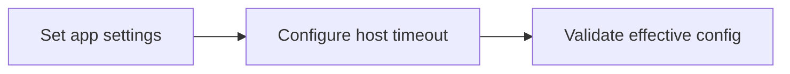

---
hide:
  - toc
validation:
  az_cli:
    last_tested: 2026-04-10
    cli_version: "2.83.0"
    core_tools_version: "4.8.0"
    result: pass
  bicep:
    last_tested: null
    result: not_tested
---

# 03 - Configuration (Flex Consumption)

Manage environment settings, runtime options, and host behavior per environment.

## Prerequisites

| Tool | Version | Purpose |
|------|---------|---------|
| Node.js | 20+ | Local runtime and package execution |
| Azure Functions Core Tools | v4 | Local host and publishing |
| Azure CLI | 2.61+ | Azure resource provisioning and management |

!!! info "Flex Consumption plan basics"
    Flex Consumption (FC1) supports VNet integration, identity-based storage, per-function scaling, and remote build workflows.

## What You'll Build

You will configure runtime and host settings for a Flex Consumption Function App and verify the effective app configuration.

!!! info "Infrastructure Context"
    **Plan**: Flex Consumption (FC1) | **Network**: VNet integration supported

    This tutorial modifies app settings on an existing Flex Consumption function app.

    ```mermaid
    flowchart TD
        CLI["Azure CLI"] -->|"appsettings set"| FA[Function App\nFlex Consumption FC1]
        FA -->|reads| SETTINGS["App Settings\n• FUNCTIONS_EXTENSION_VERSION\n• languageWorkers__node__arguments"]

        style FA fill:#0078d4,color:#fff
        style SETTINGS fill:#E3F2FD
    ```



## Steps

### Step 1 - Set variables (if not already set)

```bash
export RG="rg-func-node-flex-demo"
export APP_NAME="<your-function-app-name>"
```

### Step 2 - Configure app settings

```bash
az functionapp config appsettings set \
  --name "$APP_NAME" \
  --resource-group "$RG" \
  --settings \
    "FUNCTIONS_EXTENSION_VERSION=~4" \
    "languageWorkers__node__arguments=--max-old-space-size=4096"
```

!!! warning "`FUNCTIONS_WORKER_RUNTIME` is platform-managed on Flex Consumption"
    Unlike Consumption and Premium plans, Flex Consumption does **not** allow setting `FUNCTIONS_WORKER_RUNTIME` via app settings. Attempting to set it returns an error:

    ```text
    ERROR: The following app setting (Site.SiteConfig.AppSettings.FUNCTIONS_WORKER_RUNTIME)
    for Flex Consumption sites is invalid. Please remove or rename it before retrying.
    ```

    The runtime is configured automatically by the `--runtime node` parameter during `az functionapp create`.

### Step 3 - Configure host timeout

Update `host.json` with the timeout. Flex Consumption supports unlimited timeout (`-1`):

```json
{
  "version": "2.0",
  "functionTimeout": "-1"
}
```

!!! note "Flex Consumption timeout"
    Flex Consumption supports `"functionTimeout": "-1"` for unlimited execution time on HTTP triggers. This is a significant advantage over Consumption (max 10 minutes). Timer and queue triggers may still have platform-imposed limits.

### Step 4 - Validate effective config

```bash
az functionapp config appsettings list \
  --name "$APP_NAME" \
  --resource-group "$RG" \
  --output table
```

### Step 5 - Review Flex Consumption-specific notes

- Flex Consumption routes all traffic through the integrated VNet by default once configured.
- `FUNCTIONS_WORKER_RUNTIME` is platform-managed — do not set it manually.
- Use long-form CLI flags for maintainable runbooks.

## Verification

The `appsettings list` command should show at least these settings:

```text
Name                                   Value
-------------------------------------  --------------------------------
FUNCTIONS_EXTENSION_VERSION            ~4
languageWorkers__node__arguments       --max-old-space-size=4096
AzureWebJobsStorage                    DefaultEndpointsProtocol=https;...
APPLICATIONINSIGHTS_CONNECTION_STRING  InstrumentationKey=...
```

!!! note "No `FUNCTIONS_WORKER_RUNTIME` in the list"
    On Flex Consumption, `FUNCTIONS_WORKER_RUNTIME` does not appear in app settings because it is managed at the platform level via `functionAppConfig.runtime.name`.

## Next Steps

> **Next:** [04 - Logging and Monitoring](04-logging-monitoring.md)

## See Also

- [Tutorial Overview & Plan Chooser](../index.md)
- [Node.js Language Guide](../../index.md)
- [Platform: Hosting Plans](../../../../platform/hosting.md)
- [Operations: Deployment](../../../../operations/deployment.md)
- [Recipes Index](../../recipes/index.md)

## Sources

- [Azure Functions Node.js developer guide (Microsoft Learn)](https://learn.microsoft.com/azure/azure-functions/functions-reference-node)
- [Azure Functions app settings reference (Microsoft Learn)](https://learn.microsoft.com/azure/azure-functions/functions-app-settings)
- [Azure Functions Flex Consumption plan (Microsoft Learn)](https://learn.microsoft.com/azure/azure-functions/flex-consumption-plan)
