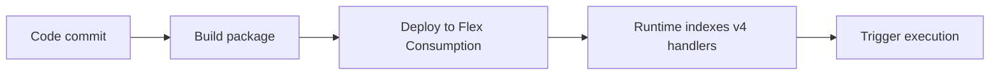

# 03 - Configuration (Flex Consumption)

Manage environment settings, runtime options, and host behavior per environment.

## Prerequisites

| Tool | Version | Purpose |
|---|---|---|
| Node.js | 20+ | Local runtime and package execution |
| Azure Functions Core Tools | v4 | Local host and publishing |
| Azure CLI | 2.61+ | Azure resource provisioning and management |

!!! info "Plan basics"
    Flex Consumption supports VNet integration, identity-based storage, per-function scaling, and remote build workflows.

## What You'll Build

You will apply required app settings for the Node.js worker and runtime extension, then validate effective settings in Azure.
You will also tune host-level timeout behavior appropriate for the Flex Consumption plan characteristics.

## Steps



### Step 1 - Configure app settings

```bash
az functionapp config appsettings set --name $APP_NAME --resource-group $RG --settings "FUNCTIONS_WORKER_RUNTIME=node" "FUNCTIONS_EXTENSION_VERSION=~4" "languageWorkers__node__arguments=--max-old-space-size=4096"
```

### Step 2 - Configure host timeout

```json
{
  "version": "2.0",
  "functionTimeout": "-1"
}
```

### Step 3 - Validate effective config

```bash
az functionapp config appsettings list --name $APP_NAME --resource-group $RG --output table
```

### Plan-specific notes

- Flex Consumption routes all traffic through the integrated VNet by default, so you do not set `WEBSITE_VNET_ROUTE_ALL` manually.
- Flex Consumption does not support custom container hosting for Function Apps.
- Use long-form CLI flags for maintainable runbooks.

## Verification

```text
Name                               Value
---------------------------------  --------------------------------
FUNCTIONS_WORKER_RUNTIME           node
FUNCTIONS_EXTENSION_VERSION        ~4
languageWorkers__node__arguments   --max-old-space-size=4096
```

The table confirms required Node.js worker settings are applied to the deployed app.

## See Also
- [Tutorial Overview & Plan Chooser](../index.md)
- [Node.js Language Guide](../../index.md)
- [Platform: Hosting Plans](../../../../platform/hosting.md)
- [Operations: Deployment](../../../../operations/deployment.md)
- [Recipes Index](../../recipes/index.md)

## Sources
- [Azure Functions Node.js developer guide (Microsoft Learn)](https://learn.microsoft.com/azure/azure-functions/functions-reference-node)
- [Create your first Azure Function with Core Tools (Microsoft Learn)](https://learn.microsoft.com/azure/azure-functions/create-first-function-cli-node)
- [Azure Functions hosting options (Microsoft Learn)](https://learn.microsoft.com/azure/azure-functions/functions-scale)
