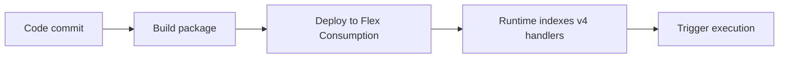

# 05 - Infrastructure as Code (Flex Consumption)

Deploy repeatable infrastructure with Bicep and parameterized environments.

## Prerequisites

| Tool | Version | Purpose |
|---|---|---|
| Node.js | 20+ | Local runtime and package execution |
| Azure Functions Core Tools | v4 | Local host and publishing |
| Azure CLI | 2.61+ | Azure resource provisioning and management |

!!! info "Plan basics"
    Flex Consumption supports VNet integration, identity-based storage, per-function scaling, and remote build workflows.

## What You'll Build

You will deploy the complete Flex Consumption infrastructure stack from Bicep, including storage, hosting plan, and Linux Function App resources.
You will then verify the deployment state using Azure Resource Manager deployment metadata.

## Steps



### Step 1 - Define Bicep template

Below is a simplified Flex Consumption template showing key resources. The repository template at `infra/flex-consumption/main.bicep` adds VNet integration, private endpoints, private DNS, and full RBAC configuration using a single `baseName` parameter.

```bicep
param location string = resourceGroup().location
param baseName string

var functionAppName = '${baseName}-func'
var storageAccountName = toLower(replace('${baseName}storage', '-', ''))
var appServicePlanName = '${baseName}-plan'
var managedIdentityName = '${baseName}-identity'
var deploymentContainerName = 'deployment-packages'

resource storage 'Microsoft.Storage/storageAccounts@2023-05-01' = {
  name: storageAccountName
  location: location
  sku: { name: 'Standard_LRS' }
  kind: 'StorageV2'
  properties: {
    allowSharedKeyAccess: false
  }
}

resource managedIdentity 'Microsoft.ManagedIdentity/userAssignedIdentities@2023-01-31' = {
  name: managedIdentityName
  location: location
}

resource deploymentBlobService 'Microsoft.Storage/storageAccounts/blobServices@2023-05-01' = {
  parent: storage
  name: 'default'
}

resource deploymentContainer 'Microsoft.Storage/storageAccounts/blobServices/containers@2023-05-01' = {
  parent: deploymentBlobService
  name: deploymentContainerName
}

resource plan 'Microsoft.Web/serverfarms@2024-04-01' = {
  name: appServicePlanName
  location: location
  sku: {
    name: 'FC1'
    tier: 'FlexConsumption'
  }
  properties: {
    reserved: true
  }
}

resource functionApp 'Microsoft.Web/sites@2024-04-01' = {
  name: functionAppName
  location: location
  kind: 'functionapp,linux'
  identity: {
    type: 'UserAssigned'
    userAssignedIdentities: {
      '${managedIdentity.id}': {}
    }
  }
  properties: {
    serverFarmId: plan.id
    httpsOnly: true
    functionAppConfig: {
      runtime: {
        name: 'node'
        version: '20'
      }
      scaleAndConcurrency: {
        maximumInstanceCount: 100
        instanceMemoryMB: 2048
      }
      deployment: {
        storage: {
          type: 'blobContainer'
          value: 'https://${storage.name}.blob.${environment().suffixes.storage}/${deploymentContainerName}'
          authentication: {
            type: 'UserAssignedIdentity'
            userAssignedIdentityResourceId: managedIdentity.id
          }
        }
      }
    }
  }
}

resource functionAppSettings 'Microsoft.Web/sites/config@2024-04-01' = {
  parent: functionApp
  name: 'appsettings'
  properties: {
    AzureWebJobsStorage__accountName: storage.name
    AzureWebJobsStorage__credential: 'managedidentity'
    AzureWebJobsStorage__clientId: managedIdentity.properties.clientId
  }
}
```

### Step 2 - Deploy template

```bash
az deployment group create --resource-group $RG --template-file infra/flex-consumption/main.bicep --parameters baseName=$BASE_NAME
```

### Step 3 - Verify deployment state

```bash
az deployment group show --resource-group $RG --name main --output json
```

### Plan-specific notes

- Flex Consumption routes all traffic through the integrated VNet by default once `virtualNetworkSubnetId` is configured, so you do not set `WEBSITE_VNET_ROUTE_ALL=1` manually.
- Flex Consumption does not support custom container hosting for Function Apps.
- The repository template (`infra/flex-consumption/main.bicep`) includes full VNet integration with private endpoints and DNS zones. The simplified snippet above omits networking for clarity.
- Use long-form CLI flags for maintainable runbooks.

## Verification

```json
{
  "name": "main",
  "properties": {
    "provisioningState": "Succeeded",
    "mode": "Incremental",
    "timestamp": "2026-04-08T08:40:03.0000000Z"
  }
}
```

A `Succeeded` provisioning state confirms the Bicep deployment completed for the selected plan.

## See Also
- [Tutorial Overview & Plan Chooser](../index.md)
- [Node.js Language Guide](../../index.md)
- [Platform: Hosting Plans](../../../../platform/hosting.md)
- [Operations: Deployment](../../../../operations/deployment.md)
- [Recipes Index](../../recipes/index.md)

## Sources
- [Azure Functions Node.js developer guide (Microsoft Learn)](https://learn.microsoft.com/azure/azure-functions/functions-reference-node)
- [Create your first Azure Function with Core Tools (Microsoft Learn)](https://learn.microsoft.com/azure/azure-functions/create-first-function-cli-node)
- [Azure Functions hosting options (Microsoft Learn)](https://learn.microsoft.com/azure/azure-functions/functions-scale)
