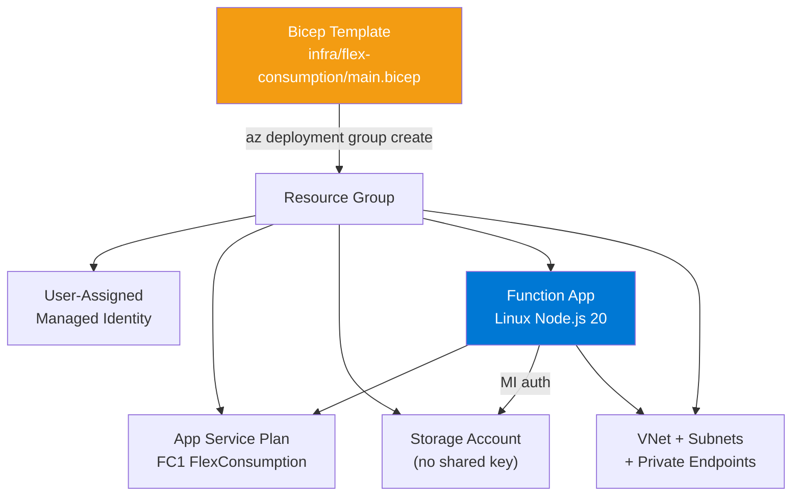
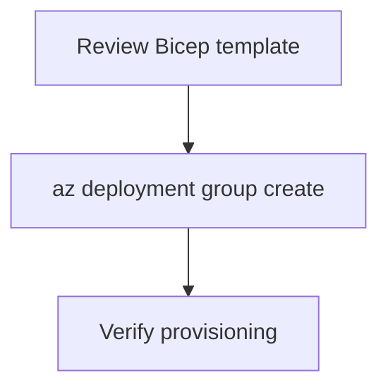

---
validation:
  az_cli:
    last_tested: 2026-04-10
    cli_version: "2.83.0"
    core_tools_version: "4.8.0"
    result: pass
  bicep:
    last_tested: 2026-04-10
    result: pass
content_sources:
  - type: mslearn-adapted
    url: https://learn.microsoft.com/azure/azure-functions/functions-reference-node
  - type: mslearn-adapted
    url: https://learn.microsoft.com/azure/azure-resource-manager/bicep/overview
  - type: mslearn-adapted
    url: https://learn.microsoft.com/azure/azure-functions/flex-consumption-plan
---

# 05 - Infrastructure as Code (Flex Consumption)

Deploy repeatable infrastructure with Bicep and parameterized environments.

## Prerequisites

| Tool | Version | Purpose |
|------|---------|---------|
| Node.js | 20+ | Local runtime and package execution |
| Azure Functions Core Tools | v4 | Local host and publishing |
| Azure CLI | 2.61+ | Azure resource provisioning and management |

!!! info "Flex Consumption plan basics"
    Flex Consumption (FC1) supports VNet integration, identity-based storage, per-function scaling, and remote build workflows.

## What You'll Build

You will deploy the complete Flex Consumption infrastructure stack from Bicep, including storage, hosting plan, managed identity, and Linux Function App resources.

!!! info "Infrastructure Context"
    **Plan**: Flex Consumption (FC1) | **Network**: VNet integration with private endpoints

    The production Bicep template at `infra/flex-consumption/main.bicep` includes full VNet integration, private endpoints, and DNS zones.

    <!-- diagram-id: what-you-ll-build -->


<!-- diagram-id: what-you-ll-build-2 -->


## Steps

### Step 1 - Set variables (if not already set)

```bash
export RG="rg-func-node-flex-demo"
export LOCATION="koreacentral"
```

### Step 2 - Review the Bicep template

The production template is at `infra/flex-consumption/main.bicep`. Below is a simplified example showing key Flex Consumption resources:

```bicep
param location string = resourceGroup().location
param baseName string

var functionAppName = '${baseName}-func'
var storageAccountName = toLower(replace('${baseName}storage', '-', ''))
var appServicePlanName = '${baseName}-plan'
var managedIdentityName = '${baseName}-identity'
var deploymentContainerName = 'deployment-packages'

resource storage 'Microsoft.Storage/storageAccounts@2023-05-01' = {
  name: storageAccountName
  location: location
  sku: { name: 'Standard_LRS' }
  kind: 'StorageV2'
  properties: {
    allowSharedKeyAccess: false
  }
}

resource managedIdentity 'Microsoft.ManagedIdentity/userAssignedIdentities@2023-01-31' = {
  name: managedIdentityName
  location: location
}

resource plan 'Microsoft.Web/serverfarms@2024-04-01' = {
  name: appServicePlanName
  location: location
  sku: {
    name: 'FC1'
    tier: 'FlexConsumption'
  }
  properties: {
    reserved: true
  }
}

resource functionApp 'Microsoft.Web/sites@2024-04-01' = {
  name: functionAppName
  location: location
  kind: 'functionapp,linux'
  identity: {
    type: 'UserAssigned'
    userAssignedIdentities: {
      '${managedIdentity.id}': {}
    }
  }
  properties: {
    serverFarmId: plan.id
    httpsOnly: true
    functionAppConfig: {
      runtime: {
        name: 'node'
        version: '20'
      }
      scaleAndConcurrency: {
        maximumInstanceCount: 100
        instanceMemoryMB: 2048
      }
      deployment: {
        storage: {
          type: 'blobContainer'
          value: 'https://${storage.name}.blob.${environment().suffixes.storage}/${deploymentContainerName}'
          authentication: {
            type: 'UserAssignedIdentity'
            userAssignedIdentityResourceId: managedIdentity.id
          }
        }
      }
    }
  }
}
```

!!! note "Flex Consumption vs Consumption Bicep differences"
    - Uses `FC1` / `FlexConsumption` SKU instead of `Y1` / `Dynamic`
    - Uses `functionAppConfig` block (not `siteConfig.appSettings`) for runtime, scaling, and deployment
    - Supports `allowSharedKeyAccess: false` on storage (identity-based auth)
    - Uses blob container for deployment instead of Azure Files

### Step 3 - Deploy template

```bash
az deployment group create \
  --resource-group "$RG" \
  --template-file infra/flex-consumption/main.bicep \
  --parameters baseName=ndflex0410
```

### Step 4 - Verify deployment state

```bash
az deployment group show \
  --resource-group "$RG" \
  --name main \
  --query "properties.provisioningState" \
  --output tsv
```

### Step 5 - Review Flex Consumption-specific notes

- The repository template includes full VNet integration with private endpoints and DNS zones. The simplified snippet above omits networking for clarity.
- Flex Consumption routes all traffic through the integrated VNet by default once `virtualNetworkSubnetId` is configured.
- Use long-form CLI flags for maintainable runbooks.

## Verification

Deployment output shows `Succeeded`:

```json
{
  "name": "main",
  "properties": {
    "provisioningState": "Succeeded",
    "mode": "Incremental",
    "timestamp": "2026-04-10T00:30:36.0000000Z"
  }
}
```

## Next Steps

> **Next:** [06 - CI/CD](06-ci-cd.md)

## See Also

- [Tutorial Overview & Plan Chooser](../index.md)
- [Node.js Language Guide](../../index.md)
- [Platform: Hosting Plans](../../../../platform/hosting.md)
- [Operations: Deployment](../../../../operations/deployment.md)
- [Recipes Index](../../recipes/index.md)

## Sources

- [Azure Functions Node.js developer guide (Microsoft Learn)](https://learn.microsoft.com/azure/azure-functions/functions-reference-node)
- [Automate resource deployment with Bicep (Microsoft Learn)](https://learn.microsoft.com/azure/azure-resource-manager/bicep/overview)
- [Azure Functions Flex Consumption plan (Microsoft Learn)](https://learn.microsoft.com/azure/azure-functions/flex-consumption-plan)
