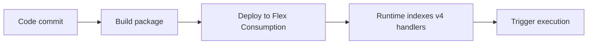

# 06 - CI/CD (Flex Consumption)

Automate build and deployment with GitHub Actions and environment gates.

## Prerequisites

| Tool | Version | Purpose |
|---|---|---|
| Node.js | 20+ | Local runtime and package execution |
| Azure Functions Core Tools | v4 | Local host and publishing |
| Azure CLI | 2.61+ | Azure resource provisioning and management |

!!! info "Plan basics"
    Flex Consumption supports VNet integration, identity-based storage, per-function scaling, and remote build workflows.

## What You'll Build

You will define a GitHub Actions workflow that builds and deploys your Node.js Functions app on each push to `main`.
You will validate release health with HTTP checks or Application Insights telemetry after the deployment finishes.

## Steps



### Step 1 - Create workflow

```yaml
name: deploy-node-functions
on:
  push:
    branches: [ main ]
jobs:
  deploy:
    runs-on: ubuntu-latest
    steps:
      - uses: actions/checkout@v4
      - uses: actions/setup-node@v4
        with:
          node-version: '20'
      - run: npm ci
      - run: npm test --if-present
      - uses: Azure/functions-action@v1
        with:
          app-name: ${{ secrets.APP_NAME }}
          sku: flexconsumption
          package: '.'
          remote-build: true
          publish-profile: ${{ secrets.AZURE_FUNCTIONAPP_PUBLISH_PROFILE }}
```

### Step 2 - Store secrets

- Add `APP_NAME` in GitHub Actions secrets.
- Add `AZURE_FUNCTIONAPP_PUBLISH_PROFILE` from Function App publish profile export.

### Step 3 - Validate release

```bash
FUNC_KEY=$(az functionapp function keys list --resource-group $RG --name $APP_NAME --function-name health --query default --output tsv)
curl --header "x-functions-key: $FUNC_KEY" "https://$APP_NAME.azurewebsites.net/api/health"

az monitor log-analytics query --workspace "$WORKSPACE_ID" --analytics-query "AppRequests | where TimeGenerated > ago(5m) | take 5"
```

### Plan-specific notes

- Flex Consumption does not support Kudu/SCM, so `az functionapp log tail` is not available. Use Application Insights or HTTP verification instead.
- Flex Consumption routes all traffic through the integrated VNet by default, so you do not set `WEBSITE_VNET_ROUTE_ALL` manually.
- Flex Consumption does not support custom container hosting for Function Apps.
- Use long-form CLI flags for maintainable runbooks.

## Verification

```json
[
  {
    "TimeGenerated": "2026-04-08T08:20:19.0000000Z",
    "Name": "GET /api/health",
    "ResultCode": "200",
    "DurationMs": 34
  }
]
```

HTTP 200 from `/api/health` and recent Application Insights request rows confirm the deployed function is serving traffic.

## See Also
- [Tutorial Overview & Plan Chooser](../index.md)
- [Node.js Language Guide](../../index.md)
- [Platform: Hosting Plans](../../../../platform/hosting.md)
- [Operations: Deployment](../../../../operations/deployment.md)
- [Recipes Index](../../recipes/index.md)

## Sources
- [Azure Functions Node.js developer guide (Microsoft Learn)](https://learn.microsoft.com/azure/azure-functions/functions-reference-node)
- [Create your first Azure Function with Core Tools (Microsoft Learn)](https://learn.microsoft.com/azure/azure-functions/create-first-function-cli-node)
- [Azure Functions hosting options (Microsoft Learn)](https://learn.microsoft.com/azure/azure-functions/functions-scale)
