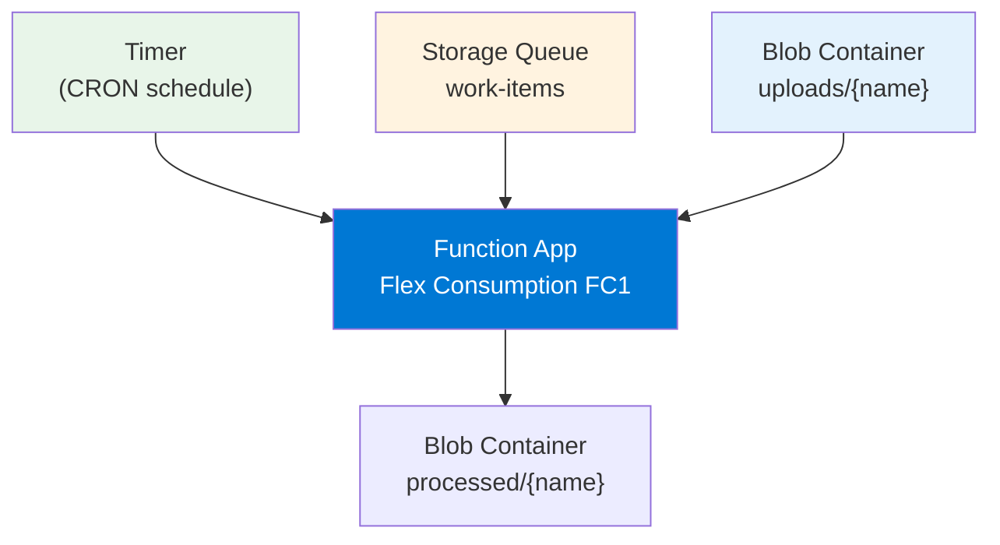
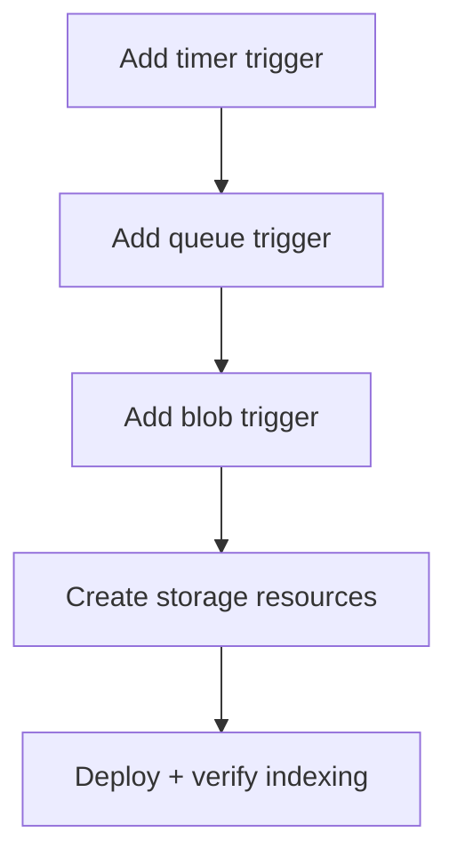

---
validation:
  az_cli:
    last_tested: 2026-04-10
    cli_version: 2.83.0
    core_tools_version: 4.8.0
    result: pass
  bicep:
    last_tested:
    result: not_tested
content_sources:

  references:
    - type: mslearn-adapted
      url: https://learn.microsoft.com/en-us/azure/azure-functions/functions-reference-node
    - type: mslearn-adapted
      url: https://learn.microsoft.com/en-us/azure/azure-functions/functions-triggers-bindings
    - type: mslearn-adapted
      url: https://learn.microsoft.com/en-us/azure/azure-functions/flex-consumption-plan
  diagrams:
    - id: what-you-ll-build
      type: flowchart
      source: self-generated
      justification: Flow view of what you ll build, synthesized from Microsoft Learn documentation cited on this page.
      based_on:
        - https://learn.microsoft.com/en-us/azure/azure-functions/functions-reference-node
        - https://learn.microsoft.com/en-us/azure/azure-functions/functions-triggers-bindings
        - https://learn.microsoft.com/en-us/azure/azure-functions/flex-consumption-plan
    - id: what-you-ll-build-2
      type: flowchart
      source: self-generated
      justification: Flow view of what you ll build 2, synthesized from Microsoft Learn documentation cited on this page.
      based_on:
        - https://learn.microsoft.com/en-us/azure/azure-functions/functions-reference-node
        - https://learn.microsoft.com/en-us/azure/azure-functions/functions-triggers-bindings
        - https://learn.microsoft.com/en-us/azure/azure-functions/flex-consumption-plan
---
# 07 - Extending Triggers (Flex Consumption)

Add queue, timer, and blob triggers with the Node.js v4 APIs and verify the Functions host indexes each binding.

## Prerequisites

| Tool | Version | Purpose |
|------|---------|---------|
| Node.js | 20+ | Local runtime and package execution |
| Azure Functions Core Tools | v4 | Local host and publishing |
| Azure CLI | 2.61+ | Azure resource provisioning and management |

!!! info "Flex Consumption plan basics"
    Flex Consumption (FC1) supports VNet integration, identity-based storage, per-function scaling, and remote build workflows.

## What You'll Build

You will add timer, queue, and blob triggers to a Node.js v4 app and verify that the Functions host indexes each binding both locally and in Azure.

!!! info "Infrastructure Context"
    **Plan**: Flex Consumption (FC1) | **Network**: VNet integration supported

    This tutorial adds non-HTTP triggers that require storage queues and blob containers.

    <!-- diagram-id: what-you-ll-build -->


<!-- diagram-id: what-you-ll-build-2 -->


## Steps

### Step 1 - Set variables (if not already set)

```bash
export RG="rg-func-node-flex-demo"
export APP_NAME="<your-function-app-name>"
export STORAGE_NAME="<your-storage-account-name>"
```

### Step 2 - Add a timer trigger

Save the following as `src/functions/nightlySummary.js`:

```javascript
const { app } = require('@azure/functions');

app.timer('nightlySummary', {
    schedule: '0 0 2 * * *',
    handler: async (_timer, context) => {
        context.log('Nightly summary job fired');
    }
});
```

### Step 3 - Add a queue trigger

Save the following as `src/functions/orderProcessor.js`:

```javascript
const { app } = require('@azure/functions');

app.storageQueue('orderProcessor', {
    queueName: 'work-items',
    connection: 'QueueStorage',
    handler: async (queueItem, context) => {
        context.log(`Order received: ${JSON.stringify(queueItem)}`);
    }
});
```

### Step 4 - Add a blob trigger

Save the following as `src/functions/blobIngest.js`:

```javascript
const { app } = require('@azure/functions');

app.storageBlob('blobIngest', {
    path: 'uploads/{name}',
    connection: 'AzureWebJobsStorage',
    handler: async (blob, context) => {
        context.log(`Blob received, size: ${blob.length} bytes`);
    }
});
```

### Step 5 - Create storage resources

```bash
# Create the queue
az storage queue create \
  --name "work-items" \
  --account-name "$STORAGE_NAME" \
  --auth-mode login

# Create blob containers
az storage container create \
  --name "uploads" \
  --account-name "$STORAGE_NAME" \
  --auth-mode login

az storage container create \
  --name "processed" \
  --account-name "$STORAGE_NAME" \
  --auth-mode login
```

| CLI element | Explanation |
|---|---|
| Command(s) | `az storage queue create`, `az storage container create` |
| Key flags | `--name`, `--account-name`, `--auth-mode` |
| Variables | `$STORAGE_NAME` |
| Expected result | Azure CLI returns provisioning details; confirm the resource name and successful provisioning state before continuing. |


### Step 6 - Verify local trigger indexing

```bash
cd apps/nodejs && func host start
```

### Step 7 - Deploy and verify in Azure

```bash
func azure functionapp publish "$APP_NAME"
```

### Step 8 - Test the queue trigger

```bash
az storage message put \
  --queue-name "work-items" \
  --content '{"orderId":"test-flex-001","item":"widget"}' \
  --account-name "$STORAGE_NAME"
```

| CLI element | Explanation |
|---|---|
| Command(s) | `az storage message put` |
| Key flags | `--queue-name`, `--content`, `--account-name` |
| Variables | `$STORAGE_NAME` |
| Expected result | Azure CLI completes successfully and returns JSON, table, or no output depending on the command; verify the next documented check before continuing. |


!!! note "Queue auth mode"
    If `--auth-mode login` fails with a permissions error, use `--auth-mode key` or pass `--account-key` explicitly. The Storage Queue Data Contributor role is required for login-based queue writes.

### Step 9 - Review Flex Consumption-specific notes

- Flex Consumption supports per-function scaling for queue and blob triggers.
- Use long-form CLI flags for maintainable runbooks.
- Queue triggers on Flex Consumption benefit from per-function scaling — each function can scale independently.

## Verification

Local `func host start` output shows all triggers indexed:

```text
Functions:

    helloHttp: [GET] http://localhost:7071/api/hello/{name?}
    health: [GET] http://localhost:7071/api/health
    nightlySummary: timerTrigger
    orderProcessor: queueTrigger
    blobIngest: blobTrigger
```

Deployed function list:

```bash
az functionapp function list \
  --name "$APP_NAME" \
  --resource-group "$RG" \
  --output table
```

| CLI element | Explanation |
|---|---|
| Command(s) | `az functionapp function list` |
| Key flags | `--name`, `--resource-group`, `--output` |
| Variables | `$APP_NAME`, `$RG` |
| Expected result | Azure CLI returns the requested resource data; verify names, IDs, status fields, or metric values match the scenario. |


## Clean Up

If you are finished with the Flex Consumption tutorials, delete the resource group:

```bash
az group delete --name "$RG" --yes --no-wait
```

| CLI element | Explanation |
|---|---|
| Command(s) | `az group delete` |
| Key flags | `--name`, `--yes`, `--no-wait` |
| Variables | `$RG` |
| Expected result | Azure CLI completes the removal request; verify the target no longer appears in follow-up `show` or `list` output. |


## See Also

- [Tutorial Overview & Plan Chooser](../index.md)
- [Node.js Language Guide](../../index.md)
- [Platform: Hosting Plans](../../../../platform/hosting.md)
- [Operations: Deployment](../../../../operations/deployment.md)
- [Recipes Index](../../recipes/index.md)

## Sources

- [Azure Functions Node.js developer guide (Microsoft Learn)](https://learn.microsoft.com/en-us/azure/azure-functions/functions-reference-node)
- [Azure Functions triggers and bindings (Microsoft Learn)](https://learn.microsoft.com/en-us/azure/azure-functions/functions-triggers-bindings)
- [Azure Functions Flex Consumption plan (Microsoft Learn)](https://learn.microsoft.com/en-us/azure/azure-functions/flex-consumption-plan)
