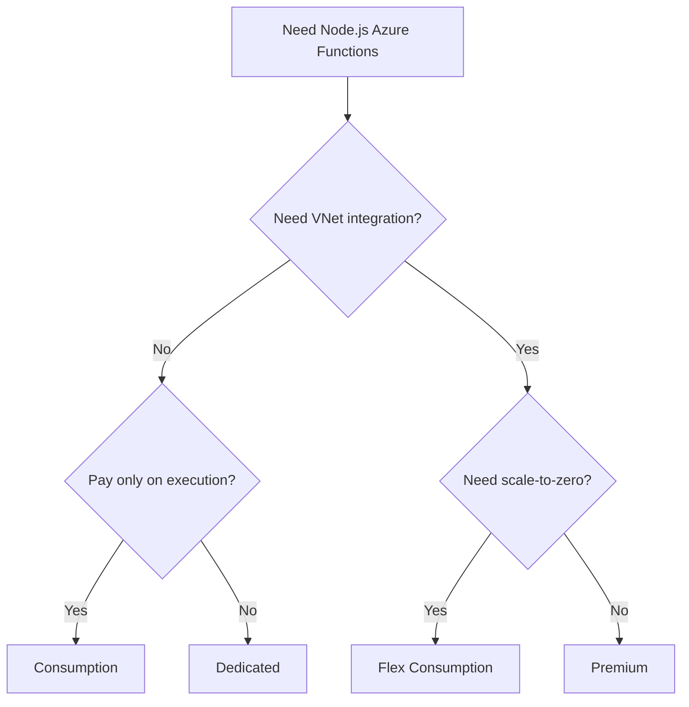

# Tutorial - Choose Your Hosting Plan

This section provides four independent Node.js tutorial tracks. Each track follows the same seven steps from local development to production operations.

## Which Plan Should I Start With?

## Plan Comparison at a Glance

| Feature | Consumption | Flex Consumption | Premium | Dedicated |
|---|---:|---:|---:|---:|
| Scale to zero | Yes | Yes | No | No |
| VNet integration | No | Yes | Yes | Yes (tier-dependent) |
| Deployment slots | Limited | No | Yes | Yes |
| Timeout max | 10 min | Unlimited | Unlimited | Unlimited |
| Typical fit | Burst workloads | Modern serverless default | Low latency and warm capacity | Existing App Service estates |

## Tutorial Tracks

- [Consumption](consumption/01-local-run.md)
- [Flex Consumption](flex-consumption/01-local-run.md)
- [Premium](premium/01-local-run.md)
- [Dedicated](dedicated/01-local-run.md)

## What Each Step Covers

| Step | Topic |
|---|---|
| 01 | Local run |
| 02 | First deploy |
| 03 | Configuration |
| 04 | Logging and monitoring |
| 05 | Infrastructure as code |
| 06 | CI/CD |
| 07 | Extending triggers |

## See Also
- [Node.js Language Guide](../index.md)
- [Node.js v4 Programming Model](../v4-programming-model.md)
- [Platform: Hosting Plans](../../../platform/hosting.md)

## Sources
- [Azure Functions hosting options (Microsoft Learn)](https://learn.microsoft.com/azure/azure-functions/functions-scale)
- [Flex Consumption plan (Microsoft Learn)](https://learn.microsoft.com/azure/azure-functions/flex-consumption-plan)
